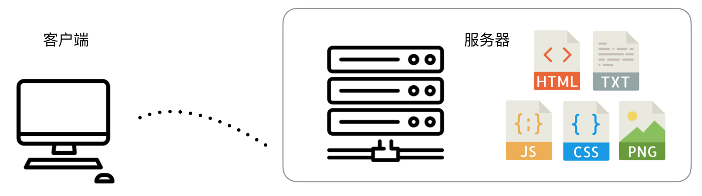
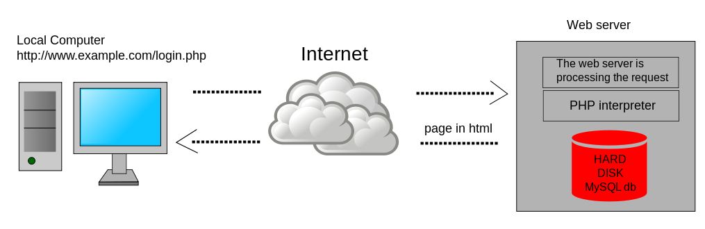
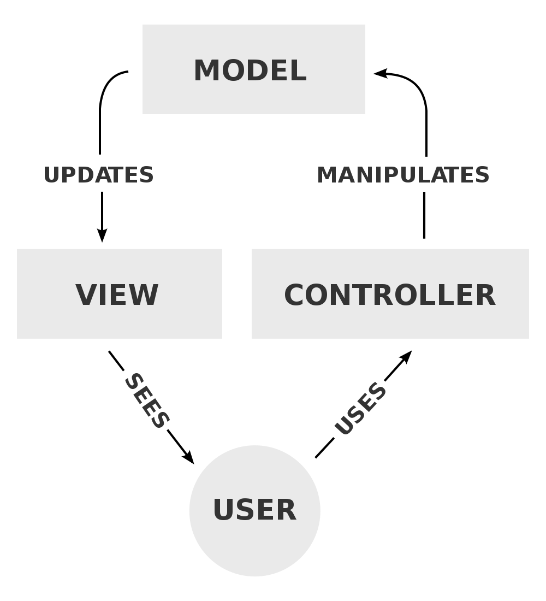

# Web前端简史

### 世界上第一个网站

世界上第一个网站是由在英国 CERN（欧洲核子研究中心，法语为 Conseil Européen pour la Recherche Nucléaire，因此缩写为 CERN，对应的英文名称是 European Council for Nuclear Research） 工作的一位科学家，蒂姆·伯纳斯－李（Tim Berners-Lee），在 1989 年创建的，页面服务由蒂姆的 NeXT 电脑提供（这台机器目前仍在 CERN）。我们现在依然可以在 [http://info.cern.ch/](http://info.cern.ch/) 看到它相关的原始页面。如果打开 [World Wide Web](http://info.cern.ch/hypertext/WWW/TheProject.html)（地址是 `http://info.cern.ch/hypertext/WWW/TheProject.html`），观察它的响应头，可以看到该文件的最后修改时间（`Last-Modified Time`）是 1992 年 12 月 3 日，意味着该页面已经在网络上服务了 26 年（截止到 2018 年 8 月）！该请求的响应报文的首部如下：

```
HTTP/1.1 200 OK
Date: Thu, 08 Feb 2018 15:21:53 GMT
Server: Apache
Last-Modified: Thu, 03 Dec 1992 08:37:20 GMT
ETag: "40521e06-8a9-291e721905000"
Accept-Ranges: bytes
Content-Length: 2217
Connection: close
Content-Type: text/html
```

时过境迁，1952 年创建的 CERN 的最初目标，是探究原子内部的结构（这也是为什么它的名字里有“核子”，即 nuclear）。而到了今天，人类对于物质的理解已经不仅仅停留在原子核层面，CERN 的研究内容也更为深入，主要为粒子物理领域（particle physics）——研究物质的基础组成及它们之间的相互作用。

World Wide Web (WWW) 项目的初衷是让世界各高校、研究机构的科学家可以分享信息。1993 年 8 月 30 日，CERN 将 WWW 软件公开到了公网中，软件里包括 Web 服务软件、一个简单的浏览器以及一份代码库。随后，CERN 声明这些软件都可自由获取与使用。

万维网从此脱离实验室，“飞入寻常百姓家”。在接下来的二十几年里，不计其数的计算机、智能设备，加快了全球的信息交换速度。信息科技成为21世纪初人类文明进步的最大推手，CERN 的物理学家们功不可没。

1994年，雅虎时代开始。雅虎对当时的几乎所有网站人工进行分类，其数据库中的注册网站无论是在形式上还是内容上质量都非常高。

### 静态页面时期



在静态页面时期，Web 服务器就是最简单的文件服务器。用户主要请求 HTML 文件为入口，然后服务器会响应后续的脚本、样式、图片等资源请求。这些文件由网站开发人员、设计师、内容管理人员一起维护。客户端如果想要与网站进行通信怎么办？发邮件！

这个时期主要以博客为主。

### 动态内容网页

动态内容网页（Dynamic Web Page）技术的兴起源 于 Web2.0 浪潮。这个时期，互联网上产生的数据急剧增长，Web 开发人员需要解决“不同的人进入到某个相同页面时因自身数据或配置的不同而看到不同的效果”这样的需求，给出了动态内容网页技术这个解决方案。

注：动态内容网页技术与 DHTML（Dynamic HTML，微软于 1997 年发布 IE4 时提出）是有很大差异的，前者务必要有服务器端数据与模板的拼合，强调的是内容的动态性，而后者则强调在浏览器中的运行时效果。术语 DHTML 在现代 web 开发活动中也很少被提及，程序员们早已很自然地使用 DOM API、BOM API 进行浏览器页面内的编程。

在实现方式上，动态内容网页技术也存在两类：一是最早借助于服务器端脚本（例如 Perl、PHP、JSP 以及 ASP.NET 等）实现的服务器端动态页面（server-side dynamic web page）；另一种是在 Ajax 技术出现后，主要通过 JavaScript 操作 DOM 来生成视图的的方式，即客户端动态页面（client-side dynamic web page）。

这种技术架构如下图所示，相比于静态内容页面，数据库开始成为网站的核心：



### MVC 架构



术语 MVC（Model-View-Controller，模型-视图-控制器）原本是桌面 GUI 程序开发中的常用架构模式，它最早于 1970 年代引入到 SmallTalk-76 编程语言中。1988 年的一篇论文则使其正式成为一种通用设计模式。

Web 开发借鉴了这一理念。1996 年， NeXT 的 WebObjects 项目基于 Objective-C 语言开发，使用 MVC 架构进行源码组织，此举迅速地推动了 MVC 理念的普及。之后，MVC 模式被迁移到了其他语言阵营，并各自有一个重量级的 MVC 框架诞生。例如 Java 的 Spring（2002年），Python 语言世界里的 Django（2005年），Ruby 语系下的 Rails（2005年），PHP 的 Laravel（2011年）。MVC 的优势在于以分层的方式进行了解耦合，提升了代码一致性；但同时也存在一些不足，例如容易导致分散：总是要将一个特性分成三个部分去写。

对前端开发者来，则经历了一段后端主导的 MVC 开发时期。这个时期下，前后端代码通常在一个项目下共同维护。以 Java 的 Spring MVC 框架为例，目录结构通常这样设置：

```

```

这种开发模式对于前后端人员其实都不太友好，尤其是前端团队为了提升前端性能以及开发效率而引入了各类构建工具之后，版本管理期间的冲突可能就会让人不胜其扰。此外，前后端在同一个项目下，意味着任何一方单独希望上线时，另一方的服务也都会重启一下，而这种干扰原本是不期望发生的。诸如此类的种种原因，使得前后端分离的开发模式逐渐被国内各互联网公司采纳。

### 前后端分离架构

有两项技术催动了前后端分离架构的最终广泛应用：Ajax 和 Node.js。前者使得 Web 页面可以主动获取或推送交互时依赖的数据，而不必由服务端通过模板渲染的形式提供；后者则极大地扩展了 ECMAScript 语言的应用场景，前端开发人员可以使用自己熟悉的语言搭建简单的 Web 服务器，或者执行复杂的前端资源构建。

那么，什么是前后端分离？首先，是源代码的独立管理。

谁提出的前后端分离解决方案？

## 参考资料

1. Krasner, Glenn E.; Pope, Stephen T. (Aug–Sep 1988). "A cookbook for using the model–view controller user interface paradigm in Smalltalk-80". The Journal of Object Technology. SIGS Publications.
