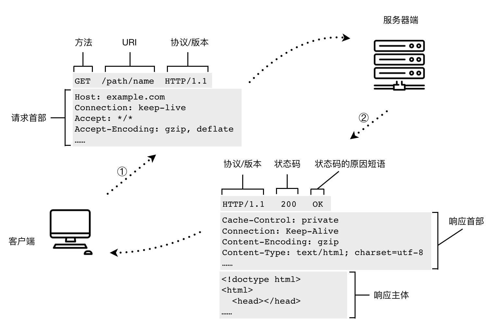
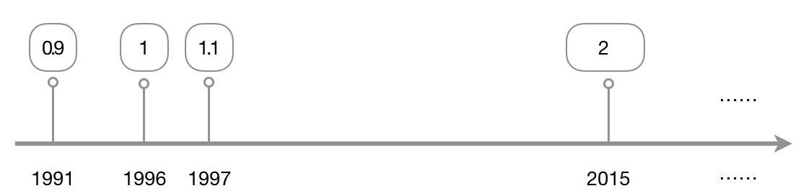

# HTTP 简介

Tim Berners-Lee 的网站最初是基于这样的理论基础而构建起来的：首先，以一个标准通用标记语言（实际中选择了 HTML）作为页面的呈现方式；二，基于  HTTP（Hypertext Transfer Protocol，超文本传输协议）传输文档；三，由 URL（Uniform Resource Locator，统一资源定位符）来唯一指定文档的所在地址。Tim 率领团队实现了 HTTP 的第一版。再之后，IETF（Internet Engineering Task Force，国际互联网工程任务组，成立于 1985 年底）与 W3C（World Wide Web Consortium，万维网联盟，由 Tim Berners-Lee 于 1994 年 10 月在麻省理工学院计算机科学实验室创立）共同推进了 HTTP 的标准化。

在计算机网络分层体系结构中，HTTP 属于最顶部的应用层。除了 HTTP 服务外，同属于应用层的还有 FTP、DNS、SSH、Telnet、TLS/SSL、POP、IMAP 等服务或应用程序。HTTP 协议的两端，必定有一个承担了客户端角色，另一个承担的是服务器端角色。一个经典的 HTTP 通信过程及报文结构如下：

HTTP 以文档的形式确立的第一版规范是 1991 年的 0.9 版本。之后的重要版本变迁如下图所示。HTTP/1.1 是目前应用最广泛的 HTTP 协议版本。2015 年提出的 HTTP/2 规范则重点在性能上给出了优化方案，这个版本在推出后，网站的支持比例就呈不断上升趋势。根据 w3techs 的数据[1]，截至 2018 年 8 月，全球有 29% 的网站已经支持 HTTP/2 协议了。

<figure>

<figcaption>HTTP 主要版本变迁。1991 年 HTTP/1.1 发布之后，依然通过多个版本的 RFC 对 HTTP/1.1 规范进行补充。RFC 是指 Request for Comments（请求评论）。通常，当某家机构或团体开发出了一套标准或提出对某种标准的设想，想要征询外界的意见时，就会在 Internet 上发放一份 RFC，对这一问题感兴趣的人可以阅读该 RFC 并提出自己的意见。常见的机构或团体有 IETF、IRTF、IAB 等。</figcaption>
</figure>

## 参考资料

1. https://w3techs.com/technologies/details/ce-http2/all/all
