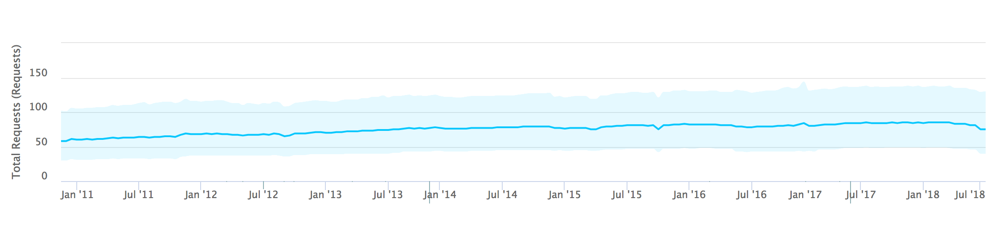
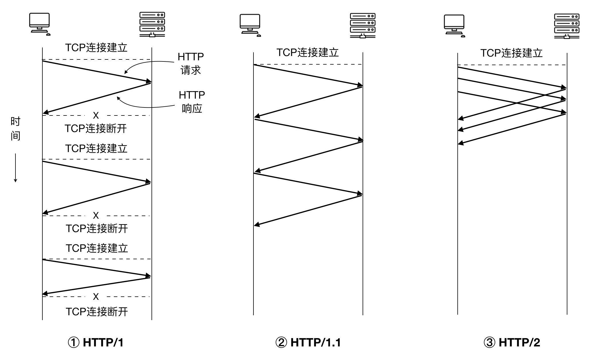

# HTTP 简介

Tim Berners-Lee 的网站最初是基于这样的理论基础而构建起来的：首先，以一个标准通用标记语言（实际中选择了 HTML）作为页面的呈现方式；二，基于  HTTP（Hypertext Transfer Protocol，超文本传输协议）传输文档；三，由 URL（Uniform Resource Locator，统一资源定位符）来唯一指定文档的所在地址。Tim 率领团队实现了 HTTP 的第一版。再之后，IETF（Internet Engineering Task Force，国际互联网工程任务组，成立于 1985 年底）与 W3C（World Wide Web Consortium，万维网联盟，由 Tim Berners-Lee 于 1994 年 10 月在麻省理工学院计算机科学实验室创立）共同推进了 HTTP 的标准化。

在计算机网络分层体系结构中，HTTP 属于最顶部的应用层。除了 HTTP 服务外，同属于应用层的还有 FTP、DNS、SSH、Telnet、TLS/SSL、POP、IMAP 等服务或应用程序。HTTP 协议的两端，必定有一个承担了客户端角色，另一个承担的是服务器端角色。一个经典的 HTTP 通信过程及报文结构如下：

HTTP 以文档的形式确立的第一版规范是 1991 年的 0.9 版本。之后的重要版本变迁如下图所示。HTTP/1.1 是目前应用最广泛的 HTTP 协议版本。2015 年提出的 HTTP/2 规范则重点在性能上给出了优化方案，这个版本在推出后，网站的支持比例就呈不断上升趋势。根据 w3techs 的数据[1]，截至 2018 年 8 月，全球有 29% 的网站已经支持 HTTP/2 协议了。

<figure>

<figcaption>HTTP 主要版本变迁。1991 年 HTTP/1.1 发布之后，依然通过多个版本的 RFC 对 HTTP/1.1 规范进行补充。RFC 是指 Request for Comments（请求评论）。通常，当某家机构或团体开发出了一套标准或提出对某种标准的设想，想要征询外界的意见时，就会在 Internet 上发放一份 RFC，对这一问题感兴趣的人可以阅读该 RFC 并提出自己的意见。常见的机构或团体有 IETF、IRTF、IAB 等。</figcaption>
</figure>

HTTP 协议本身存在两个最主要的问题，一个与安全有关，一个与性能有关。针对这两个问题，社区、企业和规范制定方分别给出了 HTTPS 和 HTTP/2 这两个解决方案。

## HTTPS

HTTP 请求、响应报文都是明文传输，在网络通信的任何环节都存在被窃听的可能。中间人攻击（Man-in-the-Middle，MITM）就是这样一种技术：在请求或响应的传输途中，拦截并篡改报文内容。常见的中间人攻击方法包括 ARP 欺骗、DNS 欺骗，主要用来窃取用户隐私数据、交易支付数据等安全性较高 的信息，有时也会被运营商恶意使用，篡改各公司的网页。

HTTPS（HTTP Secure）是避免中间人攻击的解决方案，它在应用层与传输层之间添加了一层加密处理，通过 TLS（Transport Layer Security）或更早的 SSL 对报文进行非对称加密。

## HTTP/2

Tim Berners-Lee 在提出 HTTP 协议时，只设想过用它来传输 HTML 文档。不过随着网站复杂度的提升，每个页面涉及的资源逐渐增加，而且很多都不是 HTML 文档（例如脚本、样式表、图片、字体）。这种复杂度的提升对 HTTP 协议的性能提出了更高的要求。

首先，我们可以从两份具体的数据来感受一下 Web 复杂度的增长。

第一份数据来自 Andrew B. King[2]的调研：从 2003 年到 2008 年，每张网页包含的对象数从 25.7 个上升到 49.9个（凡是需要发出独立http请求的网页元素，都算作一个对象）。

第二份数据来自 HTTP Archive，这个机构从 2010 年起开始追踪世界排名靠前的网站的 HTTP 相关性能数据（包括页面体积、HTTP/HTTPS/HTTP2请求数、TCP 连接数等）。2011 年 11 月至 2018 年 6 月，这些网站每个页面的 HTTP 请求的中位数，从 58 增长到了 83 个。

<figure>

<figcaption>2011.11.15~2018.07.15 期间，被统计的网站的 HTTP 请求中位数趋势。</figcaption>
</figure>

HTTP/1.1 相比于 HTTP/1.0 增加了一个关于持久连接的首部：`Connection: keep-alive`。该特性针对 TCP 连接的复用做了一些优化。HTTP/1.0 中，每个 TCP 连接在完成一次 HTTP 请求/响应后会关闭，造成了很高的资源浪费。`Connection: keep-alive` 允许服务器与客户端使用已打开的 TCP 连接来继续下一个 HTTP 请求。对于一个有 80 个 HTTP 请求的页面，如果按照 HTTP/1.0 协议通信，客户端与服务器之间会先后建立 80 次 TCP 连接；如果按照 HTTP/1.1 协议通信，考虑到现代网站通常采用多个域来提供资源，那么通常需要 20 个 TCP 连接就可以满足加载需求了。

不过这还不够好，HTTP/1.* 版本中，一个 TCP 链路上同时只允许存在一个 HTTP 会话。如果每个 TCP 连接中可以同时支持多个 HTTP 请求，那么 TCP 资源的消耗又可以下降一大截！

HTTP/2 正是对此作了优化。它采用了称为“多路复用”（Multiplexing）的技术，允许在同一个 TCP 连接里同时有上行数据和下行数据（即全双工），从而可以使多个 HTTP 请求共用一个 TCP 连接。如此一来，建立 TCP 连接的成本又可以下降一个数量级，每个网站只需要若干个（甚至只用 1 个） TCP 连接就能够完成所有的资源获取。

HTTP/2 源自于谷歌公司的 SPDY（读音类似于 speedy）项目。2015 年 5 月发布的 RFC-7540 正式将 HTTP/2 标准化。HTTP/2 的全称是 Hypertext Transfer Protocol Version 2，它主要有这些新的特点：

+ TCP 多路复用
+ 压缩请求、响应报文的首部
+ 服务器推送

对前端开发人员来说，HTTP/2 的普及对构建发布流程有着较大的影响。我们现在为了提升 web 前端网络性能而采取的各种减少 HTTP 请求数量的技术，例如 CSS 精灵图、JavaScript/CSS 文件合并等等，可能都不再需要了。因为所有的 HTTP/2 请求可以同时发起！

<figure>

<figcaption>HTTP 三个主要版本对 TCP 连接的使用差异对比。① HTTP/1 版本里，每个 TCP 只能用于一次 HTTP 通信，完成后会立即关闭。每个 HTTP 请求都需要重新建立 TCP 连接。② HTTP/1.1 增加了 `Connection: keep-alive` 首部，允许持久连接的 TCP。③ HTTP/2 则允许在同一个 TCP 连接里同时进行多个 HTTP 请求/响应会话。（本图参考[5]绘制）。假设网络带宽都足够大，那么 HTTP/2 的方案则明显可以很大程度上降低整个页面的网络延时。</figcaption>
</figure>

## HTTP/3

尽管 HTTP/2 的性能已经较 HTTP/1.1 提升了很多，但是，为 HTTP/2 协议标准化做出海量研究的谷歌工程师们对 HTTP 性能的追求依然没有停止。这一次，谷歌打算从传输层对协议进行改进。首先，他们推出了新的传输层协议 QUIC，并在 2015 年正式提交给 IETF 作为标准草案。QUIC 是 Quick UDP Internet Connections 的缩写，与 TCP、UDP 协议同属于传输层。之后在 2016 年，谷歌提出了新的 HTTP 协议 HTTP-over-QUIC，此协议糅合了 HTTP/2、TCP、UDP、TLS（用户加密）等关键技术，可以认为是对当前 HTTP 协议的重写。

2018 年 11 月，IETF 官方声明将接受 HTTP-over-QUIC 方案，并将其命名为 HTTP/3。

HTTP-over-QUIC 目前还只是起步阶段。浏览器支持度方面，Chrome 从 29 版本、Opera 从 16 版本开始支持 HTTP-over-QUIC 协议，其他浏览器暂不支持。服务器端方面，根据 W3Techs 的统计数据，截止 2018 年 11 月，在全球前 1000 万个网站里，31.2% 的网站支持 HTTP/2，而支持 QUIC 的则只有 1.2%。

## 参考资料

1. https://w3techs.com/technologies/details/ce-http2/all/all
2. https://http2.github.io/
3. Andrew B. King. Website Optimization [M]. O'Reilly.
4. https://httparchive.org/
5. Andrew S. Tanenbaum, Davide J. Wetherall 著. 严伟, 潘爱民 译. 计算机网络（第五版） [M]. 北京: 清华大学出版社, 2014.
6. https://www.zdnet.com/article/http-over-quic-to-be-renamed-http3/
