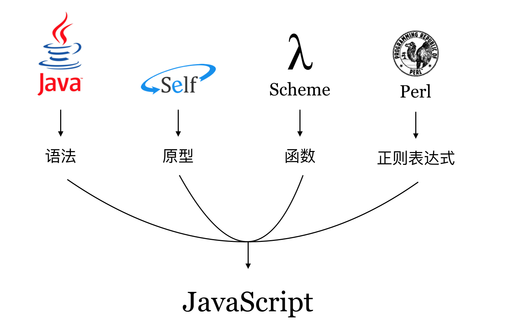

## 语言特点

JavaScript 是一门多范式语言，开发者可以使用命令式风格、面向对象风格以及函数式风格来组织源代码。在语言设计上，JavaScript 可谓集众家之所长：



Douglas Crockford 认为，“JavaScript 是第一个成为主流的 Lambda 语言。相对于 Java 而言，JavaScript 与 Lisp 和 Scheme 有更多的共同点。它是披着 C 外衣的 Lisp”<sup>[1]</sup>。其在语言设计上的优越性，使得 JavaScript 在今天愈加强大。

**弱类型**

JavaScript 是一门弱类型，或者“动态类型”的语言，并不意味着 JavaScript 语言是“没有类型”的，而是指用户声明标识符（变量）时不必指定类型，且标识符指向的值的类型可以随意更改，即变量的类型通常在运行时确定。

```javascript
var a = 'some string';  // 初始化时指定 a 为字符串类型

a = {id: 1};  // 但之后也可以让 a 指向一个对象，成为一个引用类型
```

**面向对象**

基于原型，JavaScript 支持面向对象的程序设计模式。

```javascript
// 封装
function Person(name = '', age = null) {
  this.name = name;
  this.age = age;
}

Person.prototype.sayHello = function() {
  var str = `Hi, I am ${this.name}.`;
  if (this.age || this.age === 0) {
    str += ` I'm ${this.age} years old.`;
  }
  console.log(str);
}

var wang = new Person('Wang', 29);
wang.sayHello();

// 继承
function Student() {
  Person.apply(this, Array.prototype.slice.call(arguments));
}
Student.prototype = new Person();

var st = new Student('XiaoMing');
st.sayHello();  // 调用父类定义给实例的方法
```

此外，利用每个函数内部的 `arguments` 上下文变量对实参进行数量与类型的检查，可以实现函数的重载。

**函数式风格**

JavaScript 里的函数是“一等公民”，即函数本身亦是对象，一个函数可作为另一个函数的返回值，也可以作为其他函数的传入参数。由于 JavaScript 在设计出来时就借鉴了函数式编程语言 Scheme，因此对函数式风格的编程支持得很好。

```javascript
var arr = [1, 2, 3, 4];
// 内置的函数式编程风格的API
var b = arr.map(item => item * item);
```

可以用常见的科里化（curring）做到一些很酷的事情：

```javascript
function multi(x = 1) {
  function m(y = 1) {
    x = x * y;
    return m;
  }

  m.toString = function() {
    return '' + x;
  };

  m.valueOf = function() {
    return x;
  }

  return m;
}

console.log(multi(2));       // => 1
console.log(multi(2)(4));    // => 8
console.log(multi(1)(2)(3)); // => 6
```

### 参考资料

1. Douglas Crockford. JavaScript 语言精粹[M]. 北京: 电子工业出版社, 2012.
