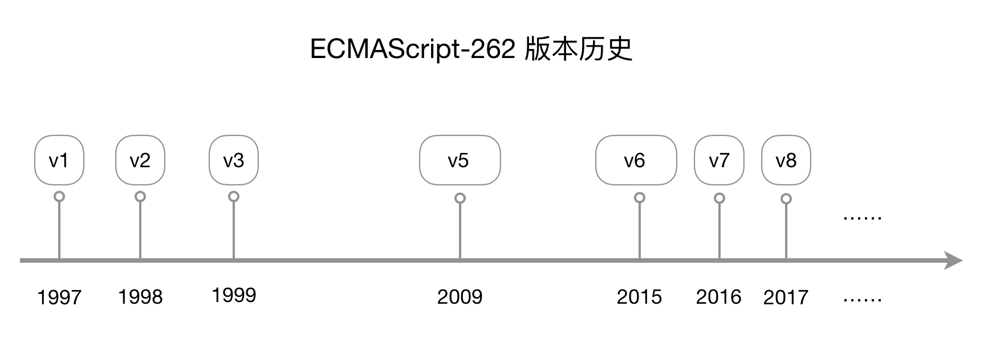

# JavaScript 简介

JavaScript 最初是作为一种脚本语言被发明出来。“脚本语言”似乎表明这是一种玩具语言，并非可登大雅之堂者。然而这么多年下来，很多被称作脚本的编程语言（Perl、Python、JavaScript）都已经超越了最初意义的脚本用途，而是成为威力相当强大的独立通用编程语言。

在流传甚广的以打趣为目的的《编程语言野史》一文这样描述 JavaScript 这门语言的诞生：

> 1995 – Brendan Eich 读完了历史上所有在程序语言设计中曾经出现过的错误，自己又发明了一些更多的错误，然后用它们创造出了LiveScript。之后，为了紧跟Java语言的时髦潮流，它被重新命名为JavaScript。再然后，为了追随一种皮肤病的时髦潮流，这语言又被命名为ECMAScript。

不同的 JavaScript 引擎可能采取不同的编译器实现方法。在设计 JavaScript 时，Brendan Eich 受 Java 影响颇大，因此使用了字节码解释器（bytecode interpreter）对 JavaScript 解释执行[1]。而著名的 V8 引擎，在运行前先将 JavaScript 编译为机器码（而非字节码或是解释执行它），以此提升性能[2]。

JavaScript 发布后，获得了巨大的成功。这个语言的发明与繁荣，印证了 MVP（Minimum Viable Product，最小可用产品）理念的价值。简单、跨平台、分布式使得 JavaScript 成为浏览器端的唯一语言，这种重要性反过来迫使各个巨头携手推进其标准化。1997年，由网景、昇阳、微软、宝蓝等公司组织及个人组成的技术委员会在 ECMA（European Computer Manufactures Association，欧洲计算机制造商协会）确定定义了一种名叫 ECMAScript 的新脚本语言标准，规范名为 ECMA-262。

JavaScript 是一门多范式语言，开发者可以使用命令式风格、面向对象风格以及函数式风格来组织源代码。

## 参考资料

1. [JavaScript at 20, by Brendan Eich](http://brendaneich.github.io/ModernWeb.tw-2015/#1)
2. [V8 engine | wikipedia](https://en.wikipedia.org/wiki/V8_engine)

