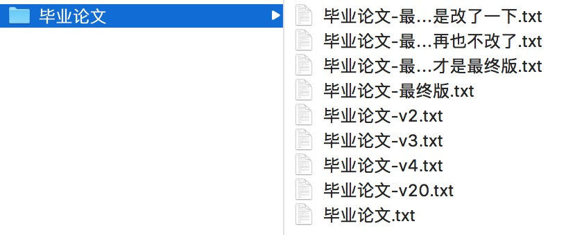

# 前端工程化的定义

20 多年前，Web 刚刚兴起的时候，并没有 Web 前端开发工程师这样的职位，当时的网页开发工作应该被称为网页设计，切图、布局、样式是其主要工作。随着互联网的不断发展，前端交互、性能、数据处理、安全问题一个个成为网页设计人员的关注点，这群人也分为了两个领域：交互设计师，前端程序员。软件开发中的大部分工程问题，前端程序员都需要涉及。

Node.js 诞生后，前端开发人员凭借自身的 JavaScript 语言优势，也可以逐渐接管部分原本由后端工程师承担的工作，例如页面服务器端渲染、网站路由管理。以常见的 MVC（Model-View-Controller）架构为例，也就是 View 和 Controller 两个环节。

苹果公司的 iPhone 手机（2007年）引领的智能设备革命，使得前端代码的运行环境变得日益复杂。时至今日，Web 页面的 “一处编写，随处运行” 天然优势促使 Android、iOS 等系统中的大量应用采取了 Hybrid 开发模式。而且不仅仅是浏览器，微信还推出了小程序这样的运行环境，使得 JavaScript 可以编写出接近原生应用的“页面”。

到了现在，我们可以认为 Web 前端工程化主要包含以下范畴：

+ 版本控制
+ 模块化开发
+ 前端资源构建
+ 持续集成与自动化部署
+ 服务器运维
+ 性能优化

## 版本控制

版本控制系统（VCS，Version Control System）通常用于管理软件开发过程中的源代码文件，好的版本控制系统应该具备多人并行开发、代码变更记录、文件冲突处理机制、分支策略等特性。版本控制系统经历过三代演进：

** 本地版本控制（Local Version Control System）**

最原始的本地备份式版本控制。这种版本控制策略，本质上只是文件备份，最常用的方式就是将当期文件复制到另一个目录（可能会添加时间戳）。不少人也许有过类似下面这样命名文件的经历，这其实就是一种本地版本控制策略：

** 集中式版本控制系统（Centralized Version Control System）**

然后是以 Subversion（通常被叫做 svn） 为代表的中央版本控制系统。

** 分布式版本控制系统（Distributed Version Control System）**

再后来，出现了以 Git 为代表的分布式版本控制系统。

Subversion（2000年）、Git（2005年） 都是免费开源软件，Git 出现的更晚一些，也吸收了前者的很多优点，两者各有优缺点。不过随着 Github 网站的崛起，以及自由软件开发的持续热浪，越来越多的程序员新人更倾向于使用 Git 作为自己主要的版本控制工具，对前端开发人员来说更是如此—— JavaScript 向来是 Github 上面最受欢迎的编程语言（GitHub Universe，2017）。

Git 的使用入门、原理请参加附录A。读者如果希望更深入地学习 Git 知识，那么 Scott Chacon 和 Ben Straub 所著的 Pro Git（2nd Edition, 2014）可能是目前最好的 Git 学习资料，任何人都可以在网上免费阅读此书：https://git-scm.com/book/en/v2。此外，乔恩·罗力格（Jon Loeliger）与马修·麦卡洛（Matthew McCullough）合著的《Git版本控制管理（第2版）》也不错。

## 模块化开发

## 前端资源构建

## 持续集成与自动化部署

