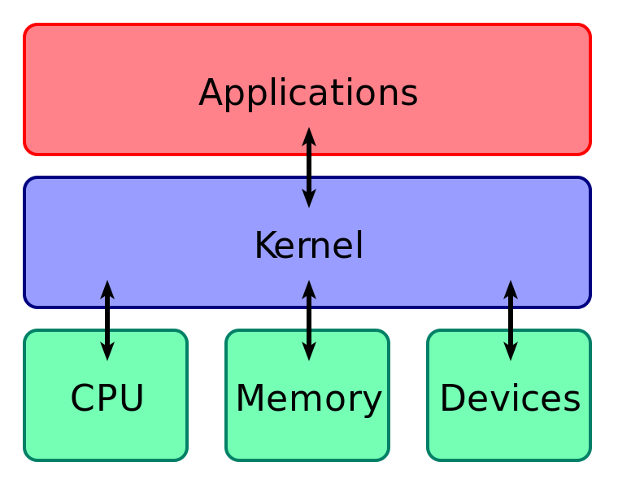
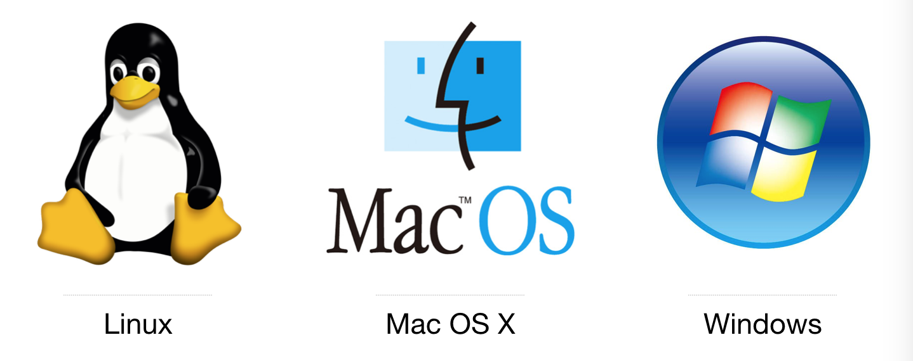
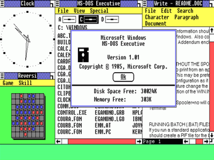

## 操作系统&电脑

在进行各种编程活动之前，我们先讨论一下一切应用软件运行的“大环境”——操作系统。操作系统的定义可以从两个方向来理解。一个是自顶向下，站在应用程序的角度讲，操作系统负责隐藏硬件的各种丑陋接口，向上提供给程序量化、优雅、一致的抽象；另一个角度是自底向上，操作系统负责在相互竞争的程序之间有序地控制对处理器、存储器以及其他I/O接口设备的资源分配，即调度者。

<figure>

<figcaption>操作系统内核在现代计算机体系中的层次，介于应用程序与硬件之间。</figcaption>  
</figure>

### 个人计算机操作系统

目前，在个人计算机领域主要存在着三大类操作系统：

在知名的应用统计网站 [https://netmarketshare.com/](https://netmarketshare.com/) 上面可以看到个人 PC/笔记本所使用的主要操作系统的市场占有率（截止到2018年6月）：

|    操作系统    |     占有率     |
|:-------------:| -------------:|
|     Windows   |     88.40%    |
|     Mac OS    |      8.90%    |
|     Linux     |      2.24%    |
|   Chrome OS   |      0.32%    |

**Linux**

Linux 是 UNIX 阵营里的佼佼者，虽然其早期是“寄生”在 Minux 上面，但其开发与后续的演进却并不包含任何来自原始 Unix 源码树的代码，而是基于 POSIX 标准（Portable Operating System Interface，可移植操作系统接口）实现，这使得 Linux 与 Unix 有着非常相似的行为，应用程序很容易在两个操作系统之间移植。从 1991 年 9 月发布 0.01 版本以来，林纳斯一直主导着 Linux 内核的开发。Linux 是一款开源的操作系统，意味着任何人都可以免费获取源代码与使用（在 GPL 协议所约定的方式）。Linux 的后期开发也是迄今为止规模最大的开源协作项目。如今，林纳斯（Linus Torvalds）甚至将 Linux 内核源码同步到了 Github 网站上[5]，感兴趣的读者可以去阅读一下源代码。同 UNIX 一样，Linux 是由程序员设计的，也是给程序员使用的。Linux 操作系统使用方面的介绍，可以参考《鸟哥的 Linux 私房菜：基础学习篇（第三版）》，这大概是最适合入门者的读物了。

**MacOS X**

MacOS X 使用了卡内基梅隆大学的 Accetta 等人研发的 Mach 内核（属于微内核，Linux 则采用了宏内核方案）。之后，由于乔布斯招安林纳斯来做 MacOS X 的计划宣告失败，只得请 FreeBSD 的发起人之一 乔丹·哈伯德带领团队开发底层内核 Darwin（混合了 Mach 内核与 BSD 技术）。

**Microsoft Windows**

<figure class="fr" style="width: 300px;">

<figcaption>Windows 1.0 的图形界面</figcaption>
</figure>

从诞生之初，微软公司的 Windows 操作系统就一直坚守着用户图形界面这一设计原则。发布于 1985 年 11 月的 Windows 1.0 版本并非严格意义上的操作系统，它只是一个类似 Shell 的程序，包装在里面的是 MS-DOS（Microsoft Disk Operating System），当时的宣传名字叫做 MS-DOS Executive。MS-DOS 实际上是微软从一家名为西雅图计算机产品（Seatle Computer Producst）的本地公司买来后，再移植到 IBM PC 后的产物。Windows 1.0 包括时钟、日历、计算器、记事本、终端、剪切板等组件。

不过，在 80 年代末，微软意识到不能再开发以 MS-DOS 为核心的系统了，决定开发新的内核，即后来的 Windows NT（NT 是 New Technology 的意思）。现在市面上常见的 Windows 10/8/7/XP 等操作系统都是基于 Windows NT 的。Windows NT 系统最开始用于工作站电脑以及服务器电脑。后来逐渐占据了个人计算机市场。Windows NT 最开始计划同时支持三大类操作系统接口，即 Windows API，POSIX 和 OS/2 API。但后来事与愿违，POSIX 和 OS/2 API 在 Windows XP 系统开始，逐渐不被支持。对 POSIX 标准的无视，造成了 Windows 系列操作系统与 Linux/Unix 系统之间的软件不兼容。

### 服务器操作系统

顾名思义，服务器操作系统就是运行在服务器上的操作系统。用作服务器的机器可以是大型的个人计算机（现在比较流行的方案）、工作站，甚至是大型机。服务器操作系统对稳定性、安全性、性能有着更高的要求。常见的服务器操作系统包括 Solaris、FreeBSD、Linux 和 Windows Server 系列。

### 选哪个操作系统？

不得不说，Windows 系统在商业上有着巨大的成功。但是对于 Web 程序员们来说，Windows 通常并不是开发环境的首选（微软员工可能除外）。Eric S. Raymond 在自己的著作《UNIX 编程艺术》中提到了操作系统对使用者的影响：

> 操作系统的设计有所不同，造就了该系统下软件开发大大小小、方方面面的风格。……总的来说，与不同操作系统相关的设计和编程风格可以追溯出三个源头：
> - 操作系统设计者的意图
> - 成本和编程环境的限制对设计的均衡影响
> - 文化随机漂移，传统无非就是先入为主

不同的操作系统存在的纯用户转变为开发者的门槛有所不同。Unix 操作系统都会默认安装编译器和脚本工具，并且默认就是（或者可以随时切换到）命令行界面（CLI，Command Line Interface）。CLI 具有高度的脚本化能力，它们很容易就能支持程序的搭配，相比非技术用户喜爱的 GUI，通常更简洁、更有表现力。诸如此类的特点，使得人们常说 Unix 是程序员写给程序员的。

CLI 还是 GUI？初学者通常倾向于选择易用的 GUI 交互方式，而老手则会越来越愿意在 shell 中输入命令。GUI 程序适合对单一任务，要求所见即所得，或者能够方便预览的场景。例如在图片上面编辑文字，或者编辑代码。CLI 程序则适合需要进行批处理、脚本化、自动化等较多重复性工作的场景。1984 年后人们对 GUI 兴趣的爆发，多半是因为商业消费类软件的大规模出现。GUI 的易用性吸引了大量的初学者。然而程序员不该将自己一直定位为初学者，要变成在电脑面前“发号施令”的那个角色，而不是成为 GUI 界面上的操作工。

Windows 系统在网络支持方面的落后，以及系统天然的各种强制约束（例如 GUI 运行在内核中、不够安全等等），导致 2000 年后，其在服务器操作市场领域完全输给了 Linux。这也是为什么很多 Web 开发者（Web 前端工程师也不例外）选择在 Lnix 操作系统下进行软件开发工作。除了上面提到的那些优点，因为绝大部分 Web 服务是由运行了类 Unix 系统的服务器提供的，所以开发时如果可以保持开发环境与生产环境的一致，可以提前规避很多问题。

**总而言之，推荐读者在 Unix 系列的操作系统下编程，包括 Linux、MacOS X、FreeBSD 等，其独特的编程艺术、优雅的设计哲学，会启示你写出更好的软件。**

### 关于 POSIX

早期 UNIX 系统经历了 BSD 与 System 两个系统的分流。各种非标准的实现给软件供应商带来很大的苦恼：既要保证软件能够在 BSD 上面运行，又要确保 System V 下也没有问题。UNIX 世界的这种分裂极大地阻碍了 UNIX 的商业成功。于是，IEEE 召集了上百名来自业界、学界以及政府的人员成立了一个标准委员会。名字就叫做 POSIX。在经历了多次讨论后，POSIX 委员会制定了一个标准，名字为 1003.1，它规定了每一个符合标准的 UNIX 系统必须提供的库函数。POSIX 的意义就在于：一个软件经销商写了一个只调用了符合 1003.1 标准函数的程序，那么他就可以确信这个程序可以运行在任何一台按照标准实现的 UNIX 系统上。

林纳斯在写 Linux 内核时，就意识到了标准的重要性。1991 年 7 月 3 日，林纳斯在 MINIX 新闻组里发了个帖子，希望有人能够给他发一份 POSIX 规则文件：

> 各位网友大家好！
> 由于我目前正在 Minix 系统下做一个项目，所以对 POSIX 标准定义很感兴趣。不知道有没有人能给我提供一个最新版的 POSIX 规则（最好是以一种机器可读的格式）？要是能有 FTP 地址就更好了。

### 选择电脑

苹果电脑因为拥有极佳的硬件配置，并且其操作系统 Darwin 是 Unix 的一个发行版，Linux 的特点它基本都具备，所以成为了国内不少互联网公司程序员的标配。对于个人来说，如果预算充足，可以直接买台 Macintosh 系列的电脑。如果你没有 Mac，那么可以安装任何一款你喜欢的（或者有兴趣的） Linux 操作系统，毕竟 Web 前端开发对计算机的性能要求并不高。Ubuntu[2] 有着友好的界面，通常是入门者的选择；而 CentOS[3] 由于在服务器端的应用更为广泛，也是非常适合开发者安装的系统；一些更为资深的开发者会选择 Arch Linux[4]，读者也可以有余力的时候挑战一下。

本书所有的代码、命令都在安装了 MacOS@10.12.6 的 Macbook Pro 机器上面执行通过。

### 关于手机操作系统

### 参考资料

1. Eric S. Raymond. UNIX编程艺术 [M]. 北京: 电子工业出版社, 2012.
2. [Ubuntu 官网](https://www.ubuntu.com/index_kylin)
3. [Centos 官网](https://www.centos.org/)
4. [Arch Linux 官网](https://www.archlinux.org/)
5. [linux | github](https://github.com/torvalds/linux)
6. 如果想了解一下 Linus 与 Linux 的经历，可以读一下他 2001 年写的自传《只是为了好玩》（**Just for Fun**）.
7. Andrew S. Tanenbaum. 现代操作系统（第3版）[M]. 北京: 机械工业出版社, 2009.
