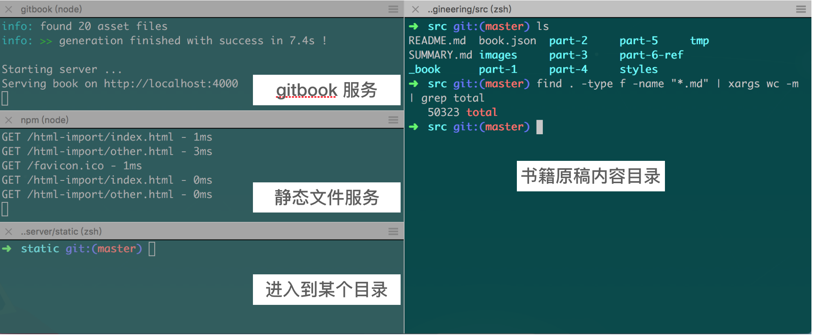
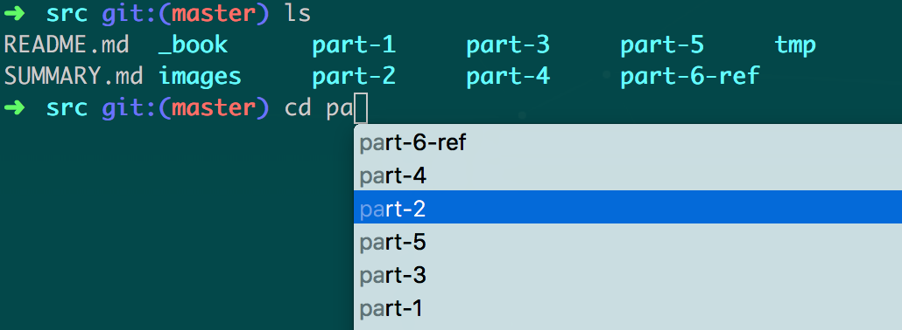
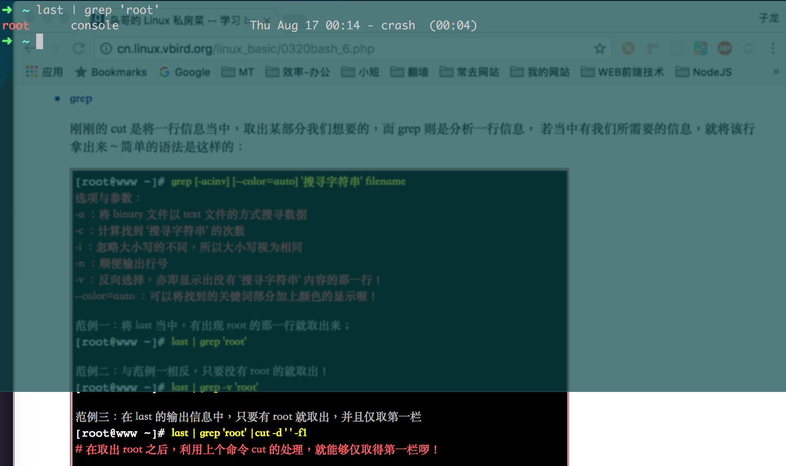
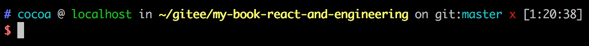
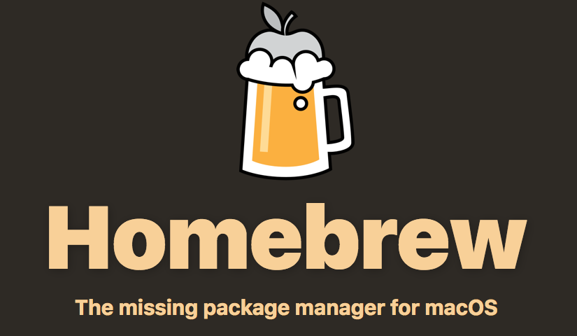

## Mac 终端与常用命令行工具

下面介绍的工具适用于 Mac OS。

### XCode

在 Mac OS 下进行开发，需要用到 XCode 里的一个子工具：Command Line Tools for Xcode。可以通过如下命令触发安装进程：

```bash
$ xcode-select --install
```

完整的 XCode 工具通常体积很大。不过其提供的模拟器（Simulator）在调试 iOS Safari 浏览器页面时是非常方便的，所以建议完整地安装 XCode。

### Iterm2

无论开发或者运维，亦或平时进行一些简单的任务，使用终端（Terminal）都比 GUI 界面程序高效得多。MacOS 虽然自带了一个终端，却并不好用，如果不借助于 Oh-my-zsh 这样的工具，甚至都无法进行文件名称补全提示。此外，MacOS 的终端也不支持窗口分隔为多面板（Split Panes）。

怀着打造一个好用的 MacOS 终端的理念，Iterm2 诞生了，它是用 Objective-C 为主要编程语言开发的终端模拟程序（terminal emulator）。它有许多方便的功能：

**多个窗口**

Iterm2 最常用的功能，是将当前标签分割为多个面板。例如我在写这本书的时候，将标签分为四个面板：



**自动补全（Autocomplete）**

输入单词的开头部分，然后按 `Cmd` 和 `;`，就可以出现自动补全提示选择框，通过上下箭头或者鼠标，可以直接选择自己想要输入的词语。如下图所示。



**随时随地召唤 Iterm2（Hotkey Window）**

在 Iterm2 的偏好设置里（`Preferences` -> `Keys` -> `Create a Dedicated Hotkey Window`），可以设置一个能够通过快捷键随时打开的悬浮半透明终端窗口。这个功能对于随时想敲上几句命令行的开发者来说很有帮助。好比我正在浏览鸟哥的Linux私房菜网站，看到有个命令很有意思，想尝试一下。就可以通过这种方式快速“召唤”出 Iterm2（如果希望在全屏模式下也可以悬浮显示 Iterm2，需要设置其打开的方式为 `Floating Window`）：



**其他**

此外，Iterm2 还有选择文本并复制的快捷方式，保留粘贴历史，强大的搜索，以及命令回溯功能。可以在其官网<sup>[1]</sup>获得更详细的使用说明。


### Zsh 和 Oh-my-zsh

1990年，Paul Falstad 还在普林斯顿大学读书时，写出了 Zsh 的第一版。程序的名字“zsh”来源于当时的一位助理教授（如今已经是耶鲁大学的教授） Zhong Shao 的账号 ID，Paul Falstad 用 “zsh” 命名这个程序向他致敬<sup>[3]</sup>。如今也可以认为 zsh 是 “Z bash” 的缩写。Zsh 要比 Unix/Linux 自带的 bash 好用得多。

Zsh 有许多优秀的插件，可以提升工作效率。例如 git 插件，当你在使用了 git 的目录下工作时，Zsh 就总是可以显示当前所在的分支，以及是否有变动。

Oh-my-zsh 则是一个 Zsh 配置管理框架。安装 Oh-my-zsh 前要确保 Zsh 已经装好（Mac 预装了 Zsh，所以很方便）。运行下面的脚本可以安装 Oh-my-zsh：`sh -c "$(curl -fsSL https://raw.github.com/robbyrussell/oh-my-zsh/master/tools/install.sh)"`

Oh-my-zsh 还提供了多种主题包供选择，在 `~/.oh-my-zsh/themes/` 目录下列出了所有可用的主题。例如在 `~/.zshrc` 里配置：

```bash
# 默认主题是 robbyrussell
# ZSH_THEME="robbyrussell"
ZSH_THEME="ys"
```

即可切换主题为 `ys`：



### Homebrew

 对 Mac 用户而言，虽然系统已经携带了应用商店（App Store），但里面的软件大都是面向非程序员用户。对开发者来说，需要有像 Ubuntu 下的 `apt-get` 程序那样的软件管理器。Homebrew <sup>[2]</sup>就承担了这样的角色，它也许是 MacOS 上最好的开源软件管理工具，最初由 Max Howell 在 2009 年用 Ruby 语言开发，现在则有十多个开发者一起维护其核心代码。用户不需要安装 Ruby，因为它早已在 MacOS 中预装好了。通过在终端运行下面的命令，可以安装 Homebrew：`/usr/bin/ruby -e "$(curl -fsSL https://raw.githubusercontent.com/Homebrew/install/master/install)"`

Homebrew 会将程序安装到其自己的目录下（在 Mac 中，通常位于 `/usr/local/Cellar` 目录下），然后将其可执行文件链接到 `/usr/local` 目录下。以 `wget` 程序为例，安装时执行：

```bash
$ brew install wget
```

wget 会被解压到 `/usr/local/Cellar/wget` 中：

```
Cellar
└── wget
    └── 1.18
        ├── README
        ├── bin
        │   └── wget
        ├── ...
```

而在 `/usr/local/bin` 目录中，会创建一个软链接 `wget` 指向 `/usr/local/Cellar/wget/1.18/bin/wget`，可以像下面那样来查看链接情况：

```bash
$ cd /usr/local
$ ls -l bin | grep wget
wget -> ../Cellar/wget/1.18/bin/wget
```

------------------

Max Howell 在 2015 年曾经闹出过一段新闻，喜剧性地描述是这样：Max Howell 去谷歌面试，面试官让他对一个二叉树进行反转，然而 Howell 没有回答上来，结果就是没有被谷歌聘用。Howell 回家后在 Twitter 上表达了自己的怨念：

> Google: 90% of our engineers use the software you wrote (Homebrew), but you can't invert a binary tree on a whiteboard so f*** off.

知名在线编程网站 Leetcode 则趁机将这个问题添加到自己的题库里（226-Invert Binary Tree<sup>[4]</sup>），并且将难度标记为“Easy”。

------------------


## 参考资料

1. [Iterm2 官网](http://iterm2.com/)
2. [Homebrew 官网](https://brew.sh/)
3. [Zsh | wikipedia](https://en.wikipedia.org/wiki/Z_bash)
4. [226. Invert Binary Tree | Leetcode](https://leetcode.com/problems/invert-binary-tree/description/)
