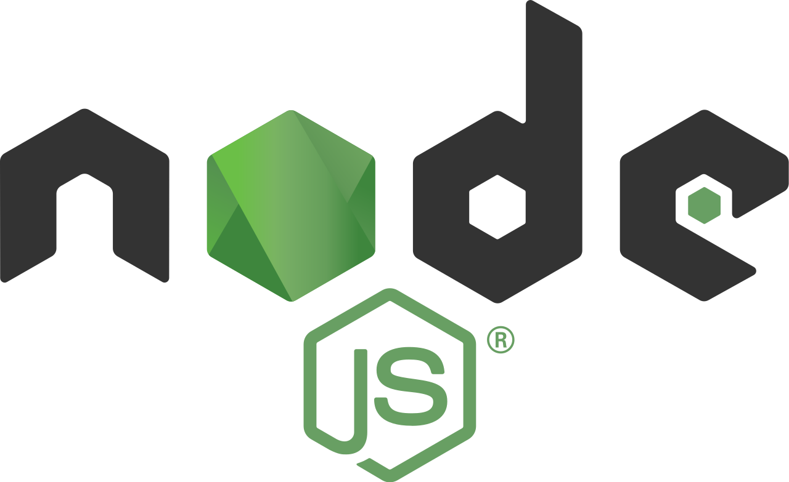

## Node.js 环境

Node.js<sup>[1, 2]</sup> 是一个跨平台的 JavaScript 运行时环境，由 Ryan Dahl 在 2009 年开发出来。在过去的8年里，Node.js 及其生态圈的发展可以用突飞猛进、日新月日来形容。前端开发者通常用 Node.js 来进行文件构建（例如 gulp、webpack 一类的构建工具）、提供页面服务（例如 express.js、koa.js 这样的服务器端框架），或者写一些网络、计算类的程序（例如爬虫）。



### 用 NVM 管理 Node.js

我们可以直接下载安装 Node.js，这样的话操作系统里共用一个 Node.js 程序。但是 Node.js 社区异常活跃，其开发迭代的速度非常快，更好的方式是使用 NVM（Node.js Version Manager，Node 版本管理工具，作者是 Tim Caswell） 来管理系统里的 Node.js，可以同时安装任意多个版本，然后在使用时指定需要的 Node.js 版本即可。可以下载并执行其 Github 仓库里的 `install.sh` 脚本来安装 NVM （可以在其官网上找到具体的命令，地址：[https://github.com/creationix/nvm](https://github.com/creationix/nvm)）：

```
# 这个命令的意思是，从该网址下载文本内容，然后将内容交给 bash 去运行
curl -o- https://raw.githubusercontent.com/creationix/nvm/v0.33.8/install.sh | bash
```

安装好 NVM 后，就可以方便地使用 nvm 命令安装或切换当前会话使用的 Node.js 版本。NVM 的常用命令：

```
# 从服务器查询目前所有可安装的 Node 版本
nvm ls-remote

# 查看当前安装的 nvm 程序的版本，如果安装正确，会打印 0.33.8
$ nvm --version

# 下载并安装某个版本的 Node.js
$ nvm install 9.7.0

# 查看当前系统已安装的所有 Node.js 版本
$ nvm ls

# 在当前的会话中，使用某个已安装了的 Node.js 版本
$ nvm use 9.7.0

# 查看当前所用 Node 版本
nvm current

# 设置默认的 Node 版本。这个命令会在 /.nvm/alias/default 文件中写入默认的 Node 版本号
nvm alias default 9.7.0

# 如果某个版本的 Node 因为太古老等原因，你不再使用它，可以这样卸载掉
nvm uninstall 0.10
```

**NVM 工作原理**

安装 NVM 时，`install.sh` 脚本实际上会将 NVM 的代码仓库下载到 `~/.nvm` 目录。然后在你的配置文件（`~/.bash_profile`，`~/.zshrc`，`~/.profile`，或者 `~/.bashrc`）里添加下面的启动脚本：

```
export NVM_DIR="$HOME/.nvm"
[ -s "$NVM_DIR/nvm.sh" ] && \. "$NVM_DIR/nvm.sh" # This loads nvm
```

The script clones the nvm repository to ~/.nvm and adds the source line to your profile (~/.bash_profile, ~/.zshrc, ~/.profile, or ~/.bashrc).
TODO

NVM 实际上是一系列 shell 脚本的集合。

**`.nvmrc`描述文件**

在项目的根目录下，可以通过 `.nvmrc` 文件来指定当前项目希望使用的 Node.js 版本。例如：

```
# 在项目的根目录下运行
$ echo "9.7.0" > .nvmrc
$ nvm use
Found '/path/to/project/.nvmrc' with with version <9.7.0>
Now using node v9.7.0 (npm v5.6.0)
```

nvm 的更多用法可以参考其官网<sup>[3]</sup>，或者运行 `man nvm` 来获得帮助。

### NPM - Node.js 包管理工具


### 参考资料

1. [Node.js 官网](https://nodejs.org/en/)
2. [Node.js | wikipedia](https://en.wikipedia.org/wiki/Node.js)
3. [nvm | github](https://github.com/creationix/nvm)
