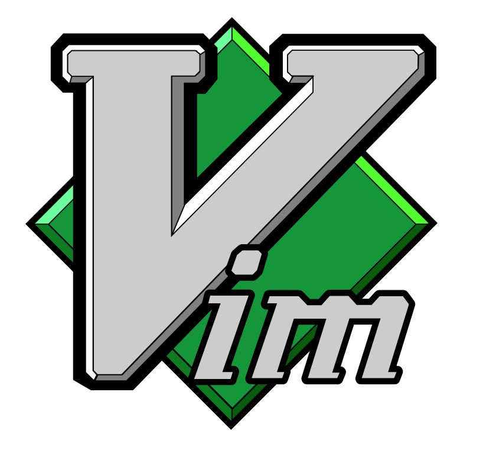
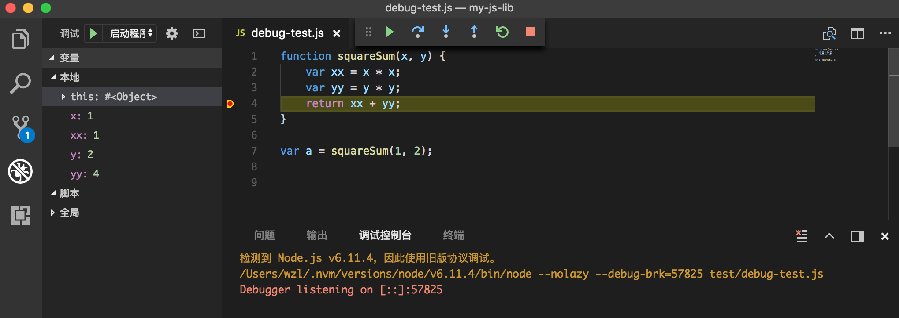

# 代码编辑器

> 工欲善其事，必先利其器。
>
> ——孔子，《论语·卫灵公》

所谓“工欲善其事，必先利其器”，又有俗语“磨刀不误砍柴工”。好的编辑器是高效开发的必备条件。这里我们介绍几个前端开发中最为常见的编辑器。

## Sublime Text


Sublime Text 是一套跨平台的文本编辑器，支持基于Python的插件。Sublime Text 是专有软件（意味着在使用、修改上有所限制），可通过包（Package）扩充本身的功能。大多数的包使用自由软件授权发布，并由社区建置维护。Sublime Text 由 Jon Skinner 开发与维护，初始版本于 2008 年发布，目前最新的版本是 Sublime Text 3。

英文 `Sublime` 意为“卓越的，令人惊叹的”。正如其名，Sublime Text 有着许多让人喜欢的功能：

+ “Goto Anything”功能：可快速跳至文件、符号或行数
+ “Command Palette”功能：弹性快捷键功能
+ 多行编辑：用户可一次选择多行并进行同步编辑。
+ 基于 Python 语言的外挂 API
+ 针对个别项目使用不同的编辑器设置
+ 通过 JSON 文件自定义设置值
+ 多面板编辑
+ 高性能
+ 跨平台（Windows、Linux 和 Mac OS X）
+ 代码摘要：用户可替常用的代码片段指定关键字快速插入。

在官网可以下载最新的程序。对于 Mac 系统，安装后创建下面的文件连接可以方便地使用快捷命令启动 Sublime Text。其官网的说明有点瑕疵，这里建议参考 Olivier Lacan<sup>[8]</sup>的方法，既将快捷命令（symlink）放于 `/usr/local/bin` 目录下，而非 `~/bin` 目录下，因为前者是 OS X 系统的默认可执行程序的加载目录（`$PATH`里默认有 `/usr/local/bin` 而没有 `~/bin`）：

```
# 创建 symlink
ln -s "/Applications/Sublime Text.app/Contents/SharedSupport/bin/subl" /usr/local/bin/subl

# 使用 subl 打开文件、目录
subl .
```

------------

**关于 `symlink`**

术语 `symlink` 的全称是 `symbolic link`，即“符号链接”，或所谓的“软链接”（`soft link`），是指某文件的内容包含指向其他文件或目录的地址。软链接在 1978 年的小型机操作系统里（如 DEC）就得到了实现，如今已被列入到 POSIX 标准中。因此所有的类 UNIX 系统，如 FreeBSD、Linux、Mac OS X，都支持此特性；Windows 系统下类似的功能是“快捷方式”。<sup>[9]</sup>

与软链接相对的是硬链接。二者的最大区别在于，硬链接与被链接的文件具有相同的 inode 号，而软链接本身有自己的 inode 号且与被链接的文件的 inode 号不同。

------------

## Vim



Vim 是从 vi（visual editor 的缩写，Bill Joy 发明） 发展出来的一个具有 TUI（Text User Interface，文本用户界面，与 GUI，即图形用户界面相对应）的编辑器。代码补完、编译及错误跳转等方便编程的功能特别丰富，在程序员中被广泛使用。Vim 的第一个版本由布莱姆·米勒（Bram Moolenaar）在 1991 年发布，源码主要由 C 语言写成。最初的简称是 Vi IMitation，随着功能的不断增加，正式名称改成了 Vi IMproved。现在是在开放源代码方式下发行的自由软件。<sup>[4]</sup>

Vim 对重复性操作进行了很好的优化。“对于 Vim 高手来说，Vim 能以思考的速度编辑文本”，这是对 Vim 最流行的描述。即便不把它作为自己的常用编辑器，在登录到服务器上的时候，Vim 很可能就是你唯一可用的编辑器。所以，Vim 应当作为前端程序员的必备技能之一。

MacOS X 和 Linux 系统都预装了一个可以开箱即用的轻量级 Vim。可以通过输入 `vim` 命令查看当前所用 Vim 的版本。当前的最新版本是7.4，如果要想获得更多的功能，最好还是重新安装一下：

```bash
# Mac OS X
$ brew install vim

# Linux Ubuntu
$ sudo apt-get update
$ sudo apt-get install vim
```

Vim 有四种常见模式（mode），在不同的模式下，即便相同的按键，也可能有不同的结果。

- 普通模式——Vim 的默认状态，在这里可以进行高效率的操作。例如，按下 `dd`（两次 `d`）键可以删掉一行文本。
- 文本插入模式——一种所见即所得的状态。在普通模式下，按 `i`、`a`、`A` 等键均可进入插入模式；而按 `esc` 键，或者按组合键 `ctrl` + `[` 则可以退出插入模式，回到普通模式。
- 可视模式——可视模式允许我们选中一块文本区域并在其上进行操作。
- 命令行模式——在命令行模式中可以输入会被解释并执行的文本。例如执行命令（":"键），搜索（"/"和"?"键）或者过滤命令（"!"键）。


## Emacs


Emacs 意为 Editing MACros，即宏编辑。Emacs 在 1970 年代诞生于 MIT 人工智能实验室（MIT AI Lab），源码主要是使用 ELisp 写成。Emacs 不仅仅是一个编辑器，它本质上是一个集成环境，进入到编辑器后，用户会感觉如同进入了一个功能完备的子操作系统中去，因为你可以在这里收发电子邮件、通过 Telnet 登录远程主机、上 Twitter、玩游戏以及浏览网站等等。因此，一个流行的笑话声称 Emacs 是一个伪装成编辑器的操作系统。

Emacs 被设计为可编程的编辑器，设计者赋予了它可以驱动其他工具的能力，结果就是 Emacs 支持在一个共享的上下文环境中处理所有的文本操作——文件、邮件、新闻、调试符号。它可以用作任何拥有交互文本界面命令的定制前端。Emacs 功能丰富，也意味着庞大臃肿，启动通常较慢。设计者希望用户可能一旦进入 Emacs，就不会再退出它。

注：在 Unix 文化里，Emacs 是程序员们关于编辑器之战的两大主角之一，另一个主角就是上面提到的 Vim/vi。

Mac OS 自带一个 GNU Emacs，在终端里输入 `emacs` 命令并回车，即可进入该程序的界面。可以通过 Homebrew 重新安装或升级 Emacs：

```
# 安装
brew install emacs --with-cocoa

# 升级
brew upgrade emacs

# 启动 GNU Emacs
emacs
```

Emacs 的入门参考书是《Learning GNU Emacs》（[美] Debra Cameron 著）。

## VSCode

VSCode 全称 Visual Studio Code，于 2016 年正式发布。微软在互联网浪潮中曾一度被大家遗忘，近些年则十分热衷于开源项目。不但开源了自家最新的浏览器 Edge 的所有代码，还精心打造了 VSCode 这样一款非常适合前端开发人员的编辑器。与 Sublime Text、Vim 相比，VSCode 是经典的集成开发环境（IDE），除了常规的语法分析、语法高亮，它可以：

1. 像 C/C++ 的开发环境 Visual Studio 那样在编辑器内调试 Node.js 代码
2. 内嵌了一个终端

用户可以在 VSCode 中指定一个启动脚本（在 `.vscode/launch.json` 中指定），然后在相关的 JS 源文件上面直接打断点，启动调试<sup>[7]</sup>。例如下面的代码，我们在第四行添加了一个断点，然后启动调试，VSCode 就会执行这个文件，然后在断点处停下，此时可以方便地查看变量值、调用堆栈等信息：




## 参考资料

1. [Sublime Text 官网](http://www.sublimetext.com/)
2. [Sublime Text | wikipedia](https://en.wikipedia.org/wiki/Sublime_Text)
3. [Vim 官网](https://www.vim.org/)
4. [Vim | wikipedia](https://zh.wikipedia.org/wiki/Vim)
5. [Emacs | wikipedia](https://zh.wikipedia.org/wiki/Emacs)
6. [VSCode | wikipedia](https://en.wikipedia.org/wiki/Visual_Studio_Code)
7. [Node.js Debugging in VS Code](https://code.visualstudio.com/docs/nodejs/nodejs-debugging)
8. [Olivier Lacan, Launch Sublime Text 3 from the command line](https://olivierlacan.com/posts/launch-sublime-text-3-from-the-command-line/)
9. [Symbolic link | wikipedia](https://en.wikipedia.org/wiki/Symbolic_link)
