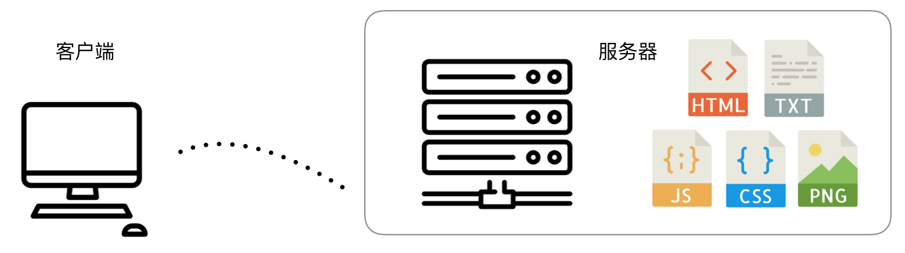

# 前端简史

### 世界上第一个网站

世界上第一个网站是由在英国 CERN（欧洲核子研究中心，法语为 Conseil Européen pour la Recherche Nucléaire，因此缩写为 CERN，对应的英文名称是 European Council for Nuclear Research） 工作的一位科学家，蒂姆·伯纳斯－李（Tim Berners-Lee），在 1989 年创建的，页面服务由蒂姆的 NeXT 电脑提供（这台机器目前仍在 CERN）。我们现在依然可以在 [http://info.cern.ch/](http://info.cern.ch/) 看到它相关的原始页面。如果打开 [World Wide Web](http://info.cern.ch/hypertext/WWW/TheProject.html)，观察它的响应头，可以看到该文件的最后修改时间（`Last-Modified Time`）是 1992 年 12 月 3 日：

```
# http://info.cern.ch/hypertext/WWW/TheProject.html 请求的 Response Headers
HTTP/1.1 200 OK
Date: Thu, 08 Feb 2018 15:21:53 GMT
Server: Apache
Last-Modified: Thu, 03 Dec 1992 08:37:20 GMT
ETag: "40521e06-8a9-291e721905000"
Accept-Ranges: bytes
Content-Length: 2217
Connection: close
Content-Type: text/html
```

时过境迁，1952年创建的 CERN 的最初目标，是探究原子内部的结构（这也是为什么它的名字里有“核子”，即 nuclear）。而到了今天，人类对于物质的理解已经不仅仅停留在原子核层面，CERN 的研究内容也更为深入，主要为粒子物理领域（particle physics）——研究物质的基础组成及它们之间的相互作用。

World Wide Web (WWW) 项目的初衷是让世界各高校、研究机构的科学家可以分享信息。1993 年 8 月 30 日，CERN 将 WWW 软件公开到了公网中，软件里包括 Web 服务软件、一个简单的浏览器以及一份代码库。随后，CERN 声明这些软件都可自由获取与使用。

万维网从此脱离实验室，“飞入寻常百姓家”。在接下来的二十几年里，不计其数的计算机、智能设备，加快了全球的信息交换速度。信息科技成为21世纪初人类文明进步的最大推手，CERN 的物理学家们功不可没。

1994年，雅虎时代开始。雅虎对当时的几乎所有网站人工进行分类，其数据库中的注册网站无论是在形式上还是内容上质量都非常高。

### 静态页面时期



在静态页面时期，Web 服务器就是最简单的文件服务器。用户主要请求 HTML 文件为入口，然后服务器会响应后续的脚本、样式、图片等资源请求。这些文件由网站开发人员、设计师、内容管理人员一起维护。客户端如果想要与网站进行通信怎么办？发邮件！

这个时期主要以博客为主。

### 动态网页技术

动态网页（Dynamic Web Page）技术的兴起源 于web2.0 浪潮。这个时期，互联网上产生的数据急剧增长，web开发人员需要解决“不同的人进入到某个相同页面时因自身数据或配置的不同而看到不同的效果”这样的需求，给出了动态网页技术这个解决方案。

注：动态网页技术与 DHTML（Dynamic HTML，微软于 1997 年发布 IE4 时提出）技术是有很大差异的，前者务必要有服务器端数据与模板的拼合，而后者则强调在浏览器中的运行时效果。术语 DHTML 在现代 web 开发活动中也很少被提及，程序员们早已很自然地使用 DOM API、BOM API 进行浏览器页面内的编程。

在实现方式上，动态网页技术也存在两类：一是最早借助于服务器端脚本（例如 Perl、PHP、JSP 以及 ASP.NET 等）实现的服务器端动态页面（server-side dynamic web page）；另一种是在 Ajax 技术出现后，主要通过 JavaScript 操作 DOM 来生成视图的的方式，即客户端动态页面（client-side dynamic web page）。

这种技术架构示意图如下：


### 后端主导的 MVC 模式时期

### 前后端分离时期

谁提出的前后端分离解决方案？？

### 前端应用时期


