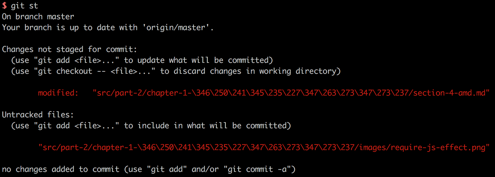
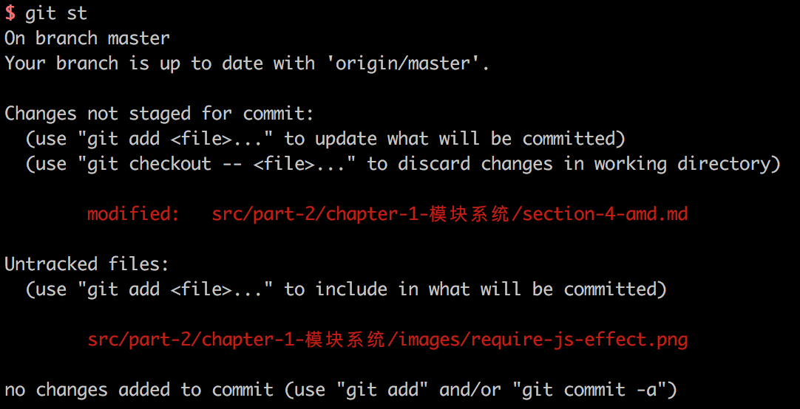
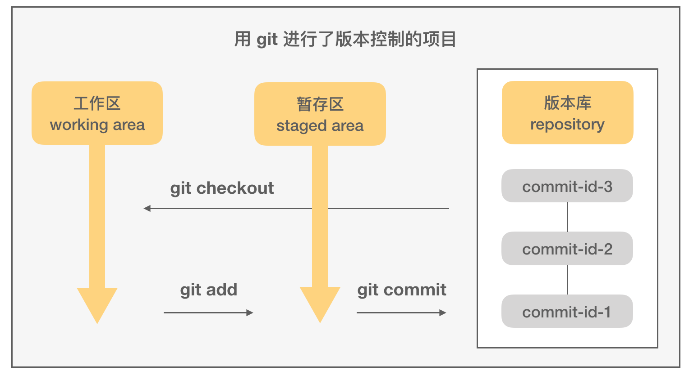

# 用 Git 进行版本控制

### Git 简介


Git 是一款强大的免费开源分布式版本控制系统，其从诞生伊始就确立了提供快速高效的版本控制为设计目标，无论项目大小。Linus Torvalds 在 2005 年 3 月开始开发 Git，最初是用于管理 Linux 的内核代码。2005 年 7 月，Linus 将 Git 项目的维护权转交给了 Junio Hamano，后者向 Git 贡献了最多的源码。Linus 自己则全身心投入到 Linux 内核的开发中。

### 安装 Git

在已经安装好了 Homebrew 的 Mac 系统下，安装 Git 不费吹灰之力：

```bash
# 安装 git
$ brew install git

# 查看当前系统里的 git 版本，以确认其是否已经安装好
# 2018-04-02 发布了 2.17.0 版本
$ git version
git version 2.17.0
```

如果系统里已经安装了 git，那么可以检查一下其是否为最新版本，如果不是，可以按照下面的方法来升级 git：

```bash
$ brew outdated
$ brew upgrade git
```

除了使用 `Homebrew` ，还可以直接在 Git 官网下载适合自己系统的二进制包进行安装。

### 常用设置

**常用操作的别名**

可以为 Git 里最常用的一些命令设置更为简短的别名，可以提高工作效率：

```bash
$ git config --global alias.co checkout
$ git config --global alias.ci commit
$ git config --global alias.br branch
$ git config --global alias.st status
```

这样在切换到某个分支时，就可以只敲 `co` 而不必输入完整的单词 `checkout` 了（节省了 77% 的时间！）：

```bash
$ git co master
```

**字符集设置**

对于日常使用中文的开发者来说，很可能自己的项目中存在一些包含中文字符的文件或目录。而 Git 的默认设置下，运行 `git status` 这样的命令，会将这些文件显示为转义后的效果：



这样的显示对开发并不友好，通过下面的设置，可以把显示时的路径转义取消：

```bash
$ git config --global core.quotepath false
```

这时如果再运行 `git status`，就会看到原本的中文路径了：



**配置文件**

用户对 Git 的特殊配置，都保存在 `~/.gitconfig` 文件里。如果执行过上面的配置，那么查看该文件，可以看到这样的内容：

```
[user]
	email = 809052335@qq.com
	name = zilong-thu
[alias]
	co = checkout
	ci = commit
	br = branch
	st = status
[core]
	quotepath = false
```

此外，运行 `git config --list` 可以查看当前用户生效的所有配置。

### Git 常用命令

**基本命令**

```bash
$ git branch     # 查看所有分支
$ git add --all  # 添加所有文件至暂存区
$ git add .      # 只添加当前目录下的修改文件到暂存区
$ git commit -m '修改说明'  # 根据暂存区的内容创建一次提交
$ git log        # 查看提交历史
$ git log -p     # 详细显示提交与修改变动信息
$ git push origin master   # 将本地仓库的 master 分支推送到远程仓库的 master 分支
$ git fetch origin master  # 拉取远程仓库的 master 分支到本地
$ git checkout branch-name    # 切换到另外一个分支
$ git checkout -b new-branch  # 基于当前分支创建一个新分支并切换到这个新的分支
```

**变基（rebase）**

在多人开发的模式下，如果依然想保持一个尽可能“干净”的提交历史，那么就需要经常用到**变基（rebase）**这个操作了。

TODO

变基是更改提交历史的 Git 操作之一，其他可以更改提交历史的操作还有 interactive rebase（交互式变基）、cherry pick 等。变更提交历史，意味着如果对公共分支进行变基操作，那么会导致其他人无法正常工作（拉、推代码会遇到冲突）。因此，以变基为代表的这些操作，都不应该在公共分支上进行；私有分支，则可以比较放心地使用。

**blame：找到“罪魁祸首”**

`git blame` 可以显示一个文件中的某行到文件末尾的每一行的最后一次修改提交信息，包括 commit ID、修改人、修改时间。因此常常用于在遇到故障时分析相关责任人，即寻找导致 bug 的“罪魁祸首”。

```bash
$ git blame -L 10, summary.md

f4ff42e0 (子龙 2018-02-05 16:19:01 +0800 10)   * [前端组件化](part-1/chapt
86084c7a (子龙 2018-02-28 15:41:22 +0800 11)   * [Welcome on Board](part
86084c7a (子龙 2018-02-28 15:41:22 +0800 12)     * [电脑、操作系统](part-1
86084c7a (子龙 2018-02-28 15:41:22 +0800 13)     * [终端与常用命令行工具](p
86084c7a (子龙 2018-02-28 15:41:22 +0800 14)     * [Node.js环境](part-1/w
...
```

### Git 关键工作原理

**文件的3个区域**



**内容追踪**

Git 的核心是追踪文件内容，而非文件名、目录。Git 对于每个提交，都会完整地生成一份内容快照。

同时为了实现高效的存储，使用了“打包文件”（packfile）的存储机制，即 Git 会时不时地对存储对象重新进行计算，将一部分 blob 打包到一起，然后对那些被合并了的提交，单独进行差异存储。整合的过程有点类似垃圾收集，Git 也的确为此过程提供了一个命令 `git gc`：

```bash
$ git gc

# 通常可以看到如下输出，就是 Git 在优化存储
Counting objects: 1483, done.
Delta compression using up to 4 threads.
Compressing objects: 100% (709/709), done.
Writing objects: 100% (1483/1483), done.
Total 1483 (delta 812), reused 1380 (delta 746)
```

此外，在用户把代码推到远程仓库时，或者 Git 认为 `.git/objects` 目录下的松散对象太多了，Git 就会自动运行一次 `gc`。在进行完存储优化后，再查看 `.git/objects` 目录，会发现所有的对象文件已经被合并了：

```bash
$ find .git/objects -type f
.git/objects/info/packs
.git/objects/pack/pack-3dac3cd61a9ed7e06639df27caf1ca3674888baf.idx
.git/objects/pack/pack-3dac3cd61a9ed7e06639df27caf1ca3674888baf.pack
```

**摘要计算**

对于每个文件，Git 会根据其里面的内容，计算出一个 160 位的 SHA1 摘要值（或称散列值，用十六进制表示的话，就是40位）。这个长度下的散列空间为 2<sup>160</sup>，具有非常好的防碰撞能力。


### 参考资料

读者如果希望更深入地学习 Git 知识，那么 Scott Chacon 和 Ben Straub 所著的 Pro Git（2nd Edition, 2014）可能是目前最好的 Git 学习资料，任何人都可以在网上免费阅读此书：[https://git-scm.com/book/en/v2](https://git-scm.com/book/en/v2)。此外，乔恩·罗力格（Jon Loeliger）与马修·麦卡洛（Matthew McCullough）合著的《Git版本控制管理（第2版）》也不错<sup>[2]</sup>。

1. [Git 官网](https://git-scm.com/)
2. Jon Leoliger, Matthew McCullough 著, 王迪, 丁彦 等译. Git 版本控制（第二版）[M]. 北京: 人民邮电出版社, 2015.
3. Vincent Driessen. A successful Git branching model. http://nvie.com/posts/a-successful-git-branching-model/
