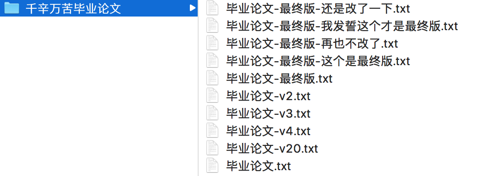
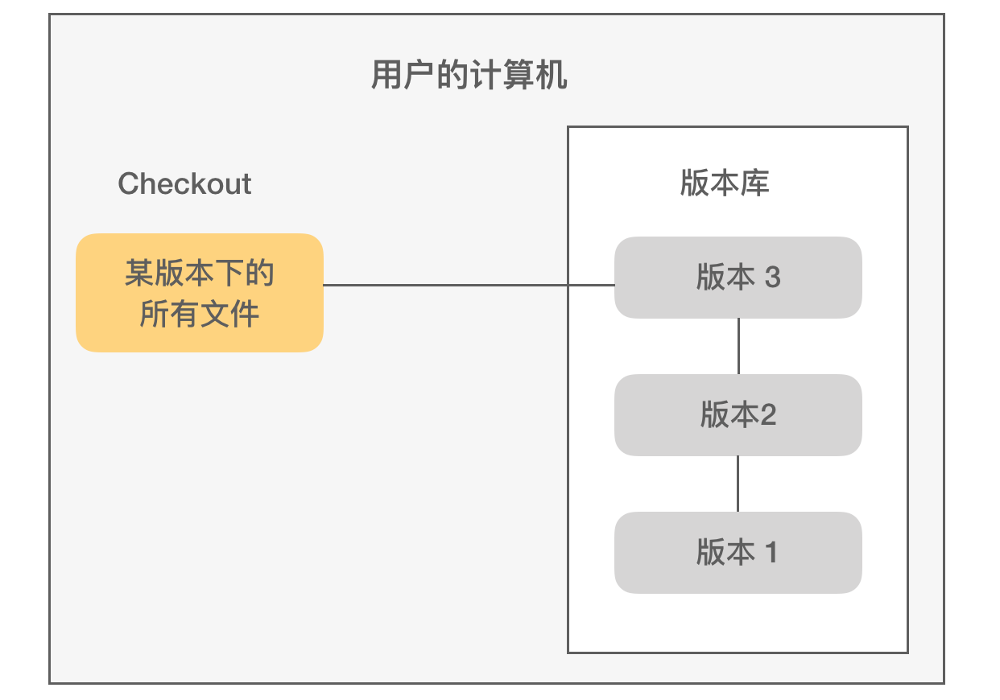

# 版本控制

版本控制系统（VCS，Version Control System）通常用于管理软件开发过程中的源代码文件，好的版本控制系统应该具备多人并行开发、代码变更记录、文件冲突处理机制、分支策略、易于回归等特性。版本控制系统经历过三代演进：

** 本地版本控制（Local Version Control System）**

最原始的本地备份式版本控制，也称为“手工版本控制”。这种版本控制策略，本质上只是文件备份，最常用的方式就是将当期文件复制到另一个目录（可能会添加时间戳）。不少人也许有过类似下面这样命名文件的经历，这其实就是一种本地版本控制策略：

后来程序员们设计了简单的本地文件数据库系统，并且为文件的备份、命名、签出等操作提供了自动化的命令，从而形成了本地版本控制系统：

本地版本控制的代表软件是 RCS（Revision Control System），其诞生于 1982 年，由 Walter F. Tichy 发布，隶属于 GNU 项目。

** 集中式版本控制系统（Centralized Version Control System）**

然后是以 Subversion（通常被叫做 svn） 为代表的中央版本控制系统。

** 分布式版本控制系统（Distributed Version Control System）**

再后来，出现了以 Git 为代表的分布式版本控制系统。

Subversion（2000年）、Git（2005年） 都是免费开源软件，Git 出现的更晚一些，也吸收了前者的很多优点，两者各有优缺点。不过随着 Github 网站的崛起，以及自由软件开发的持续热浪，越来越多的程序员新人更倾向于使用 Git 作为自己主要的版本控制工具，对前端开发人员来说更是如此—— JavaScript 向来是 Github 上面最受欢迎的编程语言（GitHub Universe，2017）。

### 参考资料

1. [Revision Control System | wikipedia](https://en.wikipedia.org/wiki/Revision_Control_System)
2. [Using Git Hooks in Your Development Workflow](https://scotch.io/tutorials/using-git-hooks-in-your-development-workflow)
