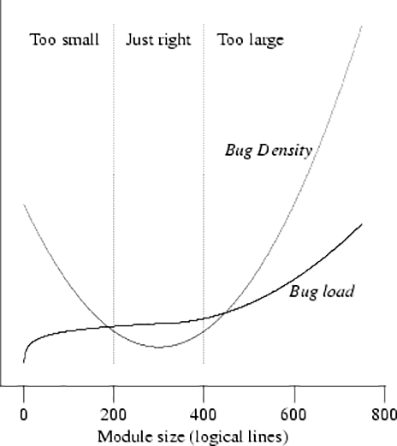

# 模块系统概述

JavaScript 模块系统旨在解决大中型前端应用脚本管理与加载问题。

+ 刀耕火种时代
+ CommonJS
+ AMD 时代
+ ESM 时代

## 模块系统的重要性

### 减少 bug 率

Hatton[1] 研究统计了代码行数与出现的 bug 数量的关系，给出了下面的曲线。结论之一是，一个模块的代码行数在200~400行之间是最佳状态，此时缺陷的密度最低。而且，Hatton 的研究发现，这个行数与所使用的编程语言无关。

## 参考资料

1. IEEE Software. Les Hatton. “Re-examining the Defect-Density versus Component Size Distribution”. March/April 1997.
