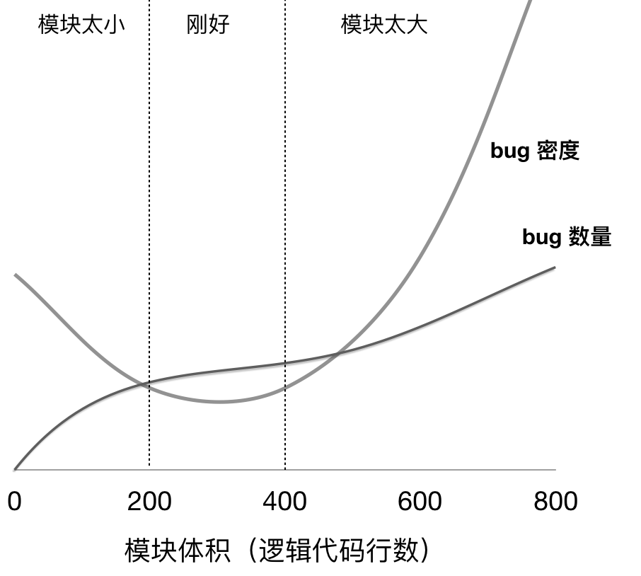

# 模块系统概述

JavaScript 模块系统旨在解决大中型前端应用脚本管理与加载问题。

## 模块系统的重要性

### 减少 bug 率

Hatton[1] 研究统计了代码行数与出现的 bug 数量的关系，给出了下面的曲线。结论之一是，一个模块的代码逻辑行数在200~400行之间是最佳状态，此时缺陷的密度最低。而且，Hatton 的研究发现，这个行数与所使用的编程语言无关。如果考虑到必要的注释、空行等，一个可读性好、思路清晰、易于维护的模块文件代码总行数通常在400~800行之间。

<figure>

<figcaption>Bug 数量、bug 密度随模块大小的变化趋势（根据 Hatton 的曲线重新绘制）。</figcaption>
</figure>

模块的代码行数太小，也会带来 bug 密度的提升，主要是因为模块与模块之间的 API 成本相应增加导致。例如，在一个模块中，当你需要通过追溯多个模块才能发现某个方法、依赖的来源时，这种成本就可以理解为模块间API的成本。

过多的跨模块查找，形成了模块间“沟通”成本。这会干扰你的注意力，使得 bug 产生的概率增加。

### 代码复用与正交性

在程序员的文化里，有一条关于编码行为的 **DRY** 准则常被津津乐道：

> Don't Repeat Yourself.（不要重复自身）
>
> -- The Pragmatic Programmer. 《程序员修炼之道》

DRY 大意是不要随意复制已有代码，要考虑能否复用相关代码。这体现了“正交性”的设计思想。

**正交**是一个非常优雅的术语。在欧几里得空间里，两个向量点积为零则为正交；在物理学中，正交表现为运动的独立性。而在软件工程的领域中，
模块的正交性有这样的特点：在纯粹的正交性设计中，任何操作均无副作用；每个操作只改变一件事情；要修改任何一个属性，有且仅有一个方法可以使用（E. S. M.，《Unix编程艺术》）。

模块化使得同一份代码可以不经复制来做到复用，从而提升系统的正交性。

### 有利于单元测试

在计算机程序设计中，单元测试（Unit Testing）是非常重要的一个环节，其有助于提升代码质量、确保代码可靠性。单元测试又叫模块测试，通常针对小的代码片段编写测试用例。

前端开发中许多功能需要依靠单元测试来确保代码正常运行。例如版本判断与比较、客户端识别模块（解析 `User-Agent`）、URL 处理与解析等等。

## 模块化解决方案分类

回顾前端模块化进程，下面几种 JavaScript 模块化解决方案先后出现：

+ 刀耕火种时代
+ CommonJS 模块规范及在 Node.js 里的实现
+ AMD，异步模块定义
+ ESM，ECMAScript 模块系统

## 参考资料

1. IEEE Software. Les Hatton. “Re-examining the Defect-Density versus Component Size Distribution”. March/April 1997.
