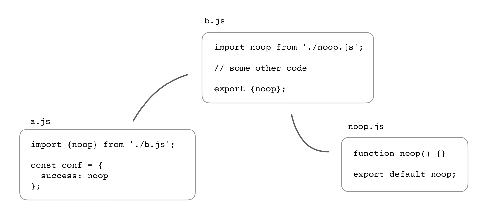

# 模块系统概述

JavaScript 模块系统旨在解决大中型前端应用脚本管理与加载问题。

+ 刀耕火种时代
+ CommonJS
+ AMD 时代
+ ESM 时代

## 模块系统的重要性

### 减少 bug 率

Hatton[1] 研究统计了代码行数与出现的 bug 数量的关系，给出了下面的曲线。结论之一是，一个模块的代码逻辑行数在200~400行之间是最佳状态，此时缺陷的密度最低。而且，Hatton 的研究发现，这个行数与所使用的编程语言无关。如果考虑到必要的注释、空行等，一个可读性好、思路清晰、易于维护的模块文件代码总行数通常在400~800行之间。

模块的代码行数太小，也会带来 bug 密度的提升，主要是因为模块与模块之间的 API 成本相应增加导致。例如，在一个模块中，当你需要通过追溯多个模块才能发现某个方法、依赖的来源时，这种成本就可以理解为模块间API的成本。

过多的跨模块查找，形成了模块间“沟通”成本。这会干扰你的注意力，使得 bug 产生的概率增加。

### 提升复用性

## 参考资料

1. IEEE Software. Les Hatton. “Re-examining the Defect-Density versus Component Size Distribution”. March/April 1997.
