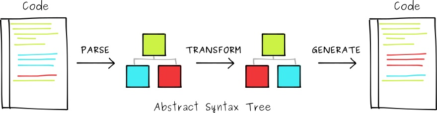

# JavaScript AST、编译器及其应用

## JavaScript AST 等概念

### ESTree 规范

很早之前，FireFox 浏览器所使用的 JavaScript 引擎 SpiderMonkey 曾经提供了一个 JavaScript API，使得开发者可以直接调用 SpiderMonkey 的 JavaScript 分析器。这个 API 所描述的 JavaScript 抽象语法树格式渐渐流行起来，如今成为 JavaScript AST 的通用描述。ESTree Spec 正是在此基础上建立起来的社区规范。在实现上，有这么几个使用较广泛的库：

+ uglifyjs
+ Esprima，是用 JavaScript 实现的 JavaScript 词法分析及语法分析器
+ espree，基于 Esprima，被 ESLint 工具使用
+ Acorn
+ Babylon，在 acorn.js 基础上发展起来，Babel.js 最开始使用的分析器

### Acorn.js


### 关于图灵完备性

图灵完备的编程语言（Turing Complete Language）


## Babel

Facebook 推出的 ECMAScript 编译器 Babel <sup>[1]</sup> 名字源于巴别塔（Tower of Babel）的故事，这个故事则起源于《圣经·旧约·创世记》（Book of Genesis）第11章：

> 大洪水过后，人类使用着同一种语言，当时人们联合起来兴建希望能通往天堂的高塔；为了阻止人类的计划，上帝让人类说不同的语言，使人类相互之间不能沟通，计划因此失败，人类自此各散东西。此故事试图为世上出现不同语言和种族提供解释。


Babel.js 的愿景如传说中那座塔一样，使得我们可以直接按照最新的 ECMAScript 标准书写代码，然后由它来翻译为浏览器已普遍支持的 ECMAScript 5。本质上讲，Babel 就是一款 JavaScript 编译器。

Babel 并非第一个将源码编译为具有更好兼容性的 JavaScript 代码的编译器。在它之前，就有 CoffeeScript 这样的 ECMAScript 方言及配套预处理器存在<sup>[2][3]</sup>。CoffeeScript 诞生于2009年，它借鉴了 Ruby、Python 与 Haskell 等语言中许多优秀的语法，例如箭头函数（Arrow Functions）、解构赋值（Destructuring Assignment）、异步函数（Async Functions）等等，增强了 ECMAScript 的简洁性和可读性。但是随着 ECMAScript 第6版在 2015 年正式发布，CoffeeScript 大部分特性都在标准中得到了支持，这款小而美的 ECMAScript 方言也算完成了它最重要的历史使命。

### 体验 Babel

可以在 Babel 的官网（https://babeljs.io/repl/）中体验编译前后代码的差异。

例如输入这样的一段代码：

```
const arr = [1, 2, 3, 4];
const brr = arr.map(ele => ele * ele);
```

设置输入语言为 es2016，目标代码的运行环境为浏览器（例如 `> 2%, ie 11, safari > 9`），那么 Babel 会将其编译为：

```
"use strict";

var arr = [1, 2, 3, 4];
var brr = arr.map(function (ele) {
  return ele * ele;
});
```

如果试图重新给常量 `arr` 赋值，那么 Babel 会在编译阶段进行报错，然后中断编译过程：

<pre style="color: red;">
<code>repl: "arr" is read-only
  1 | const arr = [1, 2, 3, 4];
  2 | const brr = arr.map(ele => ele * ele);
> 3 | arr = 2;
    | ^</code>
</pre>

### 基本使用

### 工作原理




## 混淆技术

JavaScript 抽象语法树的一个经典应用就是进行代码混淆（Obfuscated code）。代码混淆是将计算机程序的代码，转换成一种功能上等价，但是难于阅读和理解的形式的行为。JavaScript 混淆技术主要采取下面这些策略来混淆源代码：

1. 对函数作用域内的变量、函数名称进行替换，例如改写为单个字母
2. 去除换行、空格、制表符等多余空白符

这里我们以最常见的 Uglify.js 为例，介绍混淆技术的基本使用、关键技术原理等内容。

### 基本使用

安装：

```
$ npm i --save -g uglify-js
```

假如我们在 `in.js` 文件里有如下内容：

```javascript
(function (global) {
  var name = 'Hello';
  console.log(name);
})(window);
```

那么运行：

```
$ uglifyjs in.js -m -o out.js
```

可以在 `out.js` 里看到混淆处理的结果：

```javascript
(function(o){var l="Hello";console.log(l)})(window);
```


## 参考资料

1. [ESTtree Spec](https://github.com/estree/estree)
2. [Esprima](https://github.com/jquery/esprima)
3. [Acorn](https://github.com/acornjs/acorn)
4. [Babel 官网](https://babeljs.io/)
5. [CoffeeScript 官网](http://coffeescript.org/)
6. [CoffeeScript | 维基百科](https://zh.wikipedia.org/wiki/CoffeeScript)
7. [UglifyJS 官网](http://lisperator.net/uglifyjs/)
8. [](https://zhuanlan.zhihu.com/p/32189701)
