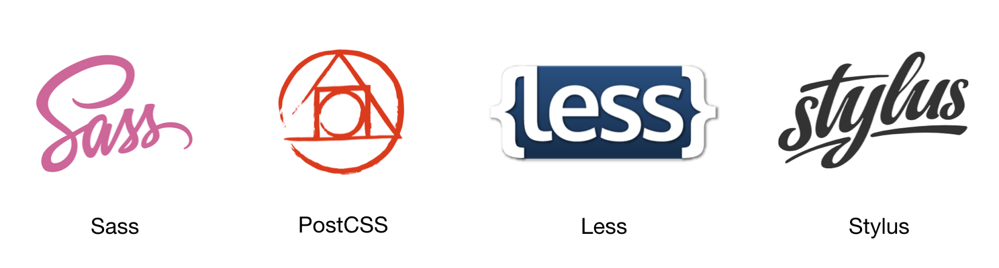

## CSS 预处理

### 为什么需要 CSS 预处理

基于 HTTP 的 Web 诞生后，CERN 的研究员们在文档样式的解决方案上面探索了多种方法，Håkon Wium Lie 提出的层叠样式表（Cascading Style Sheet，CSS）则从中脱颖而出。不过，从 1994 年诞生到 2018 年的今天，24 年来，CSS 也没有什么革命性的变化，尤其是在可编程性方面。它本身只是一种专有的数据格式，不具备图灵完备性，甚至不能定义变量。

目前的各种 CSS 预处理工具都是围绕着增强 CSS 的可编程能力而展开的，它们提供了许多可以提高开发效率的特性，包括但不限于：

+ 声明与使用变量
+ 函数定义
+ 循环语句
+ 嵌套式语法，这个其实是最方便的特性了，有望加入到 CSS 标准里
+ 本地模块化机制

### 常见的预处理工具



目前前端开发中常用的 CSS 预处理工具有 Sass、PostCSS、Less、Stylus 等。2018 年的一份面向前端开发人员的调查数据可以看到各个预处理器的使用比例，如下图所示。Sass 明显是目前最受欢迎的 CSS 预处理器。

<figure>

<figcaption>CSS 预处理工具使用比例。数据来源：https://ashleynolan.co.uk</figcaption>
</figure>

### 预处理器特性：以 Sass 为例

我们以 Sass 为例，来了解一下 CSS 预处理器在语法、模块方面的特性。Sass 的安装与使用有多种方式，我们这里采用 npm 包的形式安装其命令行工具，其他方式可以参考官网<sup>[2]</sup>。

```bash
$ npm install -g sass
$ sass --version
1.10.4 compiled with dart2js 2.1.0-dev.0.0
```

以 Sass 书写的源文件通常用 `.scss` 或者 `.sass` 作为后缀。值得注意的是，Sass 对这两种后缀的文件语法处理规则是不同的：`*.sass` 不允许使用分号、花括号，而是使用两个空格缩进作为块；`*.scss` 则与 CSS 是语法兼容的。

```bash
$ sass --watch input.scss output.css
```

**嵌套（Nesting）**

```scss
html {
  font-size: 100px;
}
.navbar {
  font-size: .14rem;
  .logo {
    display: inline-block;
    height: .5rem;
    width: .5rem;
  }

  button {
    border-radius: .02rem;
    transition: box-shadow .2s;
    &:hover {
      box-shadow: 0 0 5px rgba(0, 0, 0, .2);
    }
  }
}
```

编译后：

```css
html {
  font-size: 100px;
}

.navbar {
  font-size: 0.14rem;
}
.navbar .logo {
  display: inline-block;
  height: 0.5rem;
  width: 0.5rem;
}
.navbar button {
  border-radius: 0.02rem;
  transition: box-shadow 0.2s;
}
.navbar button:hover {
  box-shadow: 0 0 5px rgba(0, 0, 0, 0.2);
}
```

**变量**

SASS 中，一些经常重复使用的属性值可以声明为变量，通常为颜色、字体、字号、高/宽度等。

```scss
$font-stack: Helvetica, sans-serif;
$primary-color: #333;

body {
  font: 100% $font-stack;
  color: $primary-color;
}
```

编译后：

```css
body {
  font: 100% Helvetica, sans-serif;
  color: #333;
}
```

**模块引用**

一个大型的前端项目或开发框架，CSS 通常也会非常庞大。Sass 的模块机制可以帮助降低维护 CSS 源码的复杂度。模块引用通过简单的 `@import "path/to/scssfile"` 来实现，可将该文件的代码放置到当前模块中。

假设我们有这样的目录结构：

```
.
├── icons
│   ├── index.scss
│   └── success.png
├── main.scss
├── output.css
├── output.css.map
└── partials
    └── _reset.scss
```

定义一个重置样式表 `partials/_reset.scss`，以及一个图标样式表 `icons/index.scss`：

```scss
// partials/_reset.scss
* {
  box-sizing: border-box;
  margin:  0;
  padding: 0;
}
```

```scss
// icons/index.scss
.my-icon {
  display: inline-block;
  height: 1em;
  width: 1em;
}

.my-icon-success {
  background-image: url(./success.png);
}
```

在另外一个模块 `main.scss` 中使用它：

```scss
@import "./partials/_reset.scss";
@import "./icons/index.scss";

html {
  font-size: 100px;
}
```

编译后，`output.css` 文件变为：

```css
* {
  box-sizing: border-box;
  margin: 0;
  padding: 0;
}

.my-icon {
  display: inline-block;
  height: 1em;
  width: 1em;
}

.my-icon-success {
  background-image: url(./success.png);
}

html {
  font-size: 100px;
}
```

Sass 有一个小问题：它的 `@import` 会原封不动地把子文件内容替换过来。如果子文件中包含路径，则结果上来看，类似采用了动态上下文，而非更常见的词法作用域。留意上面的代码，在 `./icons/index.scss` 文件中，`url(./success.png)` 是指定了同一目录下的图片；而编译后的 `output.css` 文件里，这个值没有发生变化，`.my-icon-success` 在使用时，就会因找不到该图片而报 404 错误。Less 等工具也有类似的问题。这样有时候不便于重构以及维护。不过，在基于 webpack 的构建流中，这个问题一般可以通过 `loaders` 来解决。

**函数**

**循环语句**

### 预处理器工作原理：以 PostCSS 为例

### CSS Next

### 参考资料

1. Håkon Wium Lie, 1994-10-10, [Cascading HTML style sheets -- a proposal](https://www.w3.org/People/howcome/p/cascade.html)
2. Sass 官网：http://sass-lang.com/
3. PostCSS 官网：
4. Stylus 官网：http://stylus-lang.com/
5. Less 官网：http://lesscss.org/