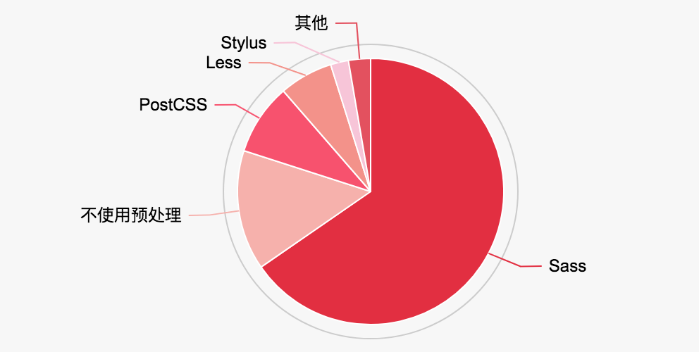

## CSS 预处理

### 为什么需要 CSS 预处理

基于 HTTP 的 Web 诞生后，CERN 的研究员们在文档样式的解决方案上面探索了多种方法，Håkon Wium Lie 提出的层叠样式表（Cascading Style Sheet，CSS）则从中脱颖而出。不过，从 1994 年诞生到 2018 年的今天，24 年来，CSS 也没有什么革命性的变化，尤其是在可编程性方面。它本身只是一种专有的数据格式，不具备图灵完备性，甚至不能定义变量。

目前的各种 CSS 预处理工具都是围绕着增强 CSS 的可编程能力而展开的，它们提供了许多可以提高开发效率的特性，包括但不限于：

+ 声明与使用变量
+ 函数定义
+ 循环语句
+ 嵌套式语法，这个其实是最方便的特性了，有望加入到 CSS 标准里
+ 本地模块化机制

### 常见的预处理工具


目前前端开发中常用的 CSS 预处理工具有 Sass、PostCSS、Less、Stylus 等。2018 年的一份面向前端开发人员的调查数据可以看到各个预处理器的使用比例，如下图所示。Sass 明显是目前最受欢迎的 CSS 预处理器。

<figure>

<figcaption>CSS 预处理工具使用比例。数据来源：https://ashleynolan.co.uk</figcaption>
</figure>

### 预处理器特性：以 Sass 为例

我们以 Sass 为例，来了解一下 CSS 预处理器在语法、模块方面的特性。Sass 的安装与使用有多种方式，我们这里采用 npm 包的形式安装其命令行工具，其他方式可以参考官网<sup>[2]</sup>。

```bash
$ npm install -g sass
$ sass --version
1.10.4 compiled with dart2js 2.1.0-dev.0.0
```

以 Sass 书写的源文件通常用 `.scss` 或者 `.sass` 作为后缀。

```bash
$ sass --watch input.scss output.css
```

**嵌套**

```css
html {
  font-size: 100px;
}
.navbar {
  font-size: .14rem;
  .logo {
    display: inline-block;
    height: .5rem;
    width: .5rem;
  }

  button {
    border-radius: .02rem;
    transition: box-shadow .2s;
    &:hover {
      box-shadow: 0 0 5px rgba(0, 0, 0, .2);
    }
  }
}
```

**变量**

**模块引用**

**函数**

**循环语句**

### 预处理器工作原理：以 PostCSS 为例

### CSS Next

### 参考资料

1. Håkon Wium Lie, 1994-10-10, [Cascading HTML style sheets -- a proposal](https://www.w3.org/People/howcome/p/cascade.html)
2. Sass 官网：http://sass-lang.com/
3. PostCSS 官网：
4. Stylus 官网：http://stylus-lang.com/
5. Less 官网：http://lesscss.org/