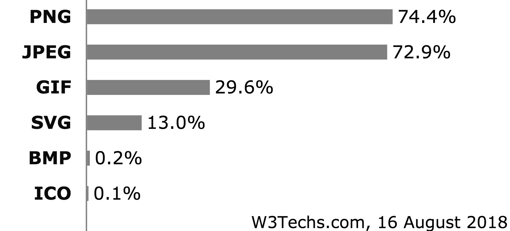
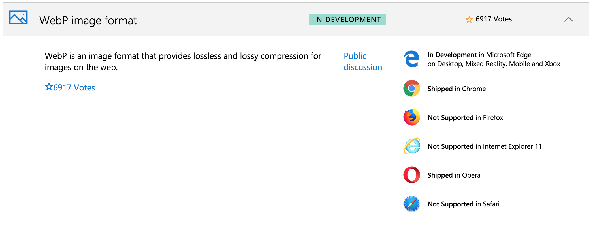
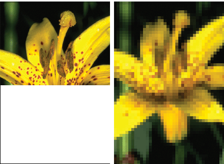
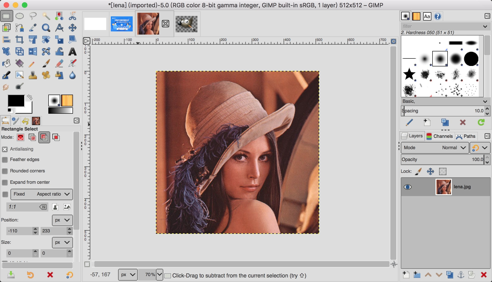
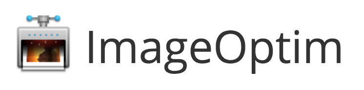
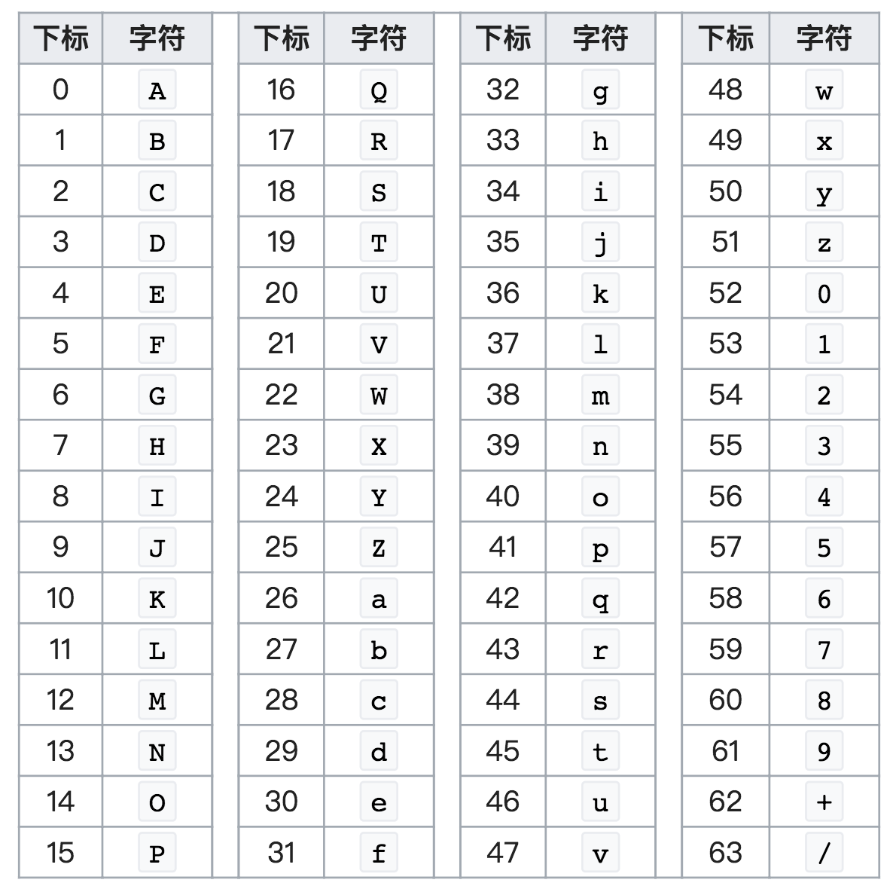
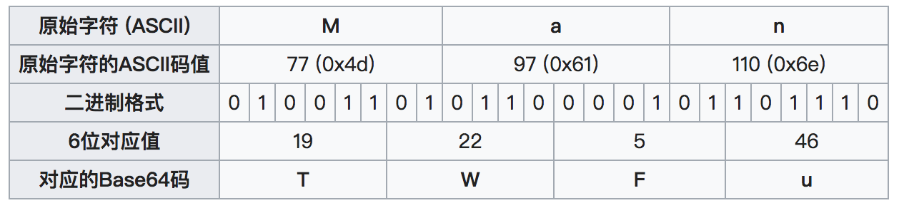

# 图片处理

在互联网上，图片是占据流量比例较高的内容媒介之一。人们常说，一图胜千言。图片在网络上主要担任两类职能：一是作为内容本身传递信息，例如新闻类的图片，用户拍摄的照片，电影的海报图片等等；二是作为指示类的辅助标识，例如按钮图标。其中后者是前端开发构建中需要对体积、图片质量、图片数量进行处理的主要对象，目的通常是为了减少不必要的体积传输、减少 HTTP 请求等，以便加快应用的响应速度。

## 常见图片格式

互联网上的常见图片格式主要有 `gif`、`png`、`apng`、`jpeg`、`svg`、`webp` 等。

<figure>

<figcaption>W3Techs 给出的网站图片格式分类占比，数据时间是 2018 年 8 月。在所调查的网站中，74.4% 的网站使用了 PNG 图片，72.9% 的网站用到了 JPEG 图片。数据来源：<a href="https://w3techs.com/technologies/overview/image_format/all" target="_blank">https://w3techs.com/technologies/overview/image_format/all</a></figcaption>
</figure>

#### GIF

GIF 是 Graphics Interchange Format 的缩写。这种格式于 1987 年出现（比互联网还要早），之后在互联网浪潮兴起后得到了广泛的支持。GIF 格式采用了 LZW（Lempel–Ziv–Welch）无损压缩技术存储图片，LZW 算法在 1985 年开始受到专利保护，这催生了 PNG 标准的诞生（见下文）。2004 年 GIF 相关的专利到期。

GIF 是位图的一种，它使用一个最多可以表达 256 种颜色的表来记录一张图片（一帧）里使用的色彩。对于每个像素，则使用 8 位二进制来表示其颜色值。颜色表可以将真彩色（true color，2<sup>24</sup>种颜色）空间映射到 256 色空间。这种方案在 GIF 诞生的年代非常合理——那时候还很少有硬件设备能够支持 256 种以上的颜色。

在网络图标方面，PNG/SVG 的使用要比 GIF 广泛；真彩色方面的欠缺，不如 JPEG格式。所以，如今 GIF 最大的优势在于良好的支持度以及其将多张图片整合到一起形成动画的能力。前端资源构建流程中，通常很少涉及 GIF 图片的处理。

#### JPEG

JPEG（全称 Joint Photographic Experts Group）是一种常见的数字图像有损压缩（lossy compression）存储格式，它诞生于 1992 年。JPEG 图片通常以 `*.jpg` 或者 `*.jpeg` 作为文件名的后缀。它占据了 MIME 类型中的 `image/jpeg`。JPEG 是 Joint Photographic Experts Group 的缩写。

#### PNG

PNG 是 Portable Network Graphics 的缩写，意为“便携式网络图片”。PNG 格式是作为 GIF 格式的替代方案而提出的，主要原因是 GIF 格式受到专利的保护。PNG 格式支持无损压缩，目前是互联网上使用最广泛的图片无损压缩存储方案。PNG 图片的 MIME 类型通常表示为 `image/png`，并且以 `png` 或者 `PNG` 作为文件名后缀。

PNG 规范在 1997 年的 RFC-2083 中初次进行了阐述。PNG 格式有这样一些特点：

+ 支持 24 位真彩色，并且附加一个 8 位的 alpha 通道（透明度）。所以一个 PNG 图片最高可以表达 32 位的颜色。
+ 无损压缩。这是当年 PNG 为了取代 GIF 而必须完成的设计目标。

具体来说，PNG 有 3 种常用的子格式：PNG8、PNG24、PNG32。PNGcheck 程序<sup>[4]</sup>可以查看一个 PNG 的具体信息，例如在 Mac 系统下：

```bash
# 安装 pngcheck
$ brew install pngcheck

# 查看 pngcheck 程序的版本、作者等基本信息
$ pngcheck
PNGcheck, version 2.3.0 of 7 July 2007,
   by Alexander Lehmann, Andreas Dilger and Greg Roelofs.
   Compiled with zlib 1.2.8; using zlib 1.2.8.
   ... # 省略

# 查看某张图片的信息
$ pngcheck gulp-2x.png
OK: gulp-2x.png (228x510, 32-bit RGB+alpha, non-interlaced, 97.4%).

# 检查某个目录下所有 PNG 图片的信息
$ pngcheck *.png
OK: file-1.png (256x160, 8-bit palette+trns, non-interlaced, 97.6%).
OK: file-2.png (858x660, 32-bit RGB+alpha, non-interlaced, 98.5%).
OK: file-3.png (992x500, 24-bit RGB, non-interlaced, 97.5%).
OK: file-4.png (446x622, 24-bit RGB, non-interlaced, 97.9%).
OK: file-5.png (866x630, 8-bit palette, non-interlaced, 96.9%).
```

PNG 图片通常优先选择无损压缩进行处理，也可以酌情考虑有损转换为 PNG24 或者 PNG8 后再进行无损压缩。PNG 有自己的官方图形处理参考工具 libpng<sup>[5]</sup>。Libpng 诞生于 1996 年，由 ANSI C (C89) 写成，具有良好的跨平台兼容性。libpng 依赖 zlib 库来压缩和解压缩数据。

PNG 图片的所有相关技术可以在 Greg Roelofs 的《PNG 权威指南》（PNG: The Definitive Guide）<sup>[6]</sup>一书中获得。这本书的第二版为 HTML 版，可以在线阅览。

#### APNG

APNG 是指动画版的 PNG（Animated Portable Network Graphics），中文名通常叫做**动态 PNG**。APNG 的第 1 帧为标准 PNG 图像，剩余的动画和帧速等数据放在 PNG 扩展数据块里，因此只支持原版 PNG 的软件会正确显示第1 帧。APNG 规范由 Mozilla 公司的 Stuart Parmenter 和 Vladimir Vukićević 在 2004 年创立。目前移动浏览器和除微软家之外的桌面浏览器都支持 APNG 图片格式。

与 Gif 相比，APNG 有许多优势：

+ 色彩丰富度：Gif 图片只支持 8 位即 256 种颜色，而 APNG 则支持 24 位即真彩色
+ 存储空间优势：Gif 文件里每一帧都是独立的图片；而 APNG 文件里，第一帧是完整的 PNG 图片，但第 2 帧及之后，可以只存储差异数据。因此，APNG 能够在提升了色彩的展现能力的同时，还保留了与 Gif 非常接近的存储体积，甚至更小。

自由、开源软件 APNG Assembler 可以用来制作 APNG 图片。

<figure>

<figcaption>APNG Assembler，一个可以用来制作 APNG 图片的软件。</figcaption>
</figure>

#### WebP

在 Web 上，JPEG 自 1992 年诞生起就几乎成为有损图像的唯一可选格式。这几十年里也有不少研究课题试图找到更高效的有损压缩格式（即在保证相同质量的前提下，使用更少的存储空间）。WebP 格式就是目前比较成功的一个格式。WebP 不止有损压缩，它也支持无损压缩。此外，还有 8 位透明通道、动画、图片元信息等特性。

谷歌是 WebP 技术的发起者及大力推广者。WebP 格式的诞生有些因缘巧合。最初，该团队致力于新的视频格式 WebM 的研发，该格式使用了 VP8 编码技术，工作人员意识到这种压缩编码技术可以用到图片上面。尝试之后效果不错，因此有了 WebP 项目。2010 年 9 月，谷歌首次对外公布了 WebP 图像格式的诞生<sup>[14]</sup>，并且随后整合到了浏览器内核 Chromium 以及移动操作系统 Android 中；此外，谷歌还发布了开源库，以便让 iOS 应用可以正确解析 WebP 图片。WebP 的压缩效果非常可观。谷歌开发团队进行的 WebP、PNG、JPEG 格式压缩对比表明，图片质量相当的情况下，WebP 格式平均要比 PNG 和 JPEG 小 30% 左右（官网 [https://developers.google.cn/speed/webp](https://developers.google.cn/speed/webp/)）。

有损压缩方面，WebP 的思路来源于 VP8 视频编解码技术——**帧内编码**（intra-frame coding）。VP8 的一个特性是帧内预测压缩。WebP 本质上是可以存储与解析一帧 VP8 图像的轻量级容器。

谷歌官方也发布了用于编解码 WebP 图像格式的命令行工具，Mac 下可以通过 Homebrew 安装：

```bash
# 安装好后，可以使用的有两个程序 cwebp 和 dwebp
#  - cwebp 可以将 JPEG、PNG、TIFF 格式的图片转化为 WebP 格式
#  - dwebp 则将 WebP 格式转换为 PNG 格式
$ brew install webp

# 将 PNG 图片转换为 WebP 格式
# cwebp [options] -q quality input.png -o output.webp
$ cwebp gulp-2x.png -o gulp-2x.webp
Saving file 'gulp-2x.webp'
File:      gulp-2x.png
Dimension: 228 x 510 (with alpha)
Output:    8664 bytes Y-U-V-All-PSNR 64.97 58.16 57.22   61.06 dB
           (0.60 bpp)
block count:  intra4:          2  (0.42%)
              intra16:       478  (99.58%)
              skipped:       465  (96.88%)
bytes used:  header:             26  (0.3%)
             mode-partition:    229  (2.6%)
             transparency:     8251 (99.0 dB)
 Residuals bytes  |segment 1|segment 2|segment 3|segment 4|  total
    macroblocks:  |       2%|       0%|       1%|      97%|     480
      quantizer:  |      36 |      36 |      31 |      25 |
   filter level:  |      11 |       8 |       5 |       4 |
Lossless-alpha compressed size: 8250 bytes
  * Header size: 72 bytes, image data size: 8178
  * Precision Bits: histogram=5 transform=5 cache=0
  * Palette size:   256
```

**浏览器兼容性**

在兼容性方面，目前，Chrome、Opera 以及安卓下的浏览器和 webview 都支持 WebP 格式，但是 FireFox、Safari 尚不支持。而根据微软 Edge 浏览器开发者网站的进度报告，因为希望支持 WebP 格式的开发者们投票数较高，因为他们决定在新版的 Edge 浏览器中支持 WebP（从 Edge 18 开始）。

<figure>

<figcaption>微软会在官方 Platform status 中<sup>[8]</sup>放出关于 Edge 浏览器当前支持的功能、在开发中的功能以及开发者们希望支持的功能。上图就是 Edge 对 WebP 格式的支持投票的状况（2018-08-19）。</figcaption>
</figure>

截至 2018 年 11 月，WebP 图像格式在各个浏览器中的支持情况如下所示（根据[https://caniuse.com/#search=webp](https://caniuse.com/#search=webp) 给出的数据绘制）。

桌面端浏览器：

| IE   | Edge | FF | Chrome | Safari | Opera |
|------|------|----|--------|--------|-------|
| No   | 18+  | 65+ | 23+    | No     | 12.1+ |

移动端浏览器对 `webp` 格式的支持普遍好于桌面端。值得一提的是 iOS Safari——一向与谷歌对着干的苹果终于在 2020 年 9 月份发布的 iOS 14 里开始支持 webp 了。

| 安卓浏览器 | Safari | Baidu | QQ浏览器 | UC (安卓) | Opera | IE Mobile | Chrome(安卓) |
|-----------|--------|-------|---------|-----------|-------|-----------|-------------|
| 4.2+      | 14+    | 7.12+ | 1.2+    | 11.8+     | 12+   | No        | 69+         |

我们可以使用传统的**浏览器嗅探**方法判断当前环境是否支持 WebP，即在浏览器里利用 `window.navigator.userAgent` 接口，或者在服务器端获取 HTTP 报文的 `User-Agent` 首部，解析出客户端名称、版本等信息，再结合上面的客户端兼容表，判断当前客户端是否在表里。

**WebP 特性检测**

如果要更准确地判断浏览器是否支持 WebP，最好使用特性检测。WebP 特性检测的思路大都是基于运行时的。例如使用 Canvas 的能力：

```javascript
function testWebpUsingCanvas() {
  /**
   * 参考：【简书】https://www.jianshu.com/p/101b047c1146
   * 因为 canvas 的浏览器兼容性极佳，所以在这里可以使用 canvas 方便地判断
   */
  try {
    return (document && (typeof document.createElement === 'function') &&
      document.createElement('canvas').toDataURL('image/webp').indexOf('data:image/webp') === 0);
  } catch (err) {
    return false;
  }
}
```

上面的 `testWebpUsingCanvas` 很方便，是同步的方法。但是也有些问题：在常见的 Hybrid 开发模式中，iOS 客户端可以使用 WebP 的解析库来支持 WebP 图片，但是 `testWebpUsingCanvas` 函数却可能返回 `false`。此时，可以采用加载真实 WebP 图片并监听其 `onload`、`onerror` 回调事件的方式，更准确地判断浏览器是否支持 WebP：

```javascript
/**
 * 通过加载一张图片来检测浏览器对 WebP 的支持情况
 * 这应该是最接近真实结果的方法了
 * 检测的结果，可以存到 localStorage 里，供下次使用
 */
function testWebpAsync() {
  return new Promise((res, rej) => {
    let img = new Image();

    img.onload = img.onerror = function() {
      // 如果浏览器支持 WebP 格式，那么图片会加载成功，并且可以获取到其真实的高度，即 2px
      const ifSupport = img.height === 2;
      res(ifSupport);
    };

    // 这张图片的高度是 2px
    // 参考：【简书】https://www.jianshu.com/p/101b047c1146
    img.src = 'data:image/webp;base64,UklGRjoAAABXRUJQVlA4IC4AAACyAgCdASoCAAIALmk0mk0iIiIiIgBoSygABc6WWgAA/veff/0PP8bA//LwYAAA';
  });
}
```

在需要判断 WebP 兼容性的地方，可以像下面这样获取结果：

```javascript
testWebpAsync().then(supportWebp => {
  if (supportWebp) {
    // 如果支持的话
  } else {
    // 不支持的话
  }
})
```

## 交错与非交错图像

在使用 `pngcheck` 检查 PNG 图片信息的时候，可以留意到输出的信息中提到了“non-interlaced”，这是指该图片为非交错格式。交错（interlaced）、非交错图像格式的差异体现在网络的加载上，如下图所示。

<figure>

<figcaption>左侧是非交错图片的加载过程，右侧是交错图像的加载过程。通常来说，用户在遇到右侧的加载效果时更愿意等待。图片来源：[8]</figcaption>
</figure>

JPEG、PNG、GIF 都支持以交错或非交错格式存储。交错式编码也叫做渐进式编码（Progressive Encoding）。设计师可以使用 PhotoShop 这样的设计工具在导出图片时选择交错式格式。前端开发人员使用 ImageMagick 程序也可以实现同样的功能：

```bash
# ImageMagick 是软件的版权注册名，而 convert 则是该软件暴露的命令行程序
$ convert test.jpg -interlace Plane test-interlaced.jpg
```

## 压缩与内联工具

大多数网站页面 60%-65% 的体积为图片占据。图片越小，则页面总体积越小，完全加载时间也越快；对于移动设备来说，较小的图片可以节省带宽、减少耗电量。

设计师在交付设计稿、图片素材的时候，可以使用 Adobe Photoshop 等工具对图片进行压缩处理。前端开发人员也可以用 Photoshop，不过这套软件价格不菲，自由软件的世界中，有同样优秀的程序可供选择。命令行工具类，有最著名的 ImageMagick。图形用户界面类的，有 GIMP <sup>[9]</sup>可以用。

### 无损压缩 vs 有损压缩

无损压缩是一些通用算法，它们试图在不丢失数据全部信息的情况下减少数据的空间占用。ZIP 就是最常见的一种无损压缩算法。

### ImageMagick

ImageMagick 最早于 1987 年由 John Cristy 开发出来，当时是为了将 24 位真彩色图片转换为 8 位的图片（即 256 色），以便图片能够在大部分显示器上面正常展示。1990 年，ImageMagick 被作为免费软件公布于世。到现在，ImageMagick 已经具有了丰富的功能，例如格式转换、尺寸调整、图片对比、添加文字/图案、截取部分图片、生成 GIF 图片等各种操作。而且具有优秀的跨平台能力，可以运行在 Linux/Unix/Windows/MacOS（现在甚至支持 iOS、Android）系统下。

<figure>

<figcaption>ImageMagick 的 logo 是一个挥舞着魔棒的巫师，他正在处理蒙娜丽莎的照片。</figcaption>
</figure>

ImageMagick 可以被多种程序语言调用，因此很适合在服务器端使用，提供动态图片生成（例如验证码）、缩略图生成等常见的图片服务。

ImageMagick 支持超过 200 种图片文件格式，包括主流的 PNG、JPEG、GIF、HEIC、TIFF、DPX、EXR、WebP、Postscript、PDF、SVG 等。ImageMagick 的具体使用可以参见其官网<sup>[11]</sup>，或者中文网<sup>[12]</sup>，或者通过 `man` 命令来获取帮助文档。我们这里展示几个常用的命令。

```bash
# 安装
$ brew install imagemagick
$ convert -version
Version: ImageMagick 7.0.7-28 Q16 x86_64 2018-03-25 http://www.imagemagick.org
Copyright: © 1999-2018 ImageMagick Studio LLC
License: http://www.imagemagick.org/script/license.php
Features: Cipher DPC HDRI Modules
Delegates (built-in): bzlib freetype jng jpeg ltdl lzma png tiff xml zlib

# 查看使用帮助
# Mac 下，/usr/local/bin 目录下的 magick 和 convert 实际上都是软链接，最终都指向了同一个程序，
# 即 /usr/local/Cellar/imagemagick/7.0.8-10/bin/magick
$ man magick
$ man convert

# 查看图片的基本信息，包括格式、尺寸等
$ magick identify test.jpg
test.jpg JPEG 690x390 690x390+0+0 8-bit sRGB 65745B 0.000u 0:00.000

# 格式转换
# ImageMagick 的格式转换可以是隐式的，根据后缀名来判断
# 将 foo.png 转换为 jpeg 格式，并保存为 foo.jpg
$ convert foo.png foo.jpg

# 调整尺寸
# 将 foo.jpg 等比例缩放，尺寸为之前的 80%，可以看到 ImageMagick 使用字母 x 来表示乘号
$ convert -resize 80%x80% foo.jpg foo-2.jpg

# 以 70% 的质量来压缩图片，-strip 用于去除图片上的信息元数据
$ convert -quality 70 -strip in.jpg out.jpg

# 图片裁剪
# 从左上角（0, 2px）开始，裁剪出一张 280×101 像素大小的图片
$ convert pub.png -crop 280x101-0+2 pub-2.png
# in.jpg 尺寸为 4160×2340，如果要裁剪掉一部分，宽度不变，高度变为 1900 像素，取居中的部分：
$ convert in.jpg -gravity center -crop 4160x1900+0+0 out.jpg

# 将图片转换为 PDF
# 场景1，在某个目录下，将所有的 jpg 图片，合并为一个 PDF 文件
$ convert *.jpg foo.pdf
# 场景2，把某张图片转换为 PDF
$ convert pic.png pic.pdf

# png8 & png24
# 使用 imageMagick 可以方便地把 PNG32 图片转换为 PNG24 或者是 PNG8 格式的图片。
# Mac 系统的截屏，默认是 PNG24。
$ convert douban-movie.png png8:douban-movie-8.png
$ ll
-rw-r--r--  1 wzl  staff   383K  1 18 10:17 douban-movie.png
-rw-r--r--  1 wzl  staff    77K  1 18 10:22 douban-movie-8.png

# 生成灰度图
$ convert <img_in> -set colorspace Gray -separate -average <img_out>

# 将两张图在竖直方向上连接，合并为一张图
$ convert -append a.jpg b.jpg out.jpg
```

### GIMP

<figure class="fr">

<figcaption>GIMP Logo</figcaption>
</figure>

GIMP（GNU Image Manipulation Program，GNU 图形处理程序）是一款跨平台的免费、开源软件。GIMP 项目目前依然在不断更新，现在，其界面风格、操作方式与 Photoshop 都很接近了。GIMP 的跨平台意味着其可以在 Linux/MacOS/Windows 系统下运行。GIMP 能够打开以 Photoshop 的私有文件格式 PSD 存储的 `*.psd` 文件，不过可能有的图层会需要转换。总体来说，GIMP 是 Photoshop 的最好免费替代者了，甚至有一些专业的设计师也在推广从 Photoshop 迁移到 GIMP<sup>[10]</sup>。

<figure>

<figcaption>GIMP 的界面风格、操作方式与 Photoshop 都很相似。图片里的这位女郎名叫 Lenna。自 1973 年起，Lenna 的这张头像就一直被用作图像处理领域的基准图像。</figcaption>
</figure>

### ImageOptim



ImageOptim<sup>[13]</sup> 是一个免费、开源的 GUI 软件，专门用于图片压缩。这是一款很小巧的工具，它支持拖拽选择图片。本质上，它是这些图片压缩程序的前端界面：MozJPEG、PNGQuant、PNGCrush、AdvPNG、OptiPNG、PNGOUT、Zopfli、JpegOptim、JpegTran、7zip、SVG。ImageOptim 会运行它们，最后自动选择最小的文件。

<figure>

<figcaption>ImageOptim 的界面</figcaption>
</figure>

### ZopfliPNG

在所有的无损压缩算法中，Zopfli 是最新也是效果最好的一个，缺点是花费时间最长。Zopfli 被认为是目前压缩率最有效的 DEFLATE 编码器。2013年2月，Google 将 Zopfli 算法的一个参考实现以 Apache 许可证 2.0 发布为自由软件程序库，并将代码托管到了 Github 上：[https://github.com/google/zopfli](https://github.com/google/zopfli)。Zopfli 的一个子程序 ZopfliPNG 是专门用于 PNG 图片压缩的命令行程序，读者可以从 Zopfli 的源码中单独编译 ZopfliPNG 程序出来。

```bash
# 先下载 zopfli 的最新源码
$ git clone https://github.com/google/zopfli.git
$ cd zopfli

# 下面这样编译，得到的是 ZopfliPNG 二进制可执行文件
$ make zopflipng

# 将 zopflipng 二进制可执行程序放到系统常用的 bin 目录下
# 然后就可以在任何地方使用 zopflipng 来无损压缩 PNG 图片了
$ mv zopflipng /usr/local/bin
```

有了命令行工具，就方便进行自动化、批量处理了。我们来看一个例子，通过一段 shell 程序，批量无损压缩某个目录及其子目录下的所有 PNG 图片：

```bash
#!/bin/bash
# 首先查找所有的 png 图片
for file in $(find . -type f -name '*.png')
do
  # 定义输出文件名，后面添加 -compressed 字符串
  newFile="${file/.png/-compressed.png}"
  # 调用 zopflipng 程序来压缩并保存为新图片
  zopflipng "${file}" $newFile
done
```

上面的内容保存到 `run-1.sh` 文件里，然后运行 `bash ./run.sh`，可以观察 ZopfliPNG 的压缩效果：

```bash
$ bash ./run.sh
Optimizing ./test.png
Input size: 10956 (10K)
Result size: 3347 (3K). Percentage of original: 30.549%
Result is smaller
# ... 省略
```

`run-1.sh` 会生成多余文件，可以逐一比较，然后决定要不要保留（通常来说可以相信 `zopflipng` 的无损压缩能力），如果确认全部替换，可以执行下面的脚本：

```bash
# 找到所有的压缩图片（名字里以 -compressed.png 结尾）
for file in $(find . -type f -name "*-compressed.png")
do
  # 删掉原图片
  rm ${file/-compressed/}
  # 把压缩后的图片重命名为原图片的名字
  mv ${file} ${file/-compressed/}
done
```

### Base64 内联小尺寸图片

Base64 是一种基于65个字符（26个大写字母 `[A-Z]`，26个小写字母 `[a-z]`，10个阿拉伯数字 `[0-9]`，加号 `+` 和斜杠 `/`，以及用来补位的第65个字符 `=`）来表示二进制数据的编码方法。Base64 编码方案是由 Simon Josefsson 在 2000 年提出的，最初定义在 RFC 1421 和 RFC 2045 里，目前最新的规范是 RFC 4648。

CSS 的背景图支持使用 base64：

```css
background-image: url(data:image/png;base64,base64_code_goes_here);
```

#### 编码规则

首先，我们有一张包含 64 个字符的编码表。下表从 0 开始，到 63 结束。

<figure>

<figcaption>Base64 编码映射表。共计 2<sup>6</sup> = 64 个字符，用二进制表示的话，最多占用 6 位比特。</figcaption>
</figure>

一个字节是 8 位比特。使用 6 和 8 的最小公倍数，即 24 比特，3 个字节。由于 Base64 的映射表里每个字符实际上最终依然占据一个字节，所以，这个过程是将 3 个字节映射为 4 个字节。

<figure>

<figcaption>使用 Base64 编码，<code>Man</code> 会被编码为 <code>TWFu</code>。对于不同长度的输入，编码结果未必刚好是 4/3 倍，有可能存在空位，这时候会使用其他 ASCII 符号来补位，例如常见的等号 <code>=</code>。</figcaption>
</figure>

#### 命令行工具

Linux/Unix/MacOS 下都自带了 `base64` 程序。`base64` 程序可以基于 RFC 4648 进行数据的 `Base64` 编解码。

```bash
$ man base64
NAME
    base64 -- Encode and decode using Base64 representation

SYNOPSIS
    base64 [-h | -D] [-b count] [-i input_file] [-o output_file]
# ... 省略

# 从 stdin 读取输入值
$ echo 22 | base64
MjIK
$ echo QWxhZGRpbjpvcGVuIHNlc2FtZQ== | base64 --decode
Aladdin:open sesame

# 读取文件作为输入，转码后把 base64 序列输出到 out.txt 文件里
$ base64 -i input_file.png -o output_file.txt
```

此外，`openssl` 程序也支持 `base64` 格式的编码：

```bash
# -A 参数是为了避免产生自动折行
$ openssl base64 -A -in in.png -out out.txt
```

#### Node.js 接口

TODO

#### 话题：多小的图片可以考虑使用 base64 进行内联？

Base64 生成的文件体积为原始图片体积的4/3倍，它对于网站性能优化的提升通常仅针对超小体积的图标类型图片，以体积的稍微增加，来减少 HTTP 的请求次数。那么多小的图片可以考虑使用 base64 进行内联呢？

考虑一个对图片文件的 HTTP/1.1 协议下的请求报文，其由三部分组成：请求行，请求头，请求响应。例如下面是请求行与请求头报文：

```http
GET /piaofang/img/connect/project-bg/bg-00-wide-e4a26031.png?__sprite__ HTTP/1.1
Host: ms0.meituan.net
Connection: keep-alive
Pragma: no-cache
Cache-Control: no-cache
User-Agent: Mozilla/5.0 (iPhone; CPU iPhone OS 9_1 like Mac OS X) AppleWebKit/601.1.46 (KHTML, like Gecko) Version/9.0 Mobile/13B143 Safari/601.1
Accept: image/webp,image/apng,image/*,*/*;q=0.8
Referer: http://ms0.meituan.net/piaofang/css/celebrity/piazza.331e5210.css
Accept-Encoding: gzip, deflate
Accept-Language: zh-CN,zh;q=0.9,en;q=0.8,ja;q=0.7,zh-TW;q=0.6,da;q=0.5
```

而得到的响应则是：

```http
HTTP/1.1 200 OK
Date: Mon, 04 Dec 2017 08:59:58 GMT
Content-Type: image/png
Content-Length: 4331
Connection: keep-alive
Server: Tengine
Last-Modified: Mon, 04 Dec 2017 06:44:55 GMT
ETag: "5a24eee7-10eb"
Accept-Ranges: bytes
Cache-Control: max-age=2592000,s-maxage=3600
Vary: Accept-Encoding
Access-Control-Allow-Origin: *
X-Ser: BC208_dx-lt-shandong-qingdao-2-cache-7, BC14_lt-fujian-fuzhou-1-cache-1
```

请求头加上请求响应报文，一共 939 字节（记为 `H`）。再加上图片本身的体积，记为 `I` 字节。图片转为 base64 后体积会变为 `4/3 * I` 个字节。如果要问对于多大的 `I`，应该采用 base64 进行转换，就相当于求解满足下面的不等式方程：

```
H + I > 4/3*I
```

可以解得 `I < 3 * H = 2817KB`，即当图片的体积小于 2.8KB 时，使用 base64 进行压缩是会让性能更优的。而且考虑到 HTTP 请求本身的开销（计算资源、建立连接、网络延时等），将这个上限定为 4KB 也是不错的选择。


## 参考资料

1. [GIF | wikipedia](https://en.wikipedia.org/wiki/GIF)
2. [JPEG | wikipedia](https://en.wikipedia.org/wiki/JPEG)
3. PNG 格式规范. https://tools.ietf.org/html/rfc2083
4. pngcheck 官网, http://www.libpng.org/pub/png/apps/pngcheck.html
5. Greg Roelofs. PNG: The Definitive Guide [M]. O'Reilly & Associates, Inc. 1999. 第二版为 HTML 版，发布于 2003 年：http://www.libpng.org/pub/png/book/.
6. [APNG | wikipedia](https://en.wikipedia.org/wiki/APNG)
7. 微软 Edge Platform status. https://developer.microsoft.com/en-us/microsoft-edge/platform/status/webpimageformat/
8. [The Difference Between Interlaced and Non-interlaced Images](https://www.ledfrog.com/blogging-tools/visual-design/2010/11/difference-interlaced-non-interlaced-images/). 2010.
9. [GIMP 官网](https://www.gimp.org/)
10. Riley Brandt's Photography Blog. http://www.rileybrandt.com/2014/03/09/photoshop-to-gimp/
11. ImageMagick 官网. https://www.imagemagick.org/script/index.php
12. ImageMagick 中文网. http://www.imagemagick.org.cn/
13. ImageOptim 官网. https://imageoptim.com
14. Chromium Blog. *WebP, a new image format for the Web*. https://blog.chromium.org/2010/09/webp-new-image-format-for-web.html
