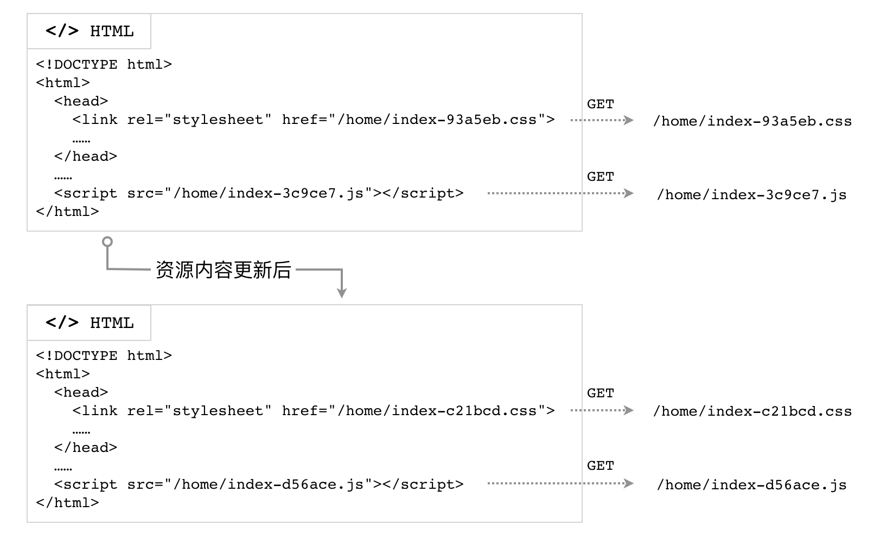

# 前端资源构建系统演进示例

前端资源的构建方式决定了开发时方方面面的体验：源码结构是否清晰，资源（图片、CSS、JS、音视频等）是否总能通过最短路径查找到，源码变动是否能够自动化刷新到浏览器中，等等。

### 准备工作：目录与服务

假设我们的根目录下的第一级文件结构这样设计：

```
.
├── build
├── client
├── gulpfile.js
├── package.json
└── server
    └── index.js
```

其中，`./server/index.js` 定义了一个极简的静态文件服务器，将 `./build` 目录作为静态文件资源服务的根目录：

```javascript
const path   = require('path');
const Koa    = require('koa');
const app    = new Koa();
const serve  = require('koa-static');

// 静态文件服务目录
const staticDir = path.join(__dirname, '../build');
app.use(serve(staticDir));
app.listen(9001);
```

运行

```
$ node ./server/index.js
```

即可启动该服务器。此时，浏览器中访问 `http://localhost:9001/home`，服务器就会响应 `./build/home/index.html` 这个文件。

`./client` 目录则用于存放我们所有的客户端源码。我们希望构建后，`build`目录内部的结构基本与源码目录下的结构保持一致，如下图所示：


下面我们使用 Gulp.js，由浅入深，一步一步地搭建起我们的开发构建流程。

### 极简版本v1：复制

```javascript
/**
 * gulpfile-v1.js
 */
const gulp = require('gulp');
const copydir = require('copy-dir');

const BUILD_ROOT = './build/';
const SRC_ROOT = './client';

gulp.task('build-client', function() {
  copydir.sync(SRC_ROOT, BUILD_ROOT);
});

// ** 是指所有深度的文件夹
gulp.task('watch', () => {
  gulp.watch(['./client/**/*'], ['build-client']);
});

gulp.task('default', ['build-client', 'watch']);
```

在上面这个 `gulpfile-v1.js` 配置文件里，我们定义了一个名为 `build-client` 的任务，和名为 `watch` 的任务，前者只是简单粗暴地将 `./client` 目录下的所有文件原封不动地复制到了 `./build` 目录下，后者则监听 `./client` 目录下所有文件的变动，在变动发生时执行复制任务。

### 版本v2：压缩文件

版本 v1 仅仅是复制源码到静态文件目录，代码没有进行任何压缩处理，直接响应给浏览器，会增加不必要的网络传输。我们可以针对不同类型的文件，分别进行压缩处理。

```javascript
const path     = require('path');
const glob     = require('glob');
const gulp     = require('gulp');
const fse      = require('fs-extra');
const copydir  = require('copy-dir');
const cleanCSS = require('gulp-clean-css');
const uglify   = require('gulp-uglify');

const BUILD_ROOT = './build/';
const SRC_ROOT = './client';

gulp.task('css', () => {
  return gulp.src(`./client/**/*.css`)
    .pipe(cleanCSS())
    .pipe(gulp.dest(BUILD_ROOT));
});

gulp.task('js', () => {
  return gulp.src(`./client/**/*.js`)
    .pipe(uglify())
    .pipe(gulp.dest(BUILD_ROOT));
});

gulp.task('copy', () => {
  const files = glob.sync(`./client/**/*.!(js|css)`);
  files.forEach(item => {
    fse.copySync(item, item.replace(SRC_ROOT, BUILD_ROOT));
  });
});

gulp.task('watch', () => {
  gulp.watch(['./client/**/*.css'], ['css']);
  gulp.watch(['./client/**/*.js'], ['js']);
  gulp.watch(['./client/**/*.!(js|css)'], ['copy']);
});

gulp.task('default', ['css', 'js', 'copy', 'watch']);
```

我们来分析一下上面的新配置。

#### 使用 glob 模块

Glob 表达式是早期 Unix shell 用于文件名匹配的有限通配符的集合，属于正则表达式的一个变种。类似地，npm 里的 `glob` 包支持使用类似的通配符集合来匹配文件路径：

+ `*` 匹配任意个数量的字符（类似于通用正则表达式 `.*`）
+ `!(pattern|pattern|pattern) ` 匹配任何不是括号里的字符序列的路径

例如，

```
glob.sync(`./client/**/*.!(js|css)`)
```

会寻找到 `./client/` 目录下后缀不是 `.js` 也不是 `.css` 的所有文件。

### 版本v3：模块化

进行了压缩，代码文件的网络传输体积变小，看上去的确很美好。然而，源码总不能只在一个文件里面写，我们还要考虑代码复用的情况（不光是 JavaScript，还有 CSS、HTML）。此时，有必要引入 JavaScript 模块系统、CSS 编译系统以及 HTML 模板。在版本 v3 里，我们实现 JavaScript 和 CSS 的模块化开发及构建方案。

#### JavaScript 模块化开发与构建

鉴于 ECMAScript 6 Modules（下面简称 ESM）早已标准化，我们不妨以 ESM 模块系统来管理浏览器端的 JavaScript 代码，然后使用 webpack 对客户端 JS 进行依赖分析、打包、压缩等工作。

首先，我们需要一种机制来寻找各个 JS 入口文件。简单起见，我们约定每个页面目录下的 `index.js` 文件是该页面的入口文件，那么我们可以这样声明一个函数：

```javascript
// 找到所有的 index.js 文件
function findAllJSEntryFiles() {
  const files = glob
    .sync('./client/**/index.js')
    .map(item => ({
      path: item,
      name: item.replace('./client/', '').replace('.js', ''),
    }));

  const pagesJsEntry = {};
  files.forEach(item => {
    // pagesJsEntry 形如 {
    //   'home/index': './client/home/index.js'
    // }
    pagesJsEntry[item.name] = item.path;
  });

  return pagesJsEntry;
}
```

借助函数 `findAllJSEntryFiles()`，我们在 `gulpfile-v2.js` 里定义的 `js` 任务可以更改为使用 webpack 进行构建：

```javascript
gulp.task('js', () => {
  const conf = {
    entry: findAllJSEntryFiles(),
    output: {
      filename: '[name].js',
      chunkFilename: '[name].js',
      path: path.resolve(__dirname, 'build'),
    }
  };

  webpack(conf, (err, stats) => {
    if (err || stats.hasErrors()) {
      console.log('-- error --');
      return;
    }

    // Done processing
    console.log('\nwebpack 构建完成 ✔\n');
  });
});
```

通过这样的配置，我们就可以方便地使用 ESM 了。以 `./client/home` 页面为例，通过下面的一个小功能，测试一下打包的结果是否正确。目录结构与 HTML 代码：


```html
<!-- ./client/home/index.html -->
<!DOCTYPE html>
<html>
<head>
  <title>Home Page</title>
</head>
<body>
  <p>测试 ESM 组织源码及使用 webpack 打包 JS 代码</p>
  <pre id="output"></pre>
  <script src="/home/index.js"></script>
</body>
</html>
```

`./home/index.js` 里，引入常用的 `underscore`，调用 `_.pick` 方法从一个对象里提取部分键值对，然后把新的对象插入到文档里：

```javascript
import _ from 'underscore';

// 调用 underscore 的 pick 方法
var pickedData = _.pick({name: 'moe', age: 50, userid: 'moe1'}, ['name', 'age']);

document.querySelector('#output').innerHTML = '=> ' + JSON.stringify(pickedData);
```

如果构建的结果正确，那么我们可以在浏览器里看到这样的结果：


#### CSS 模块化开发与构建

CSS 也有多种方案做到模块化、代码复用。这里我们选择使用 less 作为 CSS 源码的构建工具：

```javascript
const gulpLess = require('gulp-less');

// ...省略一些代码

gulp.task('css', () => {
  return gulp.src(`${SRC_ROOT}/**/*.css`)
    .pipe(gulpLess())
    .pipe(cleanCSS())
    .pipe(gulp.dest(BUILD_ROOT));
});
```

### 版本v4：资源版本标识

我们现在实现了前端 JS/CSS 资源的快速构建，然而，还面临一个问题：缓存。

为了提升 Web 前端网络性能，网站的 JavaScript、CSS 文件通常都会设置缓存策略，以免每次都重新从服务器下载资源。按照我们前面的构建步骤，可能就会因为浏览器认为缓存未过期而导致新的代码不会被请求到。

```
Cache-Control: max-age=86400
```

如果响应头是上面这样，设置了资源的过期时间为 1 天（86400秒），那么浏览器在从第一次下载该资源后的24小时内，不会再从服务器请求，而是直接读取缓存内容。

所以，我们不能抛弃缓存，又要有一种机制可以使 JS/CSS 得以更新。社区提出的解决方案是构建时计算文件内容的摘要，将其放到文件名中，作为版本标识；然后确保 HTML 文档不要被缓存（`Cache-Control: no-store`）；所有的 JS/CSS 资源依然使用足够长的 `max-age`。



#### 摘要算法

根据内容计算出唯一的标识码，通常采用摘要算法。摘要算法也称散列算法、哈希算法，可以根据全部数据，计算得到定长的字符序列。好的摘要算法应当具备这样的特点：

+ 对于相同的输入，可以得到相同的散列值
+ 对于不同的输入，只有极低的概率会得到相同的散列值（即好的防碰撞特性）
+ 难以逆向计算，已知摘要值，难以推算出其原始的输入值

摘要算法属于计算机安全领域的概念。Node.js 的核心模块 `crypto` 支持多种摘要算法（例如 MD5、SHA-1 等）。前端领域常用 MD5（Message Digest Algorithm 5，消息摘要算法-版本5） 对内容进行摘要计算。MD5 可以生成 128 位二进制的校验值，一般用 32 位十六进制数表示。MD5 的一个常见应用场景是作为文件完整性校验的判据。

首先，我们需要定义一个方法 `md5File()`，它可以读取给定文件的内容，然后计算其摘要值并返回：

```
const crypto = require('crypto');
const fs     = require('fs');

// ... 省略一些代码

/**
 * 根据文件的内容，计算其 md5 摘要
 * @param  {String} filename [文件的路径]
 * @return {String}          [文件内容的 MD5 摘要]
 */
function md5File(filename) {
  const content = fs.readFileSync(filename, {encoding: 'utf8'});
  return crypto
    .createHash('md5')
    .update(content, 'utf8')
    .digest('hex');
}
```

#### CSS 任务

我们需要在原来的 CSS 编译任务结束并且文件也写完后，进行摘要计算的操作，所以需要监听 gulp stream 的事件。

```javascript
gulp.task('css', () => {
  removeFiles(`${SRC_ROOT}/**/index-*.css`);

  const stream = gulp.src(`${SRC_ROOT}/**/*.css`)
    .pipe(gulpLess())
    .pipe(cleanCSS())
    .pipe(gulp.dest(BUILD_ROOT));

  stream.on('error', (err) => {
    console.error(err.message);
  });

  stream.on('end', () => {
    const assets = [];

    glob
      .sync(`${BUILD_ROOT}/**/index.css`)
      .forEach(item => {
        const md5sum = md5File(item);
        const newName = item.replace('index.css', `index-${md5sum}.css`);
        fs.renameSync(item, newName);
        assets.push({
          chunkName: newName.replace(BUILD_ROOT, ''),
          name: item.replace(BUILD_ROOT, ''),
          htmlName: item.replace(BUILD_ROOT, '').replace('.css', '.html'),
        });
      });

    assets.forEach(asset => {
      const cssName = asset.name;
      const htmlPath = BUILD_ROOT + asset.htmlName;
      const content = fs.readFileSync(htmlPath, {encoding: 'utf8'});
      const newContent = content.replace(cssName, asset.chunkName);
      fs.writeFileSync(htmlPath, newContent, 'utf8');
    });
    console.log('\n css 文件摘要计算及重命名完成 ✔');
  });
});
```

#### JavaScript 任务

与 CSS 类似，JavaScript 的摘要计算也需要在编译完成后进行。不过我们这次借助 webpack 提供的回调来处理。`webpack(conf, callback)` 方法接收的第二个参数为函数，会传入 `(err, stats)` 两个数据，在编译正常结束后，`stats.toJson().assets` 数组的每一项，对应了入口文件的打包后的结果，包括文件名、摘要值等：

```json
[{
  "chunkNames": ["home/index"],  // 入口名称（entry 的 key）
  "chunks": [1],                 // 入口文件数量
  "emitted": true,               // 是否正确生成了文件，术语 `emit` 在 webpack 中是“生成”的意思
  "name": "home/index-564746c23aed161469a8.js",  // 打包后携带摘要值的文件名
  "size": 16856                  // 文件的字节数
}, ...]
```

```javascript
gulp.task('js', () => {
  removeFiles(`${SRC_ROOT}/**/index-*.js`);

  const conf = {
    entry: findAllJSEntryFiles(),
    output: {
      filename: '[name]-[chunkhash].js',
      chunkFilename: '[name]-[chunkhash].js',
      path: path.resolve(__dirname, 'build'),
    }
  };

  webpack(conf, (err, stats) => {
    if (err || stats.hasErrors()) {
      console.log('-- error --');
      return;
    }

    // 替换模板中的脚本引用
    const assets = stats.toJson().assets;
    assets.forEach(asset => {
      // 入口JS 的文件名，如 home/index.js
      const jsName = asset.chunkNames[0] + '.js';

      // 页面 HTML 文件名，如 home/index.html
      const htmlName = asset.chunkNames[0] + '.html';

      // 页面 HTML 文件的路径，如 ./build/home/index.html
      const htmlPath = BUILD_ROOT + htmlName;

      // 读取页面 HTML 文件的内容，将入口 JS 的路径替换为添加了摘要值的路径
      let content = fs.readFileSync(htmlPath, {encoding: 'utf8'});
      content = content.replace(jsName, asset.name);
      fs.writeFileSync(htmlPath, content, 'utf8');
    });

    // Done processing
    // ...
  });
});
```

### 版本v5：使用 CDN

现在，我们可以对所有的资源进行构建并将 `./build/` 目录作为静态文件服务的目录，对外提供页面服务了。不过，这样的方案有一点问题，就是所有的 JS/CSS/图片 等资源的请求，都会从服务器网络进行下载，如果客户端的网络节点与服务器较远，那么会遭遇较高的网络延迟。此外，浏览器通常会限制同时发起的 HTTP 请求的数量，这些资源想要实现尽可能的并行下载，就需要放置到多个不同的域名下。解决这些问题的方案是采用 CDN（Content Delivery Network，内容分发网络）。

Unix/Linux 系统下可以使用 `rsync` 程序将某个文件目录完全同步到远程某个机器上。


## 参考资料

1. [Glob | npm](https://www.npmjs.com/package/glob)
2. [rsync 官网](https://rsync.samba.org)
