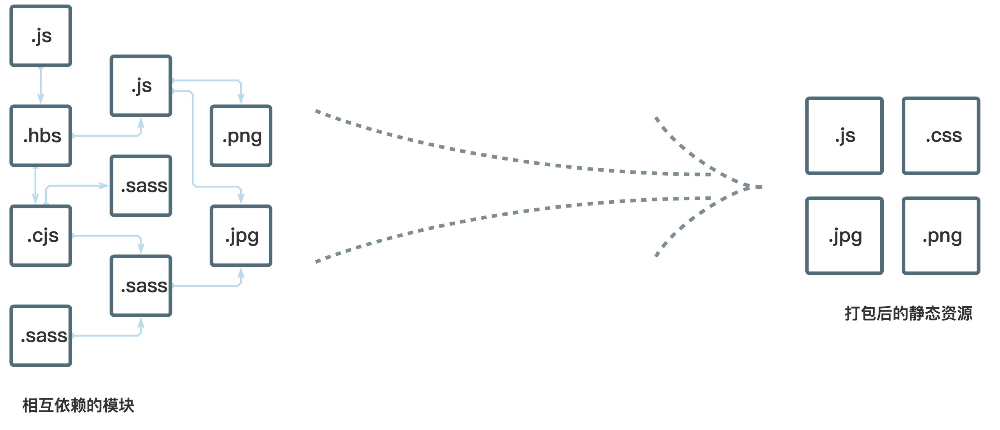

# Webpack



Webpack 是现代 JavaScript 应用的静态模块打包工具。Webpack 非常适合处理模块化组织的代码，它支持前端开发中的多种模块方案，例如：

+ ES6 模块系统，如 `import` 语句
+ CommonJS 模块系统，例如 `require()` 语句
+ AMD 风格的模块系统，如 `define`、`require` 语句
+ css/sass/less 文件中的 `@import` 语句
+ 样式表里对图片文件的依赖声明，也可以被 webpack 处理为模块，例如 `background: url(...)`，甚至 HTML 文件中的图片元素（``）

## 基本概念

**入口（Entry）**

入口点（Entry Point）通常是某些特定的文件或目录，对于每个入口文件，webpack 会从它开始进行依赖分析，每个找到的文件会被处理为中间结果（bundles）。Webpack 支持设置单个或多个入口点。

**输出目录（Output）**

Webpack 配置对象的 `output` 属性用于指定构建后的文件存放目录，以及如何去命名这些文件（例如在文件名中添加摘要值）。

**加载器（Loaders）**

Webpack 自身可以只处理 JavaScript 模块，通过 Loaders 则可以处理其他类型的文件（例如 CSS/Image）。如果配置了 `css-loader`，那么你的代码里就可以通过 `import` 语句来声明该组件所依赖的样式表，`webpack.config.js` 做类似这样的声明：

```javascript
/**
 * 需要安装 `css-loader` 和 `style-loader`
 */
module.exports = {
  module: {
    rules: [{
      test: /\.css$/,
      use: [ 'style-loader', 'css-loader' ]
    }]
  }
};
module.exports = config;
```

组件代码就可以这样写了：

```javascript
import css from 'file.css';
// 或者
import 'file.css';
```

**插件（Plugins）**

## 依赖分析

JavaScript 模块的依赖分析是 webpack 的核心流程之一。

## 深入理解 loaders

## 深入理解 plugins

## 参考资料

