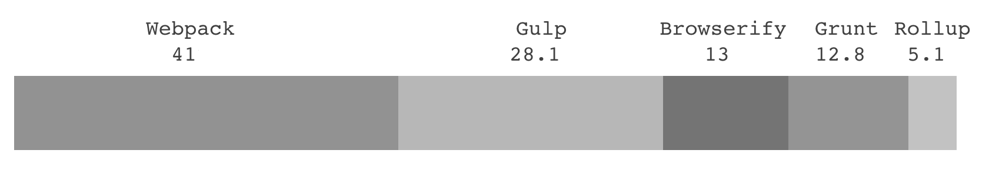

# 概述

## 依赖分析

从入口文件开始进行依赖分析，分析的结果通常是 JavaScript AST。

## 构建工具

<figure>

<figcaption>2017年，针对 2 万名前端开发者的调查显示了各个主要的 JavaScript 构建工具的使用热度对比情况。Webpack 高居榜首。注意，这并不是占比，而是热度比较。例如：Webpack 的使用者有 41 人，那么对应有 28.1 人使用 Gulp，这些人群可能有重叠。数据来源： https://stateofjs.com/2017/build-tools/results/</figcaption>
</figure>

