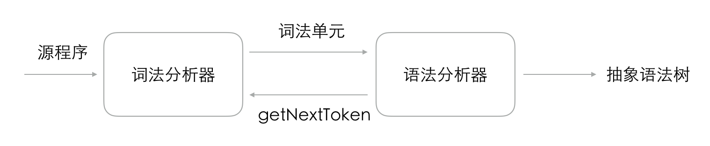
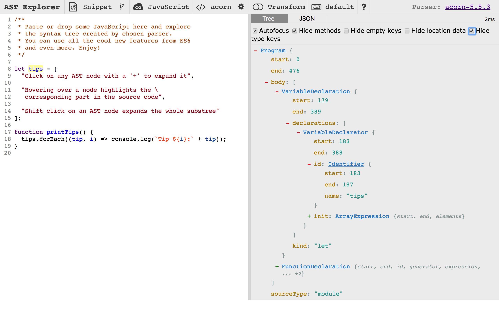

# JavaScript 解析器

任何一门图灵完备的程序设计语言（Turing Complete Language）理论上都能够自己编译自己，生成可执行代码，其中就包括自己的编译器。一门语言可以实现自己的编译器，然后可以通过编译器生成可执行代码，这种特性叫做**自举**（**`Bootstrap`**）。很多语言都有自举的编译器，例如 BASIC，C，C++，C#，Common Lisp，Go，Java，Pascal，Python，Scheme，TypeScript，等等。

自举看上去会存在“先有鸡还是先有蛋”的问题。但实际上，所有的编译器有自己的鼻祖，好比早期的 Pascal 编译器，后来的 C 语言实现的 gcc。我们通过下面的过程，就可以大概了解到“先有鸡还是先有蛋”问题是怎样解决的。

+ 假设我们想要发明一门语言 X
+ 首先，已经有了基于汇编语言实现的非常可靠的编译器 CompilerA，可以把汇编语言转换为机器码
+ 用汇编语言实现一个 X 语言编译器 XCompiler@1.0，该编译器负责将 X 语言转换为汇编语言，然后调用汇编语言编译器 CompilerA 将其转换为机器码
+ XCompiler@1.0 稳定后，使用 X 语言实现 XCompiler@2.0 版本，用 XCompiler@1.0 去编译 X 源码来生成可执行文件 XCompiler@2.0，然后不断地测试 XCompiler@2.0 版本，即使用 XCompiler@2.0 去编译别的 X 语言写的测试用例
+ XCompiler@2.0 稳定后，XCompiler@1.0 就可以告别历史舞台，X 语言就拥有了用 X 语言实现的编译器了。

JavaScript 也是一门图灵完备的程序设计语言，这意味着我们可以用 JavaScript 实现自己的编译器。不过，由于 JavaScript 通常是分布式获取，编译为二进制码并不能跨平台使用，所以，“自举”这方面的很多工作只是用 JavaScript 实现一个 JavaScript 语法分析器，可以生成抽象语法树（Abstract Syntax Tree，AST），并且基于抽象语法树进行操作，最后依然输出 JavaScript 代码。

社区里有许多用 JavaScript 实现的解析器，其中几个使用较广泛的有：

+ **Uglifyjs**，这个工具是专门用来混淆压缩 JavaScript 代码的，内置了一个解析器
+ **Esprima**，是用 JavaScript 实现的 JavaScript 词法分析及语法分析器
+ **Espree**，基于 Esprima，被 ESLint 工具使用
+ **Acorn**，目前使用量很高的一个解析器
+ **Babylon**，在 acorn.js 基础上发展起来，Babel.js 最开始使用的分析器
+ **TypeScript**

我们以 Acorn.js 为例，来看一下 JS 解析器的原理与应用场景。

## Acorn.js 工作原理

与常见的编译器语法分析过程类似，Acorn.js 也会经过词法分析、语法分析两个阶段来输出抽象语法树，如下图所示。

<figure>

<figcaption>Acorn.js 解析过程</figcaption>
</figure>

### 词法分析

大部分编程语言的词素可以分为这几类：

+ 关键字（keyword），例如 `break`、`var`、`function`、`if`、`else` 等
+ 标识符（identifier），例如变量名、函数名
+ 标点符号（punctuator），也叫分隔符（separator），例如 `(`、`)`、`{`、`[`、`;`、`,`
+ 操作符（operator），`=`、`+`、`++`
+ 字面量（literal），对应 JavaScript，就是基本值，例如布尔值 `true`、数字 `200`、字符串 `"this is a string"`
+ 注释（comment），包括 `//` 和 `/**/`

词法分析阶段，acorn.js 将字符流解析为有意义的词素序列，并对于每个词素进行分析，最后输出词法单元（`token`）序列。例如输入代码 `var a = 1;`，会得到形如这样的词法单元序列：

```
[<keyword, var>, <id, a>, <operator, =>, <literal, 1>, <separator, ;>]
```

acorn.js 暴露了自己的词法分析接口，可以像下面这样调用：

```javascript
const acorn = require('acorn');

const str = `var a = 1;`;
const tokenIter = acorn.tokenizer(str);
const tokens = [...tokenIter];
console.log(JSON.stringify(tokens));
```

执行上面的代码，会得到一个对象数组：

```javascript
[{
  type: {
    label: "var",       // 解析到的符号的类型
    keyword: "var",     // 如果是 keyword，那么说明该符号刚好为 JS 的关键字
  },
  value: "var",         // 解析到的词素
  start: 0,             // 该词素的起始下标
  end: 3                // 该词素后面一个空白符的下标
},
{
  type: {
    label: "name",
  },
  value: "a",
}
// ... 省略
}]
```


### 语法分析

语法分析（Syntax Analysis），也叫“解析”（Parsing），目标结果通常是输出该语言的抽象语法树（Abstract Syntax Tree，AST）。Acorn.js 采用了自顶向下的语法分析方法，并且输出的 AST 结构是按照 JavaScript AST 规范的约定来实现的。

## JavaScript AST 规范

使用不同工具构建的抽象语法树可能会有不同的结构，如果大家都遵从同样的规范，那么相关联的生态链工具的开发会更为轻松、明晰。很早之前，FireFox 浏览器所使用的 JavaScript 引擎 SpiderMonkey 曾经提供了一个 JavaScript API，使得开发者可以直接调用 SpiderMonkey 的 JavaScript 分析器。这个 API 所描述的 JavaScript 抽象语法树格式渐渐流行起来，如今成为 JavaScript AST 的通用描述。ESTree Spec<sup>[1]</sup> 正是在此基础上建立起来的，它现在是社区对 JavaScript 抽象语法树构建时采用最广泛的规则，可以认为是社区推动的事实标准。众多基础设施开发者一起维护着这个规范，包括 Dave Herman（Mozilla 研究中心的首席研究员和策略总监）、 Nicholas C. Zakas（ESLint 的作者）、Ingvar Stepanyan（Acorn 的作者）、Mike Sherov 与 Ariya Hidayat（Esprima 的作者）以及 Babel.js 团队等。

ESTree AST Spec 的初始版本是基于 ES5 的<sup>[2]</sup>，后续的 ES6/ES7/ES8 等版本的规范，都只针对新增语言特性提出。

ESTree AST 的每个节点，都用一个对象来标识，它们都继承自 `Node` 类，`Node` 类按照下面的接口定义：

```
interface Node {
  type: string;
  loc: SourceLocation | null;
}
```

`type` 表示节点类型，例如 `Identifier | Literal | Program | ExpressionStatement` 等。`loc` 表示该节点的起始位置，由 `SourceLocation` 定义：

```
interface SourceLocation {
  source: string | null;
  start: Position;
  end: Position;
}
```

例如一个 `if` 条件语句节点，定义如下：

```
interface IfStatement <: Statement {
  type: "IfStatement";            # 节点类型
  test: Expression;               # 判断表达式
  consequent: Statement;          # 真值分支，是个语句
  alternate: Statement | null;    # else 分支，是个语句
}
```

`<:` 符号表示前者是后者的子集。

## 解析器使用：以Acorn.js为例

在 https://astexplorer.net/ 网站可以非常直观地看到 JavaScript 源代码与其对应的抽象语法树每个节点之间的对应关系：



我们以 Acorn.js 为例来看一下 JavaScript 解析器的使用方法。首先，安装 `acorn` 等示例用到的包：

```bash
$ npm i acorn acorn-walker escodegen
# 每个包的作用说明
#   acorn:       JS 语法分析的主要入口
#   acorn-walk:  提供遍历抽象语法树的接口
#   escodegen:   将符合 ESTree 规范的抽象语法树生成为 ECMAScript 代码
```

在 `acorn-01.js` 里书写下面的代码，

```javascript
const {Parser} = require('acorn');
console.log(JSON.stringify(Parser.parse('var a = 1;')));
```

运行上面的代码：

```
$ node acorn-01.js
```

我们会输出这样的对象，它就是根据 `var a = 1;` 这样一段代码所生成的抽象语法树：

```javascript
{
  type: "Program",      // type 为 Program 的节点只有一个，表示这是程序代码语法树的根节点
  sourceType: "script",
  start: 0,
  end: 10,
  body: [               // body 是个数组，由语句（statement）组成
    {
      type: "VariableDeclaration",  // 变量声明节点
      declarations: [               // declarations 是个数组，包含了变量声明节点的子节点
        {
          end: 9,
          id: {                  // id 是 identifier 的缩写
            end: 5,
            name: "a",
            start: 4,
            type: "Identifier",   // Identifier 表示这是一个标识符，即变量或常量名
          },
          init: {
            end: 9,
            raw: "1",
            start: 8,
            type: "Literal",      // Literal 表示此节点为原始值
            value: 1
          },
          start: 4,
          type: "VariableDeclarator"
        }
      ],
      end: 10,
      kind: "var",    // 声明标识符时使用的关键字类型，可以为 [var | let | const] 之一
      start: 0,
    }
  ],
}
```

生成 AST 后，可以对其进行遍历，在访问到不同类型的节点时可以执行配置的回调函数（visitors），既可以进行统计分析，也可以直接操作 AST。

假设我们有个 `util.js` 文件，其内容为：

```javascript
export function queryData() {
  return [];
}

export function addData(data) {
  return true;
}

export function updateData(data) {
  return true;
}

export function removeData(id) {
  return true;
}
```

我们的 `acorn-02.js` 内容如下：

```javascript
const fs         = require('fs');
const {Parser}   = require('acorn');
const walk       = require('acorn-walk');
const escodegen  = require('escodegen');

// 读取 util.js 里的文件内容
const fileContent = fs.readFileSync('./util.js');
// 生成抽象语法树
const ast = Parser.parse(fileContent, {
  // 注意这里指定了源内容的类型为 module，即模块
  sourceType: 'module'
});

// 定义访问者函数
const visitors = {
  // 会在每次遇到一个 type 为 ExportNamedDeclaration 的节点时执行此函数
  ExportNamedDeclaration(node) {
    if (node.declaration.type === 'FunctionDeclaration') {
      console.log(`找到了一个 export 函数的语句，函数名称是：${node.declaration.id.name}`);
    }
  }
};
// 遍历抽象语法树
walk.simple(ast, visitors);

fs.writeFileSync('util-new.js', escodegen.generate(ast, {
  format: {
    // 指定输出代码的缩进为两个空格
    indent: {
      style: '  ',
    }
  }
}));
```

执行上面的代码，会输出：

```bash
找到了一个 export 函数的语句，函数名称是：queryData
找到了一个 export 函数的语句，函数名称是：addData
找到了一个 export 函数的语句，函数名称是：updateData
找到了一个 export 函数的语句，函数名称是：removeData
```

而如果查看 `util-new.js` 文件，则会发现每个函数名的前面被我们加上了一个 `$` 符号：

```javascript
export function $queryData() {
  return [];
}
export function $addData(data) {
  return true;
}
export function $updateData(data) {
  return true;
}
export function $removeData(id) {
  return true;
}
```

## 我们可以用 JS 解析器做什么

JavaScript 解析器通常应用在非常基础的功能上面，包括静态分析、代码检查、语法转换等。例如，社区应用最广泛的打包构建工具 webpack，就使用 acorn.js 作为自己的语法分析器的基础库；Babel 项目的 语法分析器 babylon.js 实际上是在 acorn.js 基础上开发并演化的；代码检查工具 ESLint 则使用语法分析工具 Espree.js 来提供对代码的感知能力。

## 参考

1. [ESTtree Spec](https://github.com/estree/estree)
2. https://github.com/estree/estree/blob/master/es5.md
3. [Esprima](https://github.com/jquery/esprima)
4. [Acorn](https://github.com/acornjs/acorn)
