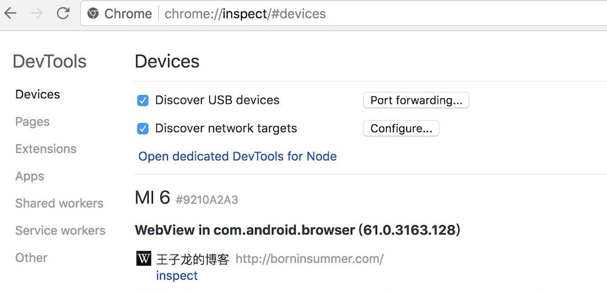
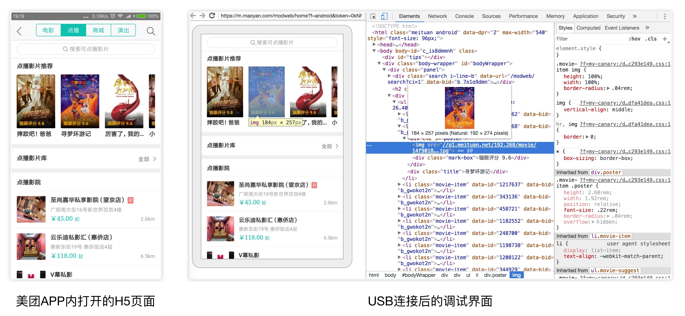

# 移动端 Web 页面调试


### 移动 web 页面输出工具

**Eruda**

Eruda 是一个专为手机网页前端设计的调试面板工具，类似 DevTools 的迷你版，其主要功能包括：捕获 console 日志、检查元素状态、捕获 XHR 请求、显示本地存储（localStorage）和 Cookie 信息等等。<sup>[1]</sup>


有两种接入 Eruda 的方式，一种是最简单的，直接在 HTML 模板中用 `<script>` 元素引用其 CDN 库，然后调用 `eruda.init()` 方法来初始化：

```html
<script src="//cdn.jsdelivr.net/npm/eruda"></script>
<script>eruda.init();</script>
```

另外一种方式适用于使用了诸如 `webpack` 一类的构建工具的项目，可以给项目添加 eruda 的 npm 包：

```bash
$ npm install eruda --save
```

然后在页面的初始化脚本中手动启用 eruda：

```javascript
import eruda from 'eruda'
eruda.init();
```

**腾讯的 vConsole**

腾讯也有一款类似的调试工具，vConsole<sup>[3]</sup>。引入的方式与 Eruda.js 类似，可以参考官方 Github<sup>[3]</sup>。

**工作原理**

Eruda 和 vConsole 采用重写浏览器原生 API 原型的方式来实现对网络、控制台相关方法的覆盖（`override`）。例如，Eruda 的 Network.js 会重写 `XMLHttpRequest`、`window.fetch` 的原型，如此一来，Eruda 就能够拦截到请求与响应的所有信息。

```javascript
/**
 * eruda/src/Network/Network.js
 */
export default class Network extends Tool {
  overrideXhr() {
  let winXhrProto = window.XMLHttpRequest.prototype;
  let origOpen = winXhrProto.open;
  let origSend = winXhrProto.send;

  // 重写 open
  winXhrProto.open = function(method, url) {
    // eruda 本身会做一些事情
    // 省略一些代码...
    origOpen.apply(this, arguments);
  };

  // 重写 send
  winXhrProto.send = function(data) {
    // eruda 本身会做一些事情
    // 省略一些代码...
    origSend.apply(this, arguments);
  }
}
```

在拦截到请求的头、响应后，Eruda 就可以利用相应的 Handlebars 模板来渲染视图了。

### 调试 webview

**Android Webview**

Chrome 浏览器的 Devtools 还可以调试安卓手机的系统浏览器页面，或者 APP 里的 webview。步骤如下：

1. 确保安卓设备已经开启了开发者权限
2. USB 数据线连接电脑时，选择“允许 USB 调试”，然后通过 APP 或者手机浏览器访问一些网页，例如 `http://borninsummer.com/`
3. 与 Node.js 的调试类似，在电脑的 Chrome 浏览器中打开 `chrome://inspect#devices` 页面，就可以看到当前的安卓设备通过 webview 打开的所有 web 页面，选择其中一个，点击 `inspect` 即可进行调试（注意，首次连接可能需要翻墙）：



<figure>

<figcaption>通过 USB 调试安卓手机浏览器打开的页面（小米手机6，MIUI9.6）</figcaption>
</figure>



**iOS WKWebview**

### 参考资料

1. [Eruda | github](https://github.com/liriliri/eruda)
2. [Debugging Tips and Tricks](https://css-tricks.com/debugging-tips-tricks)
3. [vConsole | github](https://github.com/Tencent/vConsole)
