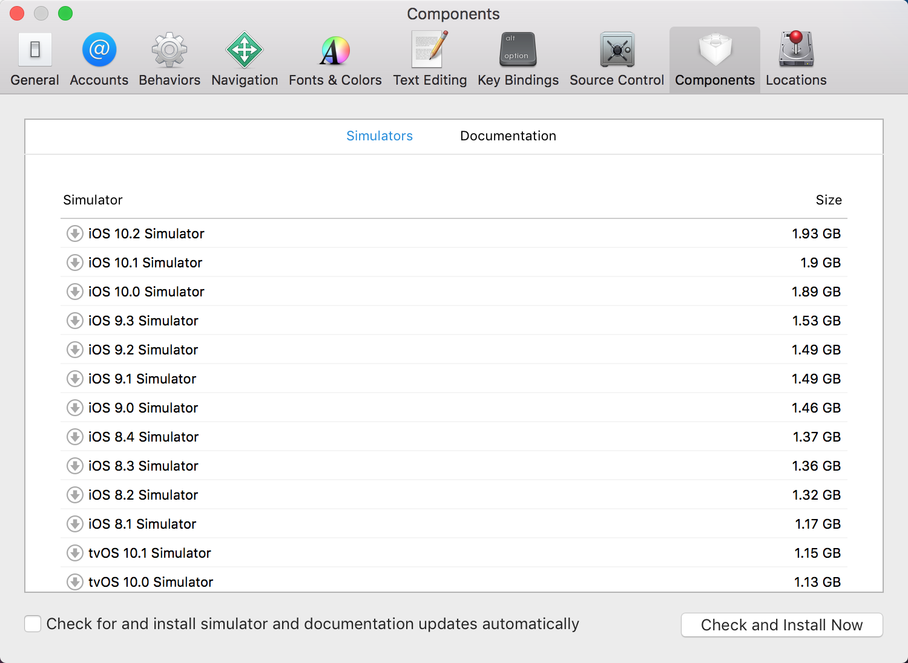
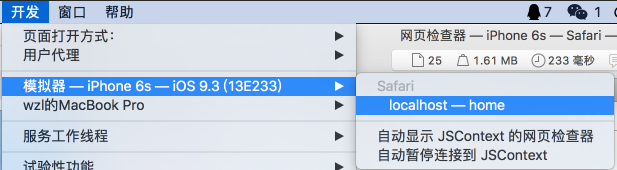
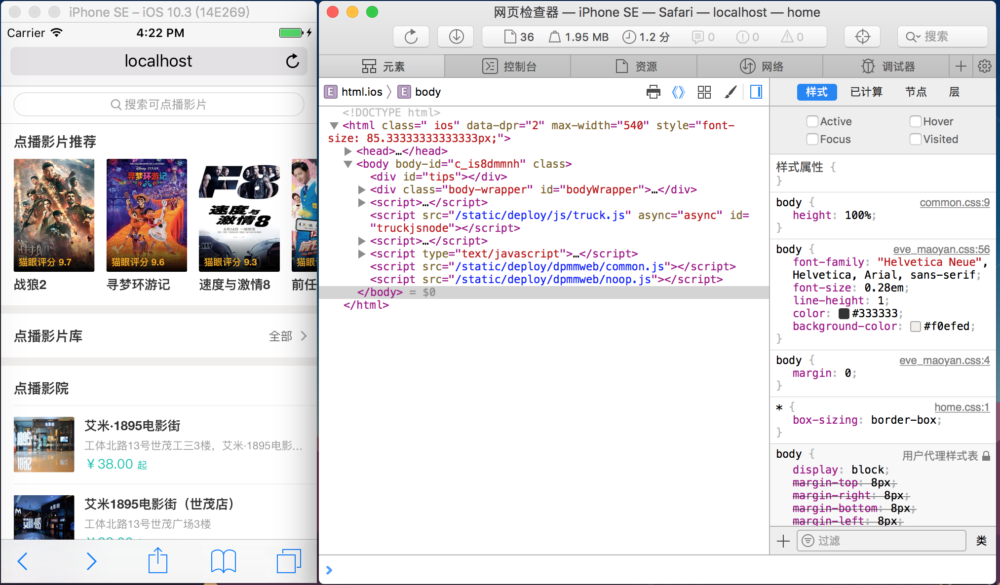

# XCode Simulator

在 Mac OS 的 XCode 里可以通过 `XCode -> Open Developer Tool -> Simulator` 启动一个 iOS 设备模拟器，该模拟器实际上是 iOS 系统的运行环境，开发者可以在里面打开 iOS Safari 浏览器，从而方便地调试前端代码。

如果要安装某个特定版本的模拟器，可以在 `XCode -> Preferences -> Components` 里找到对应的版本然后下载：

之后，在 `Simulator -> Hardware -> Device` 里可以切换为已配置过的模拟器。当选择了较高版本的 iOS 后，Simulator 可以与 Mac OS 的 Safari 浏览器通信，以便对 Simulator 里的 iOS Safari 进行调试。首先打开 PC 版的 Safari，然后选择 `开发 -> 模拟器`，选择当前的 Simulator 打开的页面。

