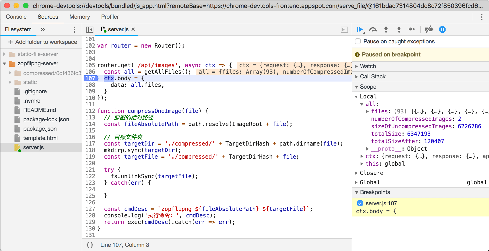

# 调试 NodeJS 程序

对于使用 V8 引擎的 Node 运行时来说，低版本可以采用 v8 debugger 协议获取到 v8 的运行过程；6.3+ 版本的 Node 则可以使用 v8 inspector 协议。

### Inspector 协议

Node 6.3 及之后的版本新增了名为 `v8-inspector` 的调试协议。在启动 Node 脚本时，`--inspect={PORT}` 参数会创建一个单独的 Node 进程监听（通过 WebSockets）该端口（默认是 `9229`）上的调试命令。配合 Chrome 浏览器的 DevTools，可以方便地获取到该程序的运行信息。

```
$ node --inspect=9229 ./server.js
# 会输出：
Debugger listening on ws://127.0.0.1:9229/0c48e445-f318-4bb7-85d9-32804ea111db
Debugger attached.
```

在 Chrome 浏览器的地址栏里输入 `chrome://inspect/#devices` 并回车，可以看到对于该端口的监听（可能有一定的延时）：


点击上图里的 `inspect`，会调起 Chrome 的 DevTools 界面，在 `Sources` 模块中选择 JavaScript 程序所在目录，就可以像对浏览器端的 JavaScript 代码一样进行调试（例如设置断点）：



### 远程调试

因为调试协议是基于网络协议 WebSockets，因此 Node 具备调试远程机器上的代码的能力。这意味着要让远程机器的调试接口暴露出来，因此不是特别安全。如果非要进行远程调试，首先要确保服务器上的程序也是以调试模式启动：

```
$ node --inspect=9229 server.js
```

假设该机器的 IP 地址为 `10.2.3.4`，那么在开发者的本地计算机上，建立一个 TCP 连接：

```
$ ssh -L 9221:localhost:9229 user@10.2.3.4
```

如此一来，本地机器的 `9221` 端口就直连了远程机器的 `9229` 端口。然后用 Chrome DevTools 或者 VS Code “附着”（attach） `9221` 端口，就可以像之前那样进行调试了。

### Debugger 协议

在 Node 7.7.0 之前（不含）的版本里，可以使用 Debugger 协议来调试 Node 程序。例如最早的 `node-inspector` 程序就是基于此协议。

```
# 安装 node-inspector
$ npm install -g node-inspector

# 以 debug 模式启动 app.js
$ node-debug app.js
```

当然，前端开发者应该尽量使用最新版本的 Node，配合 `--inspect` 来调试自己的 Node 程序。

## 参考资料

1. https://zhuanlan.zhihu.com/p/30264842
2. https://nodejs.org/en/docs/guides/debugging-getting-started/
3. [node-inspector | github](https://github.com/node-inspector/node-inspector)
