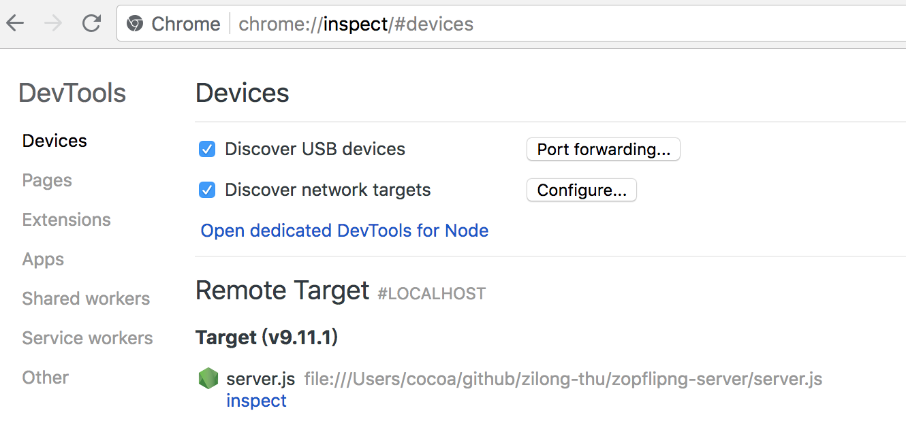

# 调试 NodeJS 程序

## v8 node 调试

对于使用 V8 引擎的 Node 运行时来说，低版本可以采用 v8 debugger 协议获取到 v8 的运行过程；6.3+ 版本的 Node 则可以使用 v8 inspector 协议。

### Debugger 协议

```
# 安装 node-inspector
$ npm install -g node-inspector

# 以 debug 模式启动 app.js
$ node-debug app.js
```

### Inspector 协议

Node 6.3 及之后的版本新增了名为 `v8-inspector` 的调试协议。在启动 Node 脚本时，`--inspect={PORT}` 参数会创建一个单独的 Node 进程监听（通过 WebSockets）该端口（默认是 `9229`）上的调试命令。配合 Chrome 浏览器的 DevTools，可以方便地获取到该程序的运行信息。


```
$ node --inspect=9229 ./server.js
# 会输出：
Debugger listening on ws://127.0.0.1:9229/0c48e445-f318-4bb7-85d9-32804ea111db
Debugger attached.
```

在 Chrome 浏览器的地址栏里输入 `chrome://inspect/#devices` 并回车，可以看到对于该端口的监听：



## 参考资料

1. https://zhuanlan.zhihu.com/p/30264842
2. https://nodejs.org/en/docs/guides/debugging-getting-started/
3. 