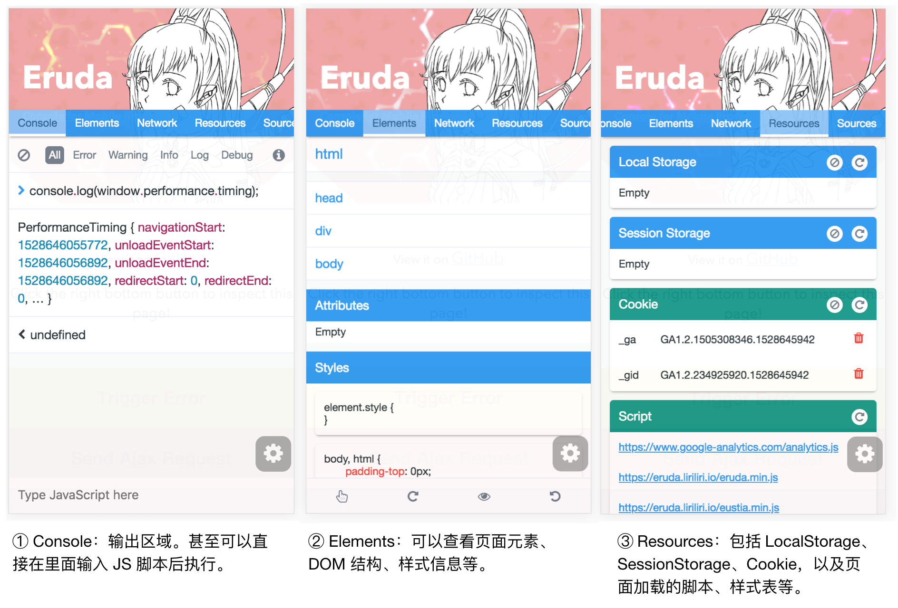

# 移动端 Web 页面调试


### 移动 web 页面输出工具 Eruda

Eruda.js 是针对移动 web 页面调试的优秀工具。它可以直接在真机上模拟出类似 PC 上的 Chrome、Safari、FireFox 等现代浏览器的开发者调试工具，包括 Console、Elements、Network、Resources、Sources 等常见模块。



有两种接入 Eruda 的方式，一种是最简单的，直接在 HTML 模板中用 `<script>` 元素引用其 CDN 库，然后调用 `eruda.init()` 方法来初始化：

```html
<script src="//cdn.jsdelivr.net/npm/eruda"></script>
<script>eruda.init();</script>
```

另外一种方式适用于使用了诸如 `webpack` 一类的构建工具的项目，可以给项目添加 eruda 的 npm 包：

```bash
$ npm install eruda --save
```

然后如下引用：

```html
<script src="node_modules/eruda/eruda.min.js"></script>
<script>eruda.init();</script>
```

### 腾讯的 vConsole

腾讯也有一款类似的调试工具，vConsole<sup>[3]</sup>。引入的方式与 Eruda.js 类似，可以参考官方 Github<sup>[3]</sup>。

### 工作原理

Eruda 和 vConsole 采用重写浏览器原生 API 原型的方式来实现对网络、控制台相关方法的覆盖（`override`）。例如，Eruda 的 Network.js 会重写 `XMLHttpRequest`、`window.fetch` 的原型，如此一来，Eruda 就能够拦截到请求与响应的所有信息。

```javascript
/**
 * eruda/src/Network/Network.js
 */
export default class Network extends Tool {
  overrideXhr() {
  let winXhrProto = window.XMLHttpRequest.prototype;
  let origOpen = winXhrProto.open;
  let origSend = winXhrProto.send;

  // 重写 open
  winXhrProto.open = function(method, url) {
    // eruda 本身会做一些事情
    // 省略一些代码...
    origOpen.apply(this, arguments);
  };

  // 重写 send
  winXhrProto.send = function(data) {
    // eruda 本身会做一些事情
    // 省略一些代码...
    origSend.apply(this, arguments);
  }
}
```

在拦截到请求的头、响应后，Eruda 就可以利用相应的 Handlebars 模板来渲染视图了。

### 参考资料

1. [Eruda | github](https://github.com/liriliri/eruda)
2. [Debugging Tips and Tricks](https://css-tricks.com/debugging-tips-tricks)
3. [vConsole | github](https://github.com/Tencent/vConsole)
