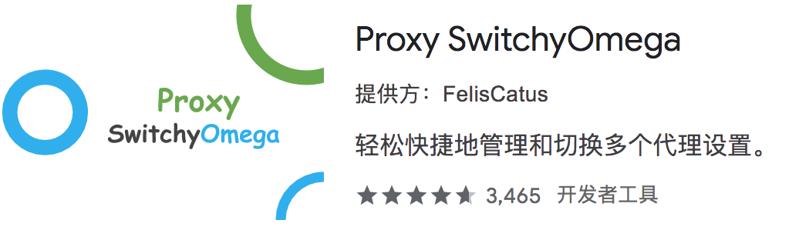
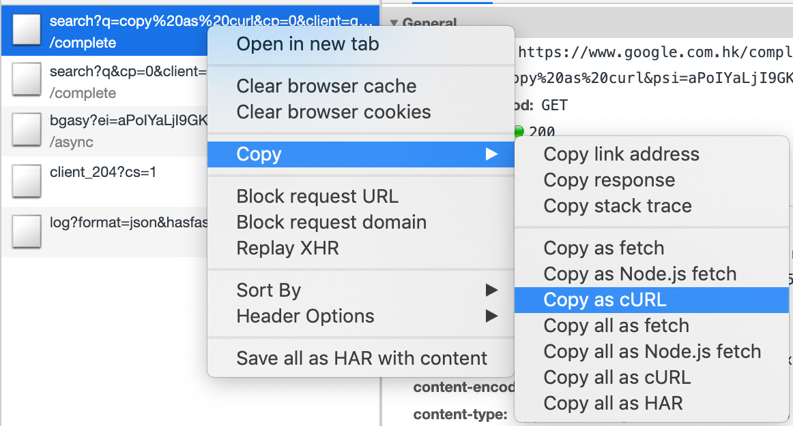

# HTTP 调试
## HTTP抓包、代理工具

在 Web 开发与调试中，开发人员经常需要抓取、修改或者代理 HTTP 请求，这些功能需要借助于一系列 HTTP 抓包/代理工具来完成。这些工具包括在 Mac 平台下的 Charles，Windows 平台下的 Fiddler，以及跨平台的 Whistle 等等。

### Chrome 扩展：SwitchyOmega

如果只是希望代理 Chrome 浏览器的请求，例如希望能够自动将所有的发往 `a.test.com/pages` 的请求代理到本地 `localhost:3000`，那么可以使用 Chrome 扩展工具来完成。这里推荐使用 SwitchyOmega。SwitchyOmega 是一款开源自由软件（[代码地址](https://github.com/FelisCatus/SwitchyOmega)），使用 GNU General Public License 版本 3 及以上授权。

### Charles

[Charles](https://www.charlesproxy.com/) 是一款收费的 HTTP 代理工具，在 Windows/Mac/Linux 三个平台下都有对应的安装包。

### Fiddler

### Whistle

[Whistle](https://github.com/avwo/whistle) 是一个 Github 开源项目，基于 Node.js 开发。

## HTTP 请求工具

开发过程中，我们可能希望直接发出网络请求，以确认接口情况或者参数传递是否正确。对于最简单的 GET 请求，可以直接在浏览器地址栏通过地址进行访问。但是对于 POST、PUT、DELETE 请求，或者参数复杂的 GET 请求，这种方法就不太方便了。这种情况下我们推荐使用 PostMan、curl 等工具进行处理。

### PostMan

### curl

Chrome 浏览器可以很方便地将一个请求转换为 curl 脚本：

