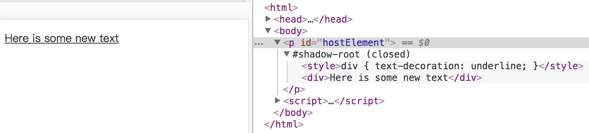

# Shadow DOM


## 浏览器支持

Shadow DOM v0 版本在 Chrome/Opera 浏览器中得到了支持，其他浏览器厂商则跳过 v0，直接开始实现 v1 版本的 Shadow DOM。

IE 11 及更早的 IE 浏览器均不支持此特性。微软的 Edge 浏览器对 Shadow DOM 的支持还处于考虑阶段。在 [1] 这里可以看到其对于此特性的描述与状态。

Firefox 对此特性的支持正在开发中。

Opera: Support since 40
Safari: partial support, 10.1+

iOS Safari, partial support, 10.2+

## 基本概念

Shadow DOM 是指，浏览器可以渲染一系列 DOM 元素，而不必把它们插入到主文档的 DOM 树结构中。

基于 Shadow DOM， 可以实现基于组件的应用。它可以为网络开发中的常见问题提供解决方案：

+ 隔离 DOM：组件的 DOM 是独立的（例如，`document.querySelector()` 不会返回组件 shadow DOM 中的节点）。
+ 作用域 CSS：shadow DOM 内部定义的 CSS 在其作用域内。样式规则不会泄漏，页面样式也不会渗入。
+ 组合：为组件设计一个声明性、基于标记的 API。
+ 简化 CSS： 作用域 DOM 意味着您可以使用简单的 CSS 选择器，更通用的 id/类名称，而无需担心命名冲突。
+ 效率： 将应用看成是多个 DOM 块，而不是一个大的（全局性）页面。

## 示例

```
<html>
<head>
  <title>Shadow DOM</title>
</head>
<body>
  <p id="hostElement"></p>
  <script>
    // 以 <p> 元素为根，创建 shadow DOM
    const p = document.querySelector('#hostElement');  // ①
    const shadowRoot = p.attachShadow({mode: 'open'});  // ②

    // ③
    shadowRoot.innerHTML = `
      <style>div { text-decoration: underline; }</style>
      <div>Here is some new text</div>
    `;
    console.log('shadowRoot: ', shadowRoot);
  </script>
</body>
</html>
```

上面的代码里，做了这些事情：

+ ① 先获取到主文档里 `id` 为 `hostElement` 的 `<p>` 元素
+ ② 然后调用 `attachShadow` 方法，将其设置为一个影子树的根节点。
+ ③ 在这个影子根节点下，插入 HTML 字符串，交给浏览器去生成对应的 DOM 结构。可以看到执行的效果：




## 参考资料

1. https://developer.microsoft.com/en-us/microsoft-edge/platform/status/shadowdom/
2. http://w3c.github.io/webcomponents/spec/shadow/
3. Shadow DOM v1：独立的网络组件. https://developers.google.cn/web/fundamentals/web-components/shadowdom?hl=zh-cn

