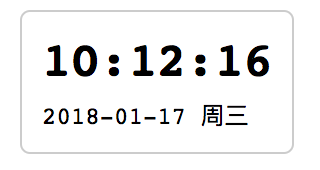

# 自定义元素（customElements）

## 纯展示组件：一个时钟挂件

我们首先来看一个极简单的组件，它由一个 HTML 文件（主文档）和一个组件脚本组成：

```
├── clock
│   ├── index.html
│   └── my-clock.js
```

我们的目标是使用自定义元素（customElements）API，获得一个可以展示当前时间的日期组件，效果如下图所示：



时钟组件 `clock.js` 文件的内容如下：

```javascript
/**
 * 时钟组件示例-v1
 */
function getTimeStr() {
  var time = new Date();
  return time.toString();
}

class MyClock extends HTMLElement {
  constructor() {
    super();

    var shadow = this.attachShadow({mode: 'open'});

    var text = document.createElement('span');
    text.textContent = getTimeStr();

    shadow.appendChild(text);

    setInterval(function() {
      text.textContent = getTimeStr();
    }, 250);
  }
}

customElements.define('my-clock', MyClock, {extends: 'p'});
```

在这段代码中，`customElements` 方法的语法是这样的：

```
customElements.define(name, constructor, options);
```

其中，

+ `name` 表示自定义的标签名
+ `constructor` 是每个新标签在创建的时候执行的构造函数
+ `options` 可选，是一个对象，用于指定元素创建的参数。目前只支持一个，即 `extends`，用于表示希望自定义的元素继承哪个内置元素


我们可以对上面的组件JS代码进行优化，例如丰富时间展示的内容，使用 IIFE 来生成一个块作用域，以及在 Shadow DOM 内使用模板一次性插入更多的 HTML 片段：

```
/**
 * 时钟组件示例-v2
 */
(function() {
/**
 * 如果num小于10，则在其左侧填充0
 * @param  {Number} num
 * @return {String|Number}
 */
function leftPadding(num) {
  if (num < 9) {
    return '0' + num;
  }
  return num;
}

/**
 * 解析当前时间
 */
function getTimeStr() {
  var time   = new Date();
  var hour   = leftPadding(time.getHours());
  var minute = leftPadding(time.getMinutes());
  var second = leftPadding(time.getSeconds());

  var year   = time.getFullYear();
  var month  = leftPadding(time.getMonth() + 1);
  var day    = leftPadding(time.getDate());
  var str    = `${hour}:${minute}:${second}`;

  var weekZNArray = ['日', '一', '二', '三', '四', '五', '六'];
  var weekDesc = '周' + weekZNArray[time.getDay()];

  return {
    weekDesc: weekDesc,
    date: `${year}-${month}-${day}`,
    time: str,
  };
}

/**
 * 用于创建自定义元素的构造函数
 */
class MyClock extends HTMLElement {
  constructor() {
    super();
    var shadow = this.attachShadow({mode: 'open'});

    var $div = document.createElement('div');

    var display = () => {
      var now = getTimeStr();
      this.value = now;

      $div.innerHTML = `
        <div>${now.time}</div>
        <div style="font-size: 12px; font-weight: normal; padding-top: 5px;">${now.date + ' ' + now.weekDesc}</div>
      `;
    }

    display();
    shadow.appendChild($div);

    setInterval(function() {
      display();
    }, 500);
  }

  getValue() {
    return this.value;
  }
}

customElements.define('my-clock', MyClock, {extends: 'div'});
})();
```

使用时，只需在 `index.html` 里引入 `my-clock.js`，然后直接使用标签 `<my-clock></my-clock>`，或者 `<my-clock/>` 就可以了。如下所示。

```html
<!DOCTYPE html>
<html>
<head>
  <title>纯展示组件：一个时钟挂件</title>
  <meta charset="utf-8">
  <meta name="viewport" content="width=device-width,initial-scale=1,maximum-scale=1">
  <style type="text/css">
    my-clock {
      display: inline-block;
      border: 1px solid #ccc;
      border-radius: 5px;
      padding: 10px;
      margin: 10px;
      font-size: 24px;
      font-weight: bold;
      font-family: monospace;
    }
  </style>
</head>
<body>
  <my-clock id="first-clock"></my-clock>

  <script type="text/javascript" src="./my-clock.js"></script>
  <script type="text/javascript">
    var firstClock = document.getElementById('first-clock');
    var val = firstClock.getValue();

    // 这两行都会打印形如 {weekDesc: "周日", date: "2018-02-25", time: "10:23:02"} 的对象
    console.log(val);
    console.log(firstClock.value);
  </script>
</body>
</html>
```

上面的 HTML 文件比较简单，我们使用了自定义的 `<my-clock></my-clock>` 标签，并且引用了定义了该标签对应的组件的 JavaScript 文件 `my-clock.js`。而且，由于在上面的 `clock.js` v2 版本里，我们给 `<my-clock>` 元素添加了自定义的属性 `value` 和方法 `getValue`，因此，在 HTML 在主脚本里，我们可以获取到 `<my-clock id="first-clock"></my-clock>` DOM 元素 `firstClock`，然后直接访问相应的自定义属性或方法。

### 自定义事件

## 浏览器支持情况

**Custom Elements v1** 是指 Supports "Autonomous custom elements" but not "Customized built-in elements"

| Firefox (Gecko) | Chrome       | IE         | Safari | Opera |
|-----------------|--------------|------------|--------|-------|
| No support      | 59.0         | No support | 10.1   | 47    |
| **Android**     |**iOS Safari**|            |        |       |
| 62              | 10.3         |            |        |       |

## 问题

+ 样式可否被父文档修改？CSS
+ 父文档如何与组件进行交互？函数式


