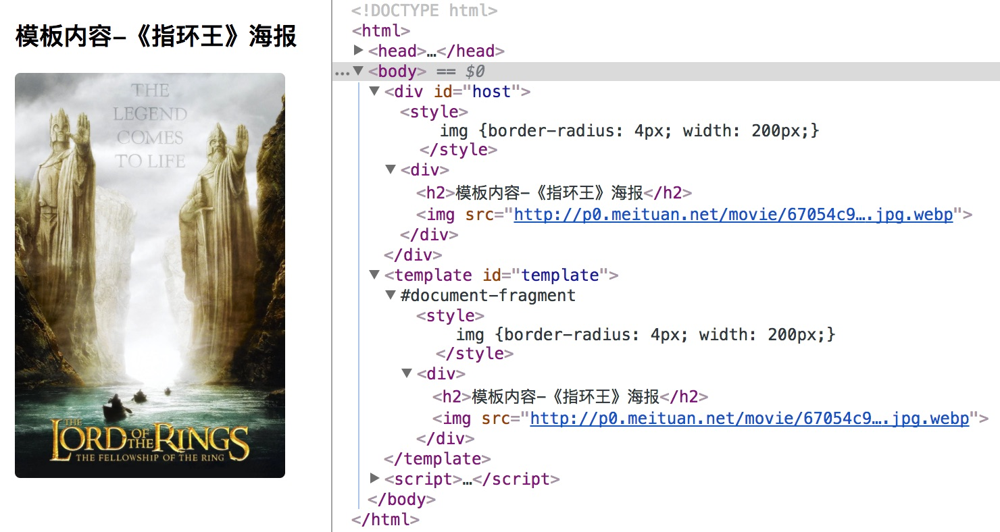

# HTML Template

Web Components 规范里的 HTML 模板（HTML Template）是指浏览器新增对标签 `<template>` 的支持，以便用户能够在其中声明任意的 HTML 片段。


## 为何需要`<template>`？

模板最初是服务端技术栈的一部分，例如 PHP，Django，Ruby on Rails，都有各自的模板系统，用于将数据与HTML结构组合为浏览器端可识别的HTML文档。即便是后来的 Node.js，也有不少模板系统可用，例如 nunjucks、esj、jade、handlebars 等等。

目前的技术栈下，后端服务（不包括Node.js这样的视图类后端服务）越来越专注于数据处理，客户端则渐渐地承担更多的用户交互与视图渲染。各类前端 MVC 框架（例如 Angular.js，Backbone.js）都重度使用前端模板进行页面或组件渲染。在没有 `<template>` 的时候，声明模板有下面3种方式常见方式。

**使用 `<div>` 标签**

第一种方式是声明一个不可见的 `<div>` 标签，将模板放置于其中，如下所示。这个方式有个致命问题：其内部如果有图片、样式、脚本，那么都会被浏览器解析并且按相应规则加载或执行，即使这些资源都还没有用到。

```html
<!-- 模板容器 div 内联样式设为 'display:none' 以避免显示在页面中 -->
<div style="display:none;">
  <div>
    <h1>Web Components</h1>
    
  </div>
</div>
```

**使用 `<script>` 标签**

另外一个办法是使用 `<script>` 标签并且将其 `type` 声明为 `text/template` 而非 `text/javascript`。

In the following example, the template content is stored inside of a script tag. The down side of this approach is that the templates will be converted into DOM elements using .innerHTML, which could introduce a cross site scripting vulnerability if an adequate sanity check is not performed.

```html
<script type="text/template">
  <div>
    <h1>Web Components</h1>
    
  </div>
</script>
```

**JavaScript字符串**

这个大家再也熟悉不过了，就是在 JavaScript 代码里进行大量的字符串拼接，生成 HTML 字符串，然后通过设置 `innerHTML` 的方式将其注入到 DOM 树中。

## 示例

下面是一个使用 `<template>` 编程的示例。

```
<div id="host">加载中……</div>

<template id="template">
  <style>
    img {
      border-radius: 4px;
      width: 200px;
    }
  </style>
  <div>
    <h2>模板内容-《指环王》海报</h2>
    
  </div>
</template>

<script>
  setTimeout(function() {
    var template = document.querySelector('#template');
    var clonedNode = document.importNode(template.content, true);  // ①
    var host = document.querySelector('#host');
    host.innerHTML = '';
    host.appendChild(clonedNode);
  }, 2000);
</script>
```

① 处用到的 `document.importNode()` 方法，会接收模板内容节点，然后返回一个该节点的深拷贝（第二个参数 `true` 表明了要使用深拷贝）。这有点类似于`document.createElement()`。

上面的代码在浏览器中解析执行后，会先显示“加载中……”文字，约2秒后，模板里的内容被插入到主文档里进行渲染。可以看到`<style>`会对主文档有影响。




## 关于数据绑定

大多数前端 MVC/MVVM 框架的模板都支持数据绑定，对开发非常方便。`<template>` 则不支持这样的特性，它只是提供了模板内容的隔离而已。

## 浏览器支持情况

HTML template 是四个子规范中完成最早的，已经是 2014 年发布的 HTML5 标准的一部分。所以到目前，总体来说，`<template>` 元素在各浏览器中的支持度很不错<sup>[2]</sup>。除了 IE/Edge，其他的浏览器的近期版本都可以放心地使用 `<template>` 特性。

| Firefox (Gecko) | Chrome       | IE          | Safari | Opera |
|-----------------|--------------|-------------|--------|-------|
| 22              | 35           | 均不支持     | 10.1   | 22    |
| **Android**     |**iOS Safari**| **Edge**    |        |       |
| 4.4             | 9.2          | 13, 部分支持 |        |       |

## 参考资料

1. [Introduction to the template elements | webcomponents.org](https://www.webcomponents.org/community/articles/introduction-to-template-element)
2. [caniuse template](https://caniuse.com/#search=template)
