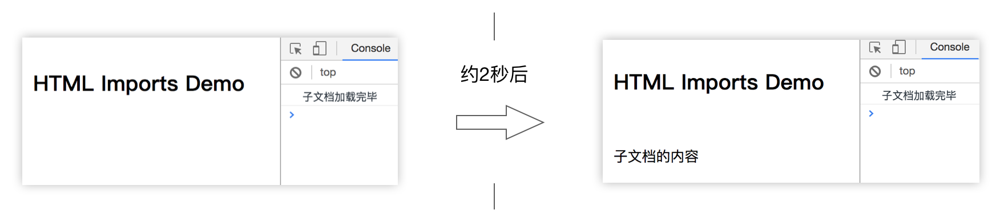
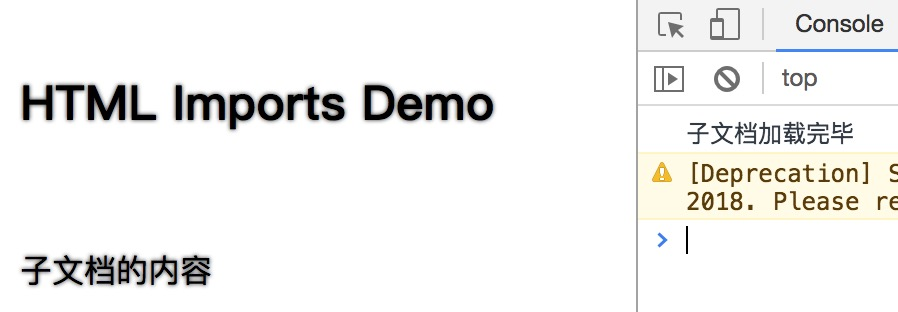

# HTML Import

HTML Import（HTML 导入） 可以将外部的 HTML 文档引入到当前页面中，并对当前页面提供完全的 DOM 访问。

### 基本用法

目录结构：

```
static                # 静态文件服务根目录
└── html-import
    ├── index.html    # 主文档
    └── part.html     # 外部文档
```

HTML Import 需要通过声明了 `rel="import"` 属性的 `<link>` 元素来导入外部 HTML 文档。而且无法通过文件协议（`file:///`）访问，必须是 HTTP 或者 HTTPS。

```html
<!-- index.html -->
<!DOCTYPE html>
<html>
<head>
  <title>HTML Imports</title>
  <link rel="import" href="./other.html">
</head>
<body>
  <h1 style="padding: 20px;">HTML Imports Demo</h1>
  <div id="part-container"></div>
</body>
</html>

<script type="text/javascript">
(function() {
  var linkEleList = document.querySelectorAll('link[rel="import"]');
  var extDocOther = linkEleList[0].import;

  setTimeout(function() {
    document.getElementById('part-container').appendChild(
      extDocOther.querySelector('div').cloneNode(true)
    );
 }, 2000);
})();
</script>
```

被引用的 HTML 文档：

```html
<!DOCTYPE html>
<html>
<head>
  <title>一个子文档</title>
</head>
<body>
  <div style="padding: 20px;">子文档的内容</div>
</body>
</html>
<script type="text/javascript">
(function() {
  console.log('子文档加载完毕');
})();
</script>
```

在本地的服务中访问 `index.html` 页面，观察控制台的输出，可以看到立即会打印出“子文档加载完毕”，约2秒后，主文档中显示出“子文档的内容”。效果如下图所示。



### 跨域引用

除了使用相对路径来引入同一个域下的 HTML 页面，还可以使用 URL 引入其他域下的文档，例如：

```
<link rel="import" href="http://borninsummer.com/">
```

### 样式影响

目前的草案里，有一章节是“9. Style processing with Imports”，描述了被引用的文档的样式要对主文档产生影响。这种样式的变化通常出乎意料，可能会对主文档造成较严重影响。因此，草案的撰写人们计划将这一章节从 HTML Imports 提案中移除（https://github.com/TakayoshiKochi/deprecate-style-in-html-imports）。

在上面的示例中，如果 `other.html` 中用 `<style>` 元素声明了一些样式规则，例如

```
<style type="text/css">
  body {text-shadow: 0 0 2px #333;}
</style>
```

那么主文档也会立即在引入 `other.html` 文档后被应用其中的样式规则（在 Chrome65 版本中测试）：



TakayoshiKochi 称，在 Chrome 67 版本之后，被引入的文档的样式将不会再应用于主文档 <sup>[1]</sup>。

### 事件

## 浏览器支持情况

| Firefox (Gecko) | Chrome       | IE         | Safari | Opera   |
|-----------------|--------------|------------|--------|---------|
| No support      | 61.0         | No support |        | Support |
| **Android**     |**iOS Safari**|            |        |         |
|                 |              |            |        |         |

## 参考资料

1. https://github.com/TakayoshiKochi/deprecate-style-in-html-imports/issues/5
