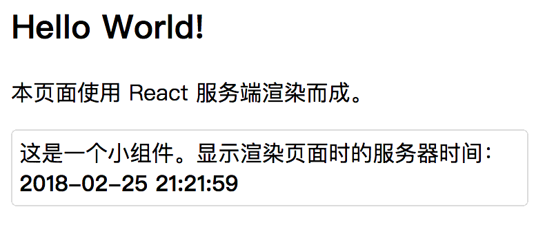

# 服务端渲染

有时候，出于 SEO 等因素的考虑，需要在服务端进行页面渲染（即 Server Side Render，SSR）。借助虚拟 DOM，React 支持使用 `ReactDOMServer`（来自`react-dom/server`）将组件树渲染为字符串。此时，组件就只会调用位于 `render` 之前的那些组件生命周期方法，即：

+ `constructor`
+ `componentWillMount`

## 原理


## 基本使用

我们来看一个最简单的服务器端应用示例。目录结构如下：

```
server
├── index.js           // koa 搭建的简单 HTTP 服务器
└── pages
    └── hello-ssr
        ├── index.js   // 页面入口
        └── part.js    // 一个组件
```

首先，我们用 Koa@2.* 构建一个简单的 HTTP 服务器。值得注意的是，Koa 依赖 node v7.6.0 或 ES2015 及更高版本和 async 方法支持。

> koa 是由 Express 原班人马打造的，致力于成为一个更小、更富有表现力、更健壮的 Web 框架。

```javascript
/**
 * 一个简单的 HTTP 服务器
 * 文件：server/index.js
 * node@9.4.0
 * koa@2.5.0
 */
const Koa            = require('koa');
const React          = require('react');
const ReactDOMServer = require('react-dom/server');

const app = new Koa();

app.use(async (ctx, next) => {
  const PageFunc = require('./pages/hello-ssr/index.js').default;
  const str = ReactDOMServer.renderToString(<PageFunc />);
  ctx.body = str;
});

const port = 7002;
app.listen(port);
```

我们的页面入口文件，`./pages/hello-ssr/index.js` 里可以像浏览器中组件的写法一样去定义或引用页面/组件：

```javascript
import React from 'react';
import Part  from './part.js';

export default class HelloWorldPage extends React.Component {
  constructor() {
    super();
    console.log('\n组件生命周期方法: constructor');
  }

  componentWillMount() {
    console.log('组件生命周期方法: componentWillMount');
  }

  componentDidMount() {
    console.log('组件生命周期方法: componentDidMount');
  }

  render() {
    return (
      <div style={{padding: '5px'}}>
        <h2>Hello World!</h2>
        <p>本页面使用 React 服务端渲染而成。</p>
        <Part />
      </div>
    );
  }
}
```

上面的页面引入了一个简单的组件，`part.js`：

```javascript
import React  from 'react';
import moment from 'moment';

export default class Part extends React.Component {
  constructor() {
    super();
  }

  render() {
    return (
      <div style={{border: '1px solid #ccc', borderRadius: '4px', padding: '5px'}}>
        <div>这是一个小组件。显示渲染页面时的服务器时间：</div>
        <strong>{moment().format('YYYY-MM-DD HH:mm:ss')}</strong>
      </div>
    );
  }
}
```

启动服务：

```
$ babel-node ./server/index.js
```

在 `http://localhost:7002/` 可以访问到服务端渲染出的页面：



## 常见问题

### 组件生命周期

### 在组件中发起异步请求

### 性能评估

## 参考资料

1. 示例代码，https://github.com/zilong-thu/react-ssr-intro
