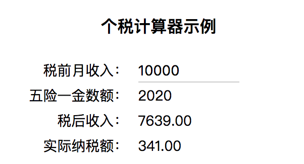

# 基本使用示例

在介绍 Vue 的工作原理之前，我们先通过一个个税计算器示例，由简到繁地演进，以熟悉 Vue 的属性变化侦测及组件化开发的基本使用方式。

## 第一步：自动更新视图

我们期望实现一个可以根据用户输入的税前收入，来实时计算纳税额、税后到手金额的小工具。效果示意图如下：



简便起见，我们直接在 HTML 文件中通过 `<script>` 标签从 CDN 服务商引入 `vue.js`：

```html
<!-- 开发环境版本，包含了用帮助的命令行警告 -->
<script src="https://cdn.jsdelivr.net/npm/vue/dist/vue.js"></script>

<!-- 这里是 vue app 在文档中的挂载点 -->
<div id="app">
  <div><label>税前月收入：</label><input v-model="income"></div>
  <div><label>五险一金数额： </label>{{ result.profit }}</div>
  <div><label>税后收入：</label>{{ result.real_income }}</div>
  <div><label>实际纳税额：</label>{{ result.tax }}</div>
</div>
```

然后，基于我国内地目前的个税法案，一个纯函数 `taxCalculator`：

```javascript
/**
 * 中国个税计算算法
 * 算法参考：http://www.gerensuodeshui.cn/
 */
function taxCalculator(options = {
  base: 3500,
  income: 10000,
  profit: 0,
}) {
  const base = options.base || 3500;
  // 税前收入
  const income = Number(options.income) || 0;
  // 五险一金缴纳额
  const profit = options.profit || Math.round(income * 0.202);
  const income_after_profit = Math.round(income - profit);
  // 应纳税所得额
  let income_for_tax = income_after_profit - base;
  if (income_for_tax < 0) {
    income_for_tax = 0;
  }
  // 应纳税所得额(不含税)表
  const list = [0, 1455, 4155, 7755, 27255, 41255, 57505, 1000000000000];
  // 税率表
  const rate = [0, 0.03, 0.1, 0.20, 0.25, 0.3, 0.35, 0.45];
  // 速算扣除数表
  const minus = [0, 0, 105, 555, 1005, 2775, 5505, 13505];
  let index = list.findIndex((item, i) => {
    return (item > income_for_tax) && (list[i - 1] < income_for_tax);
  });
  let tax = 0;
  if (income_for_tax) {
    tax = Number(income_for_tax * rate[index] - minus[index]).toFixed(2);
  }
  let real_income = (income_after_profit - Number(tax)).toFixed(2);  // 税后收入
  return {income, profit, real_income, tax};
}
```

最后，我们使用 Vue 来监听用户的输入，实时计算结果：

```javascript
const app = new Vue({
  el: '#app',
  data: {
    income: 0
  },
  computed: {
    result: function() {
      return taxCalculator({income: this.income})
    }
  }
});
```


## 第二步：添加子组件并与父组件通信

2018 年两会期间，关于提升个税起征点的议题成为社会讨论的焦点之一。我们在第一步里使用的 3500 元起征点，是 2011 年 9 月 1 日起实施的。我们可以在第一步的基础上，添加一个功能，让用户可以设置计算个税的起征点数值。

简便起见，我们直接使用 `Vue.component` 方法在全局定义一个名为 `user-settings` 的子组件。

```
/**
 * 定义一个用于设置个税起征点的组件
 */
Vue.component('user-settings', {
  template: `
    <div>
      <label>选择个税起征点</label>
      <select v-on:change="onSelectChange">
        <option v-for="item in list">{{ item }}</option>
      </select>
    </div>`,
  data: function () {
    return {
      base: 3500,
      // 可选的个税起征点数值
      list: [3500, 4000, 5000, 7000, 10000],
    }
  },
  methods: {
    // 子组件上的事件
    onSelectChange: function(event) {
      var target = event.target;
      var value  = Number(target.value);
      this.$emit('settings', {
        base: value,
      });
    }
  }
});
```

在 HTML 中，可以像 Web Components 规范约定的那样直接使用标签名嵌入子组件，使用 `v-on:settings` 监听子组件发布的名为 `settings` 事件：

```html
<div id="app">
  <!-- 省略其他代码 -->
  <user-settings v-on:settings="onSettingsChange"></user-settings>
</div>
```

最外层的 Vue APP 则改写为：

```javascript
// Vue app
const app = new Vue({
  el: '#app',
  data: {
    income: 0,
    base: 3500,
  },
  computed: {
    result: function() {
      return taxCalculator({income: this.income, base: this.base});
    }
  },
  methods: {
    onSettingsChange: function(settings) {
      this.base = settings.base;
    }
  }
});
```

调整之后的效果如下图所示，可以看到，对于税前收入 1 万元的劳动者来说，个税起征点如果从 3500 元提高到 5000 元，那么可以减少 43% 的纳税额。


