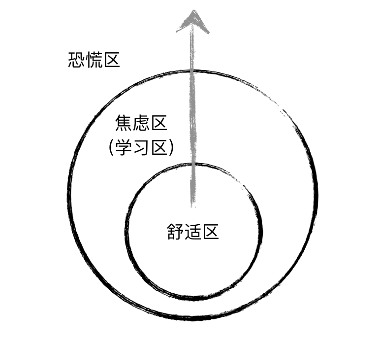

# 前端程序员的自我成长

## 关于学习技术

开发与学习过程中，会接触与使用到各种技术。它们在预期使用寿命、紧迫性等方面存在诸多差异。

### 预期寿命

先说一下所谓的**预期使用寿命**。这也与2015年底讨论的比较热的话题有点关系。

摩尔定律指出计算机性能大概每18个月会提高一倍。除了硬件，摩尔定律似乎也眷顾了软件开发领域：

> 每过 18 个月，就有一半的知识会过时。

有些工具、类库、方言从诞生到流行到凋亡，只有很短的时间。例如打包工具 Grunt，流行了一年后，社区基本上就转到 Gulp 麾下；而 Gulp 流行了一年多后，Webpack 又迅速壮大。Coffeescript 在一些开发者中也非常流行，它提供了非常简洁的编程语法，然后将其编译为（Coffeescript 程序员们认为笨拙的）原生 JavaScript。不过，随着 ECMAScript 2015 标准的正式发布，Coffeescript 其实算是完成了它的历史使命，即以社区力量推动标准化进程。

这一类技术，就是预期使用寿命比较短的技术——它们因标准或生产工具的不完善而生，最终要么因标准化而消亡，要么因为更优秀的替代者的出现而逐渐无人问津。

因此，在选择一个技术的时候，就要考虑它的预期使用寿命了：是否过一段时间，就要抛弃它，转向它的替代品？不可否认程序员是需要不断学习的一群孩子。可是如果经常要学习各种寿命短的相似工具，这个成本还是比较大的。

预期使用寿命长的，无非就是那些大家称为“基础”的技能点：例如 Git，JavaScript。Git 自 2005 年诞生至今 11 年，JavaScript 从 1996 年诞生至今已有 20 年，相信它们都会被社区长久地维护下去。那么这些就是应该作为基本功，认真去学的，最好是达到手到擒来的境界。

对前端程序员来说，在个人的自由时间里，应该优先选择学习这样的技术：

+ 所有程序员应当具备的计算机科学核心知识，例如数学、算法、数据结构、系统设计等
+ 已正式标准化或者即将标准化的，例如 ECMAScript 5/6/7，HTML5，CSS3
+ 社区或者基金会长期维护的，例如 Git, Node.js, Linux
+ 大公司长期维护的，例如 React（背后有 Facebook ），AngularJS（背后有 Google 支撑）

## 紧迫性（或优先级）

这个是跟业务开发相关的。项目中用到的那些技术，如果没有掌握，会成为影响开发进度、开发效率的因素，那就是应该具有较高的学习优先级。好比我刚来的时候，懂点JS，懂点Git操作，会点Mac操作，但就是没有接触过 React，而项目乃至整个团队都是完全基于 React 进行开发的，那么 React 自然具有最高优先级。

没有需求，也许就没有了程序员的价值。

## 如何提升

### 不断修正自己的认知

> 人不能两次踏进同一条河流
>
> —— 古希腊哲学家赫拉克利特（约公元前530年~前470年）

程序员的编程行为是严谨、严肃的，容不得马马虎虎与模棱两可。自己的错误认知可能会给系统带来潜在的问题，甚至造成致命的打击。如果你的同事指出了他认为你理解有误的地方，那么应该去做调研、验证，而非停下来，展开一场基于已有认知的辩论。

不必因为自己过去理解错了而自惭形秽。最重要的是要敢于接受正确的理解，承认那时的自己是错误的。倘若心里有点不好受，可以这样安慰自己：那时的我不是现在的我，就如同那时的河流并非此时的河流，毕竟：“万物皆流，无物常住”。

### 时不时跳出舒适区

人的认知领域可以划分为这三个区域：

人人都喜欢舒适区（comfort zone），这里阳光明媚，温度适宜，空气清新，工作起来非常高效率，甚至都不怎么用脑子。

听上去很不错。但是停留在这里太久，水平原地踏步，绝对不是件好事。稍微往舒适区外走几步，你会感觉到这里有些让人焦虑：有些技术，你听说过名字，但其实还没有完全理解它的工作原理，或者用得不熟练，然而项目中马上就要用到了。你感觉到一丝冷风吹过，天空好像没有那么明媚了。不过，好在你稍微了解过大概，可以花一两天的时间达到熟练的程度，看起来，可以应付得来。那么这个区域，就是你的学习区（learning zone），在这里，适当的未知引发你的焦虑，会刺激你学习新东西。征服了这个区域，阳光会很快明媚起来。

### 不要放过技术细节

揪住一个点，挖下去，很可能多挖几层就碰到问题的根源了。而这正是提升自己的一个好方法。

### 读书

